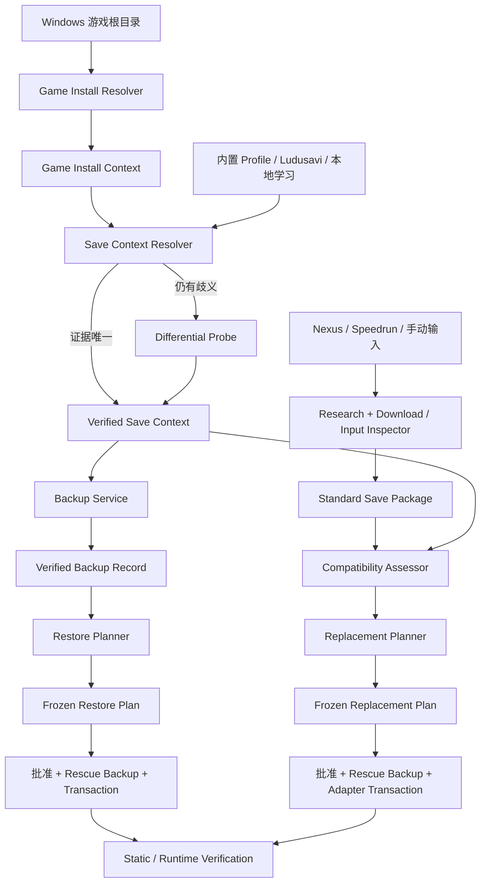

# `manage-game-saves` Skill 与游戏存档管理能力开发计划

> 状态：方案基线固定；M0–M6 已实现并通过；ER-08 下载存档真实导入与 ER-09 原始 baseline 恢复均已完成，最终状态为 `original_restored`；救援备份与验收证据已保留
>
> 固定日期：2026-07-30
>
> 目标仓库：`GameFinder`
>
> 首版平台：Windows
>
> 首版 Skill：`skills/manage-game-saves`
>
> 首个真实验收游戏：Steam 版 ELDEN RING

### 实施进度（2026-07-30）

- **M0 已完成**：Save Contracts、不可变 Context Store、SaveRootPolicy、reparse point 防护和临时目录夹具已实现。
- **M1 已完成**：Steam install resolver、Game Save Profile registry、Elden Ring Profile、静态 Save Context resolver、差分探测和 `local_verified` learned profile store 已实现。
- **MCP 已提供 M1 入口**：`probe_save_game_install`、`get_save_game_install_context`、`resolve_save_locations`、`get_save_context`、`begin_save_location_probe`、`complete_save_location_probe`。
- 原计划中的 `probe_game_install` 已被 Mod 安装域占用，因此存档域使用无冲突名称 `probe_save_game_install`；语义和输入保持为“从一个精确游戏根目录建立存档管理用 Game Install Context”。
- ER-01 已对本文给定的真实 Elden Ring 根目录通过：识别 `steam:1245620`、build `22984413`、当前 SteamID64 存档根和 `vanilla-main` Save Unit；没有写游戏或存档文件。

## 目录

1. 架构决策
2. 目标、非目标与术语
3. 系统边界与总体流程
4. 核心对象模型
5. 从游戏根目录发现存档
6. 备份与恢复
7. 标准化存档包
8. 存档调研与下载
9. 外部存档替换与导入
10. Elden Ring 首版 Adapter
11. MCP 工具与 Skill 设计
12. 存储、复用与代码布局
13. 安全不变量与错误模型
14. 测试策略
15. Elden Ring 真实验收合同
16. 实施里程碑
17. 首版完成定义
18. 风险与后续方向
19. 参考资料

## 1. 架构决策

以下决策在开发开始前固定：

1. **先做“定位存档”和“可靠备份/恢复”，再做在线来源和外部存档导入。**
2. **用户只需提供 Windows 游戏根目录。** 系统负责解析游戏、商店、安装版本、Windows 用户上下文和可能的存档位置；不能唯一确认时进入有界差分探测，不能猜路径后直接写入。
3. **存档路径不要求位于游戏根目录内。** 使用独立的 `Save Context` 与 `Save Root Policy`，不能复用“只允许写 gameRoot 内部”的安装路径假设。
4. **备份是可直接执行的低风险操作。** 当 Save Context 唯一且进程前检通过时，不要求先冻结写计划。
5. **恢复和外部存档替换都是破坏性写操作。** 必须先生成不可变计划、展示精确影响范围、获得对该计划 ID 的明确批准，再执行。
6. **每次恢复或替换前自动创建并验证 rescue backup。** rescue backup 失败时禁止写目标存档。
7. **标准化只统一包装、身份、清单和校验，不改写游戏自己的不透明二进制格式。**
8. **手动下载的文件、目录、ZIP、RAR 和 7z 都可作为标准化输入。** 原输入只读保留；标准化结果写入受管对象库。
9. **在线来源首版只支持 Nexus Mods 与 Speedrun.com。**
10. **调研和下载在用户体验上可以一体化。** 内部仍保留“候选证据”和“精确下载选择”两个对象，以便审计和重试；用户已明确要求“查找并下载”时，不增加不必要的二次授权。
11. **下载成功不等于可导入。** 所有下载都必须先成为 `Standard Save Package`，再做兼容性评估。
12. **Elden Ring 外部存档首选角色槽位导入，不首选整文件覆盖。** 这样能保留目标 `ER0000.sl2` 中其它角色；若必须覆盖已占用槽位，计划必须明确显示。
13. **静态验证与运行时验证分离。** 文件哈希和结构校验由系统完成；“游戏能识别并加载角色”由用户在离线环境运行游戏确认。
14. **Skill 负责工作流、证据判断和用户交互；MCP 负责本地探测、计划冻结、受约束写入、校验、事务和记录。**
15. **首版复用现有 `nexus-mods-server` 的 TypeScript 基础设施，但在 `src/save/` 下保持领域隔离。** 后续可以拆成独立 server，不在首版提前拆分。
16. **首版不提供备份删除和自动清理。** 先保证“创建、列出、验证、恢复”可信，避免生命周期策略误删唯一副本。

## 2. 目标、非目标与术语

### 2.1 首版目标

- 从一个 Windows 游戏根目录识别游戏和商店版本。
- 找到该安装实例当前 Windows 用户对应的本地存档位置及存档形式。
- 当静态证据不足时，通过一次有界的“运行游戏并产生存档变化”差分探测确认位置。
- 创建内容寻址、可验证、不可变的本地存档备份。
- 从备份生成精确恢复计划，并安全恢复到沙箱或真实存档位置。
- 将手动提供的存档输入标准化为统一包装。
- 从 Nexus 或 Speedrun.com 调研、选择、下载并标准化存档。
- 判断外部存档与目标 Save Context 的兼容性。
- 通过通用替换策略或游戏专属 Adapter 导入外部存档。
- 记录每一步的证据、哈希、计划、事务、验证和回滚信息。
- 通过本文件第 15 节定义的 Elden Ring 真实验收。

### 2.2 非目标

首版不承诺：

- 支持 Windows 以外的平台。
- 只凭游戏根目录就无条件找到所有游戏的存档；注册表专有、云端独占、加密容器或多账户歧义仍可能需要探测或用户选择。
- 绕过 DRM、平台登录、付费墙、站点验证码或下载权限。
- 自动关闭 Steam Cloud、修改反作弊设置或替用户处理云冲突弹窗。
- 证明第三方作者声称的“100% 完成”“全成就”或“联机安全”绝对真实。
- 对任意游戏理解槽位、账户绑定、校验和、加密或版本迁移规则。
- 自动启动游戏并代替用户判断剧情进度。
- 把存档转换成一种跨游戏通用二进制格式。
- 删除旧备份、清理云端存档或同步远程备份。

### 2.3 术语

- **Game Install Context**：从游戏根目录解析出的游戏、商店、应用 ID、安装版本和可执行文件证据。
- **Save Context**：某个游戏安装、Windows 用户、平台账户和本地存档根的已验证绑定。
- **Save Unit**：应作为一个一致性单元处理的一组文件，例如主存档、伴随备份和云标记文件。
- **Game Save Profile**：可复用但需版本校验的存档发现知识。
- **Standard Save Package**：统一包装的外部或本地存档，不改变游戏原始 payload。
- **Backup Record**：对本地 Save Unit 的不可变快照描述和内容对象引用。
- **Restore Plan**：从一个 Backup Record 恢复到一个 Save Context 的不可变写计划。
- **Replacement Plan**：把 Standard Save Package 导入 Save Context 的不可变写计划。
- **Rescue Backup**：恢复或替换执行前，针对当前目标状态自动创建的紧急备份。
- **静态验证**：哈希、文件树、结构、路径、校验和与计划后置状态验证。
- **运行时验证**：用户运行游戏后确认存档或角色可见、可加载并可再次保存。

## 3. 系统边界与总体流程



权限边界：

| 组件 | 可读本地文件 | 可联网 | 可生成候选方案 | 可写真实存档 |
|---|---:|---:|---:|---:|
| Skill / Agent | 是 | 是 | 是 | 否 |
| Source Adapter | 否或只读缓存 | 是 | 是 | 否 |
| Context / Package Inspector | 是 | 否 | 是 | 否 |
| Planner / Plan Store | 是 | 否 | 是 | 否 |
| Backup Service | 是 | 否 | 否 | 仅写受管备份库 |
| Transaction Engine | 是 | 否 | 否 | 是，且仅限已批准计划 |
| Game Save Adapter | 是 | 否 | 是 | 只能经 Transaction Engine |

不得使用 shell、普通文件 API、浏览器下载脚本或第三方 GUI 绕过 MCP 的计划与事务边界来替换真实存档。

## 4. 核心对象模型

### 4.1 Game Install Context

概念字段：

```json
{
  "installContextId": "uuid",
  "gameRoot": "D:\\...\\Game",
  "platform": "windows",
  "store": "steam",
  "game": {
    "displayName": "ELDEN RING",
    "canonicalId": "steam:1245620",
    "storeAppId": "1245620"
  },
  "installEvidence": [
    {
      "kind": "steam_appmanifest",
      "path": "D:\\...\\appmanifest_1245620.acf",
      "buildId": "22984413"
    },
    {
      "kind": "pe_version",
      "path": "D:\\...\\eldenring.exe",
      "fileVersion": "2.6.2.0"
    }
  ],
  "confidence": "confirmed",
  "createdAt": "RFC3339"
}
```

版本证据可以并存，不强行把 Steam build ID、PE FileVersion 和游戏标题画面版本映射成同一字符串。

### 4.2 Save Context

概念字段：

```json
{
  "saveContextId": "uuid",
  "installContextId": "uuid",
  "windowsUserSidHash": "sha256",
  "storeAccount": {
    "kind": "steam_id64",
    "value": "7656..."
  },
  "saveRoots": [
    {
      "absolutePath": "C:\\Users\\...\\AppData\\Roaming\\EldenRing\\7656...",
      "role": "primary"
    }
  ],
  "saveUnits": [
    {
      "unitId": "vanilla-main",
      "essential": ["ER0000.sl2"],
      "companions": ["ER0000.sl2.bak"],
      "auxiliary": ["steam_autocloud.vdf"]
    }
  ],
  "format": {
    "kind": "game-specific-container",
    "adapterId": "elden-ring-steam-pc"
  },
  "evidence": [],
  "verification": {
    "state": "confirmed",
    "method": "profile+filesystem"
  },
  "contextHash": "sha256"
}
```

`windowsUserSidHash` 用于区分 Windows 用户，但避免在普通结果中暴露原始 SID。平台账户 ID 只在确有路径和格式需要时记录。

### 4.3 Backup Record

Backup Record 至少包含：

- `backupId`、`saveContextId`、`unitId`。
- 创建原因：`manual`、`pre_restore_rescue`、`pre_replacement_rescue` 或 `acceptance_baseline`。
- 源绝对路径、相对路径清单、文件大小、SHA-256、文件属性和修改时间。
- 内容寻址对象引用与整体 tree hash。
- 复制前后源状态指纹，证明复制期间未发生变化。
- Profile、Adapter、工具和 schema 版本。
- 完整性状态与最后验证时间。
- `backupRecordHash`。

Backup Record 不允许就地修改。补充验证结果时写独立 Verification Record。

### 4.4 Standard Save Package

概念布局：

```text
<package-id>/
├── manifest.json
└── payload/
    └── <游戏原始存档文件或目录>
```

`manifest.json` 至少包含：

```json
{
  "schemaVersion": 1,
  "packageId": "savepkg-...",
  "game": {
    "canonicalId": "steam:1245620",
    "displayName": "ELDEN RING"
  },
  "source": {
    "kind": "nexus|speedrun|manual",
    "pageUrl": "https://...",
    "downloadSelection": {},
    "downloadReceiptId": "nullable",
    "originalInputPath": "nullable"
  },
  "claims": {
    "progress": "author-supplied text",
    "gameVersion": "author-supplied text",
    "dlc": [],
    "onlineSafety": "author-claimed|unknown"
  },
  "payload": {
    "root": "payload",
    "files": [],
    "treeHash": "sha256"
  },
  "binding": {
    "kind": "steam_id64|account_bound_unknown|none|unknown",
    "value": "nullable"
  },
  "format": {
    "kind": "game-specific-container",
    "adapterHint": "elden-ring-steam-pc"
  },
  "safety": {
    "archiveInspection": "passed",
    "containsExecutable": false,
    "warnings": []
  },
  "manifestHash": "sha256"
}
```

作者声明和系统验证必须分开保存。`claims.progress = "100%"` 不能被转换成系统已验证的 100%。

### 4.5 Restore / Replacement Plan

两类计划都必须：

- 使用 UUID 和规范 JSON 哈希。
- 引用冻结的 Context、Backup 或 Package 哈希。
- 记录计划时目标 pre-state。
- 列出每个将创建、替换或删除的相对路径。
- 列出源对象哈希、期望 post-state 和验证方式。
- 明确 rescue backup 范围。
- 有短期有效期并在目标漂移后失效。
- 不包含临时下载 URL、Cookie、API key 或其它凭据。

## 5. 从游戏根目录发现存档

### 5.1 发现顺序

给定 `gameRoot` 后按以下顺序执行：

1. **规范化并验证根目录**
   - 必须为绝对路径和真实目录。
   - 解析 reparse point；拒绝文件系统根或过宽目录。
   - 枚举主要可执行文件和少量身份文件，不做无界全盘扫描。
2. **识别商店和游戏**
   - Steam：沿父目录定位 `steamapps` 和 `appmanifest_*.acf`，匹配 `installdir`、可执行文件和 app ID。
   - Epic、GOG 等可保留 resolver 接口，但首版只需把 Steam 路径做到真实验收。
   - 读取 PE 元数据、`steam_appid.txt` 和已知 launcher metadata 作为辅助证据。
3. **匹配 Game Save Profile**
   - 优先匹配确切商店 app ID。
   - 再匹配可执行文件、游戏 canonical ID 和版本约束。
4. **查询通用清单**
   - 复用或导入 Ludusavi Manifest 中的 Windows 存档规则。
   - 展开 `%APPDATA%`、`%LOCALAPPDATA%`、`%USERPROFILE%\\Documents`、Steam userdata 等受控变量。
5. **验证候选位置**
   - 路径存在性和文件签名。
   - 最近写入时间与游戏最近运行时间的相关性。
   - 目录/文件命名、大小、伴随文件和账户目录形态。
   - 排除日志、截图、shader cache、配置目录和 Mod 配置。
6. **有界已知路径扫描**
   - 只扫描 Windows 常见存档根和平台 userdata。
   - 有最大深度、文件数、字节数和时间预算。
7. **差分探测**
   - 静态证据仍不能唯一确认时才进入。

### 5.2 证据状态

- `confirmed`：游戏身份、账户和存档签名均匹配，或差分探测唯一命中。
- `probable`：高置信 Profile 命中且结构匹配，但缺少一次动态证据。
- `ambiguous`：存在多个合理账户、多个存档根或多个 Mod/原版变体。
- `not_found`：在受控范围内无候选。
- `unsupported`：注册表专有、远程独占、格式或权限暂不支持。
- `stale`：Profile 版本证据已过期，需要重新验证。

只有 `confirmed` 可直接用于真实恢复或替换。`probable` 可以备份，但结果必须带警告；不能用于自动写入。

### 5.3 差分探测协议

`begin_save_location_probe`：

- 快照候选根的目录项、大小、mtime 和内容哈希抽样。
- 返回 probe ID、观察范围、有效期和用户操作说明。
- 不启动游戏，不改文件。

用户随后启动游戏并执行最小动作，例如创建新存档、进入游戏后退出到标题画面。

`complete_save_location_probe`：

- 对同一观察范围再次快照。
- 报告新增、修改和删除路径。
- 按文件形态、写入时间和进程相关性排序。
- 唯一高置信结果可生成 `local_verified` Profile。
- 仍有歧义时展示候选差异，由用户选择；不继续猜测。

本地学习只写 MCP 管理的 learned profile store，不自动修改 Skill 或仓库代码。

## 6. 备份与恢复

### 6.1 备份流程

1. 读取并验证 Save Context。
2. 检查目标游戏进程和 Profile 声明的敏感进程已停止。
3. 对 Save Unit 做复制前指纹。
4. 将每个文件复制到临时对象。
5. 计算并验证 SHA-256。
6. 发布到内容寻址对象库。
7. 对源再做一次指纹；若复制期间发生变化则重试一次或失败，不发布不一致快照。
8. 创建不可变 Backup Record。
9. 立即执行一次完整 verify，再向用户报告成功。

备份成功的定义不是“copy API 返回成功”，而是 Backup Record 可重新读取，全部内容对象存在，大小、哈希和 tree hash 均匹配。

### 6.2 备份范围

- 默认备份一个 Profile 定义的完整 Save Unit。
- 主存档、游戏自己的 `.bak` 和必要账户/云标记可属于同一 Backup Record，但要分别标记 `essential`、`companion` 和 `auxiliary`。
- 不默认备份图形配置、日志、崩溃转储和 shader cache。
- 支持一个 Save Context 有多个 unit，例如原版与联机 Mod 存档；每个 unit 分开选择，避免混写。

### 6.3 恢复模式

- `overlay`：只创建或替换备份中存在的受管文件，不删除其它文件。
- `exact_managed_snapshot`：只在 Save Unit 声明的 managed path 集合内恢复精确状态；不能把整个父目录视为可删除空间。

首版默认 `overlay`。只有恢复自身创建的完整 Backup Record，且 Profile 明确 managed path 时，才允许 `exact_managed_snapshot`。

### 6.4 恢复流程

1. 验证 Backup Record 和全部内容对象。
2. 读取当前目标状态并生成 Restore Plan。
3. 展示目标、模式、将覆盖/创建/删除的路径、备份来源和风险。
4. 用户批准精确 `restorePlanId`。
5. 重新检查计划哈希、有效期、目标 pre-state、游戏/平台进程和锁。
6. 自动创建并验证 rescue backup。
7. 将期望结果组装到 staging。
8. 校验 staging 的文件哈希和 tree hash。
9. 在事务日志保护下替换目标。
10. 静态验证 post-state。
11. 失败时用 rescue backup 回滚，并重新验证回滚结果。
12. 写 Restore Record 和 Verification Record。

### 6.5 Steam Cloud 规则

- 写入真实 Steam 存档时要求游戏已关闭。
- 首版真实验收还要求 Steam 客户端停止，或由用户明确证明处于不会同步的离线测试状态。
- Skill 只提示和检查，不自动修改 Steam Cloud 设置。
- 若 Steam 启动后出现云冲突，停止自动流程，让用户选择；不能替用户判断本地或云端哪份更有价值。
- 运行时验收完成后，先恢复验收前 baseline，再允许恢复正常云同步。

## 7. 标准化存档包

### 7.1 支持输入

- 单个存档文件。
- 已展开目录。
- ZIP、7z 或 RAR。
- 由受管 Nexus/Speedrun 下载产生的 Verified Download Receipt。
- 用户手动下载或自己备份的任意上述输入。

### 7.2 检查与标准化

`inspect_save_input` 只读执行：

- 确认输入绝对路径、类型、大小和 SHA-256。
- 安全列出归档内容，不先解压到目标目录。
- 检测 path traversal、绝对路径、设备名、符号链接/reparse point、重复路径、大小膨胀和嵌套归档。
- 标记可执行文件、脚本和非存档附带内容。
- 识别 wrapper 目录、候选 Save Unit、游戏格式和账户绑定。
- 给出一个或多个 payload 选择；有歧义时不自动决定。

`normalize_save_package`：

- 只从已检查输入读取。
- 解压到受管 staging，使用安全相对路径。
- 不改原归档或原目录。
- 只纳入明确选中的 payload；说明文档可以作为 evidence attachment，但不进入实际写入 payload。
- 对所有文件计算哈希并创建 immutable manifest。
- 发布到内容寻址 package store。
- 重新读取并验证 package 后才返回成功。

### 7.3 RAR 支持

- 运行时发现本机可用 extractor 能力，不把特定商业程序静默打包进项目。
- 必须使用可禁用密码交互、可安全列目录并能解压到指定 staging 的受控调用。
- 当前 Elden Ring 验收机已安装 `C:\Program Files\WinRAR\UnRAR.exe` 7.12，可作为真实验收 extractor。
- 若目标机器没有 RAR extractor，返回明确能力缺失，不把 RAR 当 ZIP 猜测。
- extractor 的退出码、版本、归档列表和解压后哈希写入标准化证据。

### 7.4 包的不可变性

- Package ID 由规范 manifest 和 payload tree hash 派生。
- 相同输入和相同 payload 选择应得到相同内容对象；来源 receipt 可以作为独立 provenance record 追加。
- Package 不直接指向用户下载目录中的可变文件。
- 不允许在导入阶段临时改 package payload；账户绑定或槽位转换只能发生在 replacement staging，并记录转换结果哈希。

## 8. 存档调研与下载

### 8.1 调研目标

候选排序优先考虑：

1. 游戏和平台确切匹配。
2. 与目标游戏版本、DLC 和存档格式兼容。
3. 进度声明完整且描述具体，例如全主线、全结局前置、全物品或 DLC 完成。
4. 最近仍维护，下载文件可用。
5. 安装/导入说明清楚。
6. 不要求不可接受的第三方工具或联机风险。
7. 有下载量、独立下载量、endorsement、维护者和更新时间等可审计元数据。

“搜索相关性”不能冒充“受欢迎程度”，作者的“联机安全”不能冒充系统保证。

### 8.2 Nexus Source Adapter

职责：

- 从 Game Install Context 映射 canonical Nexus game domain。
- 搜索 Save Games 类别和与 `100%`、`complete save`、`all achievements`、`NG+ ready` 等意图相关的候选。
- 对候选调用 Mod 详情、文件列表、需求和内容预览。
- 精确选择 file ID；旧版本和 archived 文件默认不选。
- 复用当前 Nexus 下载后端生成 Download Plan、Verified Download Receipt 和 SHA-256。
- 下载后自动进入 `inspect_save_input` 与标准化。

研究+下载请求可在一次 Skill 流程中完成：

```text
用户明确要求“找一个完整存档并下载”
  → 返回候选与推荐理由
  → 在选择无歧义时冻结精确下载选择
  → 直接下载、校验、标准化
```

如果存在多个同样合理的主文件、需要登录/付费、或兼容分支不能确定，才要求用户选择。

### 8.3 Speedrun Source Adapter

职责：

- 解析 canonical `https://www.speedrun.com/<game>/resources` 页面。
- 只把 `Saves` 分类中的条目视为一等存档候选；工具、patch 和 split 不能混入。
- 保存资源名、管理者、更新时间、说明、页面 URL 和最终下载 URL。
- 当官方 API 对资源字段覆盖不足时，使用网页结构化数据或受控浏览器读取，并保存页面快照摘要。
- 下载时限制为 HTTP(S)，记录重定向链、最终 URL、Content-Type、字节数和 SHA-256。
- 若条目跳转到外部文件主机并需要交互，允许用户手动下载后交给标准化流程。

2026-07-30 的 Elden Ring Speedrun.com Resources 页面显示 `Saves: No Saves`。因此：

- Elden Ring 首版真实在线下载验收使用 Nexus。
- Speedrun adapter 用解析契约测试、页面快照测试和另一个确有 Saves 条目的受控夹具验收。
- 不能为了满足来源覆盖而把 Elden Ring 的 Tools 当成存档。

### 8.4 下载收据

Download Receipt 至少包含：

- source、候选页、精确资源或 file ID。
- 原始文件名和最终保存文件名。
- 请求时间、完成时间、最终 URL 的去敏表示。
- bytes、SHA-256、Content-Type。
- 下载后归档完整性检查结果。
- source metadata snapshot hash。
- 与 Standard Save Package 的关联。

临时授权 URL、Cookie、API key 和浏览器会话数据不得写入收据。

## 9. 外部存档替换与导入

### 9.1 兼容性评估

输入必须是：

- 一个已验证的 Standard Save Package。
- 一个 `confirmed` Save Context。

评估输出：

```text
compatible_direct
compatible_with_slot_import
compatible_with_account_rebind
conversion_required
ambiguous
unsupported
```

评估维度：

- game canonical ID、平台和商店。
- 游戏/存档版本和 DLC。
- 文件名、容器结构和大小。
- 源/目标账户绑定。
- 原版、联机 Mod 或其它存档变体。
- 是否需要目标槽位。
- Adapter 是否支持结构校验、转换和 post-write 验证。

### 9.2 替换策略

- `direct_replace`：只适用于无账户绑定或绑定已经匹配的完整 Save Unit。
- `slot_import`：从源容器复制一个角色/槽位到目标容器，保留其它目标槽位。
- `account_rebind`：改写源容器账户身份并重算校验，再作为完整容器导入。
- `format_conversion`：由版本明确、可验证的 Adapter 转换。
- `unsupported`：不能安全表达时停止。

首版全局默认优先级：

```text
slot_import
  > direct_replace（绑定匹配）
  > account_rebind（用户明确要求整容器）
  > format_conversion
  > unsupported
```

### 9.3 Replacement Plan

计划必须额外显示：

- 源包和目标 Context。
- 选择的 Adapter、策略和版本。
- 源槽位、目标槽位和现有目标角色摘要。
- 是否覆盖现有角色。
- 哪些源字段将被改写，例如 SteamID 和 checksum。
- 哪些目标字段会保留。
- 生成文件的预期哈希。
- rescue backup 和回滚路径。
- “作者声称联机安全”不构成上线联机批准的警告。

### 9.4 执行与验证

1. 重新验证 Package、Context、计划、进程和目标 pre-state。
2. 对目标 Save Unit 建立独占锁。
3. 创建并验证 rescue backup。
4. 在 staging 中复制目标基线或源 payload。
5. 让 Adapter 在 staging 中执行转换。
6. Adapter 进行结构、账户绑定、槽位和游戏校验和验证。
7. 通用层验证 staging tree hash。
8. 事务替换真实目标。
9. 静态验证真实目标与 staging 一致。
10. 用户在离线环境运行游戏完成 runtime verification。
11. 验收结束后按计划恢复验收前 baseline，除非用户明确要求保留下载存档。

## 10. Elden Ring 首版 Adapter

### 10.1 身份与路径

首版 Profile：

```text
adapterId: elden-ring-steam-pc
game: steam:1245620
platform: windows
save root: %APPDATA%\EldenRing\<SteamID64>\
primary: ER0000.sl2
companion: ER0000.sl2.bak
auxiliary: steam_autocloud.vdf
```

路径发现证据：

- Steam appmanifest 的 `appid`、`installdir` 和 `LastOwner`。
- `%APPDATA%\EldenRing` 下的 SteamID64 目录。
- `ER0000.sl2` 的预期结构和大小范围。
- 本地 Steam userdata / loginusers 只能作为辅助证据，避免依赖单一可变字段。

`GraphicsConfig.xml` 不属于首版 Save Unit。

### 10.2 格式与导入策略

Elden Ring 的一个 `ER0000.sl2` 容器可包含多个角色槽位，并带账户身份和校验数据。首版 Adapter 必须支持：

- 只读列出源/目标角色槽位摘要。
- 验证容器长度、槽位边界、active slot 标记和 header 区域。
- 从源槽位复制角色数据与对应 header 到目标槽位。
- 将源槽位中的账户 ID 改为目标账户 ID。
- 重算槽位和 header 区域校验。
- 保留目标文件中未选择的槽位和全局数据。
- 生成新的完整 staging 文件，不对真实文件做原地十六进制修改。
- 对变换前后做结构化差异报告，拒绝超出允许区域的变化。

首版不自动把源 `steam_autocloud.vdf` 写入目标。目标现有 auxiliary 文件由 restore/replacement policy 保留。

### 10.3 实现证据与许可

第一实现研究基线使用：

- `BenGrn/EldenRingSaveCopier`：MIT License，适合作为槽位边界、SteamID 替换和 MD5 计算的实现参考及测试 oracle。
- `Ariescyn/EldenRing-Save-Manager`：仓库未声明许可证，只能用于行为调研，不能复制代码。
- `oisis/EldenRing-SaveForge`：GPL-3.0；除非项目明确接受 GPL 兼容义务，否则只用于独立验证和格式对照，不复制实现。

所有固定 offset 都必须：

- 有来源和适用版本记录。
- 在操作前通过容器长度、边界和结构签名验证。
- 有真实 29 MB `.sl2` 夹具的正向和负向测试。
- 当 Steam build、容器结构或文件大小不再匹配时 fail closed，不继续写入。

### 10.4 运行时安全

- 第三方下载存档首次运行只在离线环境进行。
- 不自动修改 Easy Anti-Cheat 或在线设置。
- 不进入多人模式，不把作者声明当成反作弊保证。
- 游戏成功识别、角色可加载、退出后能再次保存，才算 runtime verification 通过。
- runtime verification 失败时先保存诊断证据，再执行已计划的 baseline 恢复。

## 11. MCP 工具与 Skill 设计

### 11.1 Save Context 工具

```text
probe_game_install(gameRoot)
resolve_save_locations(installContextId)
get_save_context(saveContextId)
begin_save_location_probe(installContextId)
complete_save_location_probe(probeId)
```

### 11.2 备份工具

```text
create_save_backup(saveContextId, unitId, reason)
list_save_backups(saveContextId?)
inspect_save_backup(backupId)
verify_save_backup(backupId)
```

`create_save_backup` 在 Context 唯一且进程前检通过时可直接执行。

### 11.3 恢复工具

```text
plan_save_restore(backupId, saveContextId, mode)
get_save_restore_plan(restorePlanId)
apply_save_restore(restorePlanId)
verify_save_restore(restoreRecordId)
```

`apply_save_restore` 只接受用户明确批准的同一 `restorePlanId`。

### 11.4 标准化工具

```text
inspect_save_input(inputPath | downloadReceiptId)
normalize_save_package(inspectionId, payloadSelectionId, gameIdentity?)
inspect_standard_save_package(packageId)
verify_standard_save_package(packageId)
```

### 11.5 调研与下载工具

```text
research_save_candidates(installContextId, sourceScope, progressIntent)
get_save_candidate(candidateId)
freeze_save_download(candidateId, fileSelection)
download_save(downloadPlanId, destination?)
```

Skill 可以在一次用户请求中连续调用这些工具。`freeze_save_download` 用于固定选择和可重试性，不作为额外授权门。

### 11.6 替换工具

```text
assess_save_package_compatibility(packageId, saveContextId)
plan_save_replacement(packageId, saveContextId, strategy?, sourceSlot?, targetSlot?)
get_save_replacement_plan(replacementPlanId)
apply_save_replacement(replacementPlanId)
verify_save_replacement(replacementRecordId)
record_save_runtime_verification(recordId, outcome, notes?)
```

### 11.7 Skill 目录

后续实现时必须使用 `skill-creator/scripts/init_skill.py` 初始化，目标结构：

```text
skills/manage-game-saves/
├── SKILL.md
├── agents/
│   └── openai.yaml
└── references/
    ├── save-context-discovery.md
    ├── differential-probing.md
    ├── backup-and-restore.md
    ├── standard-save-package.md
    ├── research-and-download.md
    ├── external-save-replacement.md
    ├── elden-ring-steam-pc.md
    ├── mcp-tool-sop.md
    └── result-contract.md
```

不创建 README、CHANGELOG 或重复用户指南。`SKILL.md` 保持核心路由和强制安全顺序，详细 schema、来源差异和游戏专属知识放 references。

### 11.8 Skill 工作流

Skill 按意图组合能力，不要求用户说出内部模式名：

- “我的存档在哪”：Context discovery。
- “帮我备份”：Context discovery + direct backup + verify。
- “恢复这个备份”：inspect + frozen restore plan + approval + apply + verify。
- “找一个完成度高的存档并下载”：research + selection + download + normalize。
- “把这个 RAR 变成可管理存档”：inspect + normalize。
- “把下载的存档导入游戏”：compatibility + replacement plan + approval + rescue + apply + verify。

每次最终结果至少报告：

- 识别的游戏和存档位置。
- 使用的对象 ID 与哈希。
- 是否发生真实写入。
- 自动创建的 rescue backup ID。
- 静态和运行时验证状态。
- 警告、回滚状态和下一步。

## 12. 存储、复用与代码布局

### 12.1 状态根

建议：

```text
%LOCALAPPDATA%\GameFinder\save-manager\
├── install-contexts/
├── save-contexts/
├── learned-profiles/
├── backups/
│   ├── objects/
│   └── records/
├── packages/
│   ├── objects/
│   └── manifests/
├── downloads/
│   ├── plans/
│   └── receipts/
├── restore-plans/
├── replacement-plans/
├── transactions/
├── records/
└── locks/
```

### 12.2 复用现有能力

从 `nexus-mods-server/src/install/` 复用或抽取：

- `BackupStore` 的内容寻址文件/目录对象、复制后验证。
- `sha256File`、规范 JSON 哈希和 tree state。
- `StagingManager`。
- `PlanStore` 的 immutable plan 和有效期模式。
- `TransactionJournalStore`、`InstanceLock`、进程前检和 Recovery Manager。
- archive inspector 的安全解压边界。
- Nexus research、文件选择、持久浏览器下载和 verified receipt。

不能直接复用的假设：

- 现有 install Path Policy 以 `gameRoot` 为写入边界；存档通常位于 AppData 或 Documents。
- 安装的 ownership/uninstall 语义不等于存档恢复语义。
- Mod Archive 的 package analysis 不等于 Save Unit 识别。

因此新增 `SaveRootPolicy`，只允许写入冻结 Save Context 中的 managed roots 和 managed paths。

### 12.3 建议代码布局

```text
nexus-mods-server/src/save/
├── contracts.ts
├── save-service.ts
├── context/
│   ├── game-install-resolver.ts
│   ├── save-context-resolver.ts
│   ├── differential-probe.ts
│   └── learned-profile-store.ts
├── profiles/
│   ├── registry.ts
│   └── elden-ring-steam-pc.ts
├── package/
│   ├── input-inspector.ts
│   ├── package-normalizer.ts
│   └── package-store.ts
├── sources/
│   ├── nexus-save-source.ts
│   └── speedrun-save-source.ts
├── backup/
│   ├── save-backup-service.ts
│   └── backup-record-store.ts
├── restore/
│   ├── restore-planner.ts
│   └── restore-engine.ts
├── replacement/
│   ├── compatibility-assessor.ts
│   ├── replacement-planner.ts
│   └── replacement-engine.ts
├── adapters/
│   ├── adapter.ts
│   ├── registry.ts
│   └── elden-ring-steam-pc.ts
└── storage/
    ├── save-plan-store.ts
    ├── save-record-store.ts
    └── save-transaction-store.ts
```

## 13. 安全不变量与错误模型

### 13.1 不可破坏的不变量

1. 不验证备份，就不报告备份成功。
2. 没有 rescue backup，就不恢复或替换真实存档。
3. 没有精确计划批准，就不写真实存档。
4. 计划后目标发生漂移，就不执行旧计划。
5. 游戏或敏感平台进程仍在运行，就不写。
6. 不在用户输入目录、下载目录或原归档内原地修改。
7. 不跟随 Save Context 外的符号链接或 reparse point。
8. 不把全盘、用户目录根、`%APPDATA%` 根或游戏库根作为可写 Save Root。
9. 不把来源声明升级为系统验证事实。
10. 不把下载成功升级为兼容或导入成功。
11. 不在日志、计划或收据中保存临时授权和凭据。
12. 不用 shell 文件复制替代 MCP 恢复/替换事务。
13. Adapter 只能修改其声明并由 diff verifier 验证的字节/路径范围。
14. 回滚失败必须报告为严重状态并保留所有 journal、staging 和 rescue evidence。

### 13.2 关键错误分类

```text
GAME_INSTALL_NOT_IDENTIFIED
SAVE_CONTEXT_NOT_FOUND
SAVE_CONTEXT_AMBIGUOUS
SAVE_CONTEXT_STALE
SAVE_PROCESS_RUNNING
SAVE_SOURCE_CHANGED_DURING_BACKUP
SAVE_BACKUP_INVALID
SAVE_INPUT_UNSUPPORTED
SAVE_ARCHIVE_UNSAFE
SAVE_PACKAGE_INVALID
SAVE_SOURCE_UNAVAILABLE
SAVE_DOWNLOAD_SELECTION_AMBIGUOUS
SAVE_INCOMPATIBLE_GAME
SAVE_INCOMPATIBLE_VERSION
SAVE_ACCOUNT_BINDING_MISMATCH
SAVE_ADAPTER_UNSUPPORTED
SAVE_PLAN_EXPIRED
SAVE_TARGET_DRIFTED
SAVE_RESCUE_BACKUP_FAILED
SAVE_STATIC_VERIFICATION_FAILED
SAVE_RUNTIME_VERIFICATION_FAILED
SAVE_ROLLBACK_FAILED
CLOUD_SYNC_CONFLICT_RISK
```

错误返回应带 `recommendedAction`，例如重新探测、关闭进程、选择账户、手动下载、选择槽位、重新生成计划或保持离线。

## 14. 测试策略

### 14.1 Contract 与 Store

- Zod schema 正反例。
- 规范 JSON 哈希稳定性。
- Context、Package、Plan 和 Record 篡改检测。
- 内容寻址去重和损坏对象检测。
- 跨重启读取与并发发布。
- 绝对路径、盘符大小写和 Unicode 路径。

### 14.2 Context Discovery

- Steam appmanifest 与 `installdir` 正确匹配。
- 错误 appmanifest、多个库、多个 Steam 账户。
- Profile 变量展开。
- 不存在目录、权限拒绝和 reparse point。
- 有界扫描预算。
- 差分探测新增/修改/噪声过滤和歧义。
- learned profile 的创建、复用和失效。

### 14.3 Backup / Restore

- 单文件和多文件 Save Unit。
- 空目录、缺失 companion、可选 auxiliary。
- 复制期间源文件变化。
- 备份对象损坏、缺失和 record 篡改。
- overlay 与 exact managed snapshot。
- 目标漂移、磁盘不足、文件锁和进程阻塞。
- 每个事务 checkpoint 的故障注入和自动回滚。
- rescue backup 失败时零目标写入。
- 沙箱恢复后的逐文件 SHA-256 和 tree hash 一致。

### 14.4 Package / Archive

- 文件、目录、ZIP、7z、RAR。
- wrapper 目录剥离。
- 多个候选 payload 的歧义。
- path traversal、绝对路径、符号链接、设备名、重复路径和 archive bomb。
- 含 README 与可执行文件的警告。
- 同一 payload 的确定性 package hash。
- 原始输入在标准化前后哈希不变。

### 14.5 Source Adapter

- Nexus 候选、文件版本、需求、内容预览和下载收据。
- Nexus 页面或文件下架时明确失败。
- Speedrun `Saves` 分类解析。
- Speedrun `No Saves` 不误报。
- 外部重定向和手动下载 handoff。
- 下载中断、重试、bytes/hash 不匹配。

### 14.6 Elden Ring Adapter

- 列出 10 个槽位及 active 状态。
- 空槽位导入。
- 覆盖已占用槽位必须在计划中显式出现。
- SteamID 替换仅发生在允许区域。
- 槽位与 header checksum 重算。
- 未选择槽位逐字节保持不变。
- 目标 `.bak` 处理符合计划，不静默删除。
- 错误文件长度、损坏 header、未知结构和 offset 越界全部 fail closed。
- 变换前后 allowed-byte-range diff 验证。
- 与 MIT 参考实现的已知夹具结果交叉验证。

## 15. Elden Ring 真实验收合同

### 15.1 已核验环境基线

以下事实于 2026-07-30 只读核验，开发和验收时需重新确认：

| 项目 | 已核验值 |
|---|---|
| 游戏根目录 | `D:\Program Files (x86)\Steam\steamapps\common\ELDEN RING\Game` |
| 主程序 | `eldenring.exe`，存在 |
| PE FileVersion | `2.6.2.0` |
| Steam app ID | `1245620` |
| Steam build ID | `22984413` |
| 安装名称 | `ELDEN RING` |
| 本地候选存档根 | `C:\Users\64617\AppData\Roaming\EldenRing\76561198127396738` |
| 当前主存档 | `ER0000.sl2`，28,967,888 bytes |
| 当前伴随备份 | `ER0000.sl2.bak`，28,967,888 bytes |
| 当前辅助文件 | `steam_autocloud.vdf`，52 bytes |
| 手动存档归档 | `C:\Users\64617\Documents\游戏存档备份\EldenRing_存档\76561198127396738.rar` |
| RAR 大小 | 4,890,597 bytes |
| RAR SHA-256 | `4E357C3209D44A0D457E17C4A9AE03C8276AFF4CEFA73720443C428541FC5DFA` |
| RAR 格式 | RAR 5 |
| 可用 RAR extractor | `C:\Program Files\WinRAR\UnRAR.exe` 7.12 |

RAR 目录清单：

```text
76561198127396738\ER0000.sl2       28,967,888 bytes
76561198127396738\ER0000.sl2.bak   28,967,888 bytes
76561198127396738\steam_autocloud.vdf  52 bytes
```

本次核验没有解压归档、下载存档、备份、恢复或修改本地存档。

### 15.2 在线下载基线

首选 Nexus 候选：

```text
Mod URL:
https://www.nexusmods.com/eldenring/mods/6732

Mod ID:
6732

名称:
Base Game and DLC 100 Percent Complete Save File Online -
Multiplayer Safe Level 200 First Run NG Plus 1 Ready

首选文件:
File ID 46818
Version 1.2.0
Category MAIN
Filename LVL 200 Wretch NG plus 0-6732-1-2-0-1779584647.7z
Bytes 3,408,823
Uploaded 2026-05-24
Author compatibility claim: Patch 1.16.1

内容预览:
DLC 100 percent lv 200/ER0000.sl2
```

该候选的“100%”“联机安全”“全物品”等均为作者声明。验收开始前必须重新调用 Nexus 详情、文件、需求和内容预览工具，确认仍 published/available，并在实际下载后以 receipt 中的 bytes 和 SHA-256 为准。

当前 Steam appmanifest 显示已安装 Shadow of the Erdtree DLC depot；仍需由兼容性评估读取当前游戏版本和 DLC 证据。PE FileVersion 不可直接当成 App Ver.。

Speedrun.com 的 Elden Ring Resources 页面在基线时没有 Saves，因此不作为本游戏真实下载夹具。

### 15.3 数据安全前置条件

任何真实写入验收前必须全部满足：

1. 用户确认当前存档可以用于测试。
2. 游戏进程已停止。
3. Steam 已停止，或用户明确进入不会同步的离线状态。
4. 系统对当前真实 Save Unit 创建 `acceptance_baseline` Backup Record。
5. baseline 通过完整 verify，并记录当前主存档、`.bak` 和辅助文件哈希。
6. 将 baseline 再恢复到一个隔离临时根并验证 tree hash，证明备份确实可恢复。
7. baseline ID 和恢复方法已展示给用户。
8. 磁盘空间、路径锁和 rescue backup store 状态正常。

任一条件失败，停止真实恢复和导入验收。

### 15.4 验收用例

#### ER-01：从游戏根目录定位存档

输入：

```text
D:\Program Files (x86)\Steam\steamapps\common\ELDEN RING\Game
```

通过条件：

- 识别 `steam:1245620` 和 build ID。
- 生成 `confirmed` Save Context。
- 定位到当前 SteamID64 目录。
- 识别 `ER0000.sl2`、`.bak` 和 `steam_autocloud.vdf` 的角色。
- 不把 `GraphicsConfig.xml`、Mod 目录或游戏根文件当存档。
- 输出完整证据和 Context hash。

#### ER-02：当前真实存档备份

通过条件：

- 创建 `acceptance_baseline`。
- Backup Record 涵盖完整 Save Unit。
- 每个文件复制后 SHA-256 验证通过。
- 复制前后源指纹一致。
- `verify_save_backup` 在新调用中仍通过。
- 原存档无任何变化。

#### ER-03：手动 RAR 标准化

输入：

```text
C:\Users\64617\Documents\游戏存档备份\EldenRing_存档\76561198127396738.rar
```

通过条件：

- 检测输入 SHA-256 等于固定基线。
- 使用 UnRAR 只读列目录并安全解压到 staging。
- 自动识别外层 SteamID64 wrapper。
- 生成 Standard Save Package，payload 包含三个已知文件。
- package binding 识别为目标同一 SteamID64。
- 原 RAR SHA-256 在完成后不变。
- package 重新读取和完整验证通过。

#### ER-04：备份沙箱恢复

通过条件：

- 从 ER-02 baseline 生成沙箱 Restore Plan。
- 恢复到新建的隔离目录，不触碰真实存档。
- 每个文件哈希和整体 tree hash 与 baseline 相同。
- 重复恢复结果幂等。

#### ER-05：旧存档真实恢复与回切

流程：

1. 从 ER-03 Standard Save Package 生成真实恢复/替换计划。
2. 展示三个 payload 文件的处理策略；不允许对整个 `%APPDATA%\EldenRing` 做目录覆盖。
3. 用户批准计划。
4. 系统再创建 `pre_restore_rescue`。
5. 事务恢复旧存档并静态验证。
6. 用户在离线环境启动游戏，确认旧存档可见、可加载并可正常退出保存。
7. 生成反向计划，将 ER-02 baseline 恢复。
8. 用户批准反向计划，系统恢复并验证原始哈希。

通过条件：

- 旧存档 runtime verification 通过。
- 最终真实存档与 ER-02 baseline 的 managed files 哈希完全一致。
- 所有 rescue、plan、transaction 和 verification record 可审计。
- Steam Cloud 在 baseline 恢复前未重新启用同步。

#### ER-06：Nexus 调研、下载与标准化

通过条件：

- 重新验证 Mod 6732 和 File 46818；若已下架，按相同标准选择新的 MAIN 候选并记录替换理由。
- 记录作者进度和版本声明，且标记为 claim。
- 下载产生 verified receipt，bytes 和 SHA-256 均有值。
- 归档完整性检查通过。
- 识别 `ER0000.sl2` payload 并生成 Standard Save Package。
- Package 与目标游戏匹配，但账户绑定在解析前不得猜测为兼容。

#### ER-07：下载存档槽位导入计划

通过条件：

- Adapter 能列出下载源和当前目标的角色槽位摘要。
- 默认选择一个源 active slot。
- 优先选择目标空槽；没有空槽时必须由用户明确选择将覆盖的角色。
- 计划明确显示源槽、目标槽、SteamID 处理、checksum 重算和保留槽位。
- 计划前不修改真实存档。

#### ER-08：下载存档真实导入

流程：

1. 用户批准 ER-07 的精确 Replacement Plan。
2. 系统创建并验证 `pre_replacement_rescue`。
3. 在 staging 中执行 slot import。
4. 验证目标账户绑定、slot checksum、header checksum 和 allowed-byte-range diff。
5. 事务写入真实 `ER0000.sl2`。
6. 用户在离线环境启动游戏，确认导入角色可见、可加载并可再次保存。
7. 不进入多人模式。

通过条件：

- 导入角色 runtime verification 通过。
- 未选择的现有目标槽位仍存在并保持预期状态。
- 没有把源 `steam_autocloud.vdf` 写入目标。
- 没有未计划文件改动。

#### ER-09：验收结束恢复原始状态

除非用户在 ER-08 后明确要求保留下载存档，否则：

- 从 ER-02 baseline 生成并批准 Restore Plan。
- 恢复真实 Save Unit。
- 验证 managed files 与 baseline 哈希完全一致。
- 用户离线启动一次并确认原存档可见。
- 记录验收最终状态 `original_restored`。

只有 ER-09 通过，首版真实验收才算安全收尾。

### 15.5 负向验收

至少验证：

- 游戏运行时拒绝真实写入。
- Steam Cloud 风险状态不明确时阻止自动继续。
- 篡改 RAR 后固定 SHA-256 不匹配。
- 归档 path traversal 被拒绝。
- Backup object 缺失或损坏时拒绝恢复。
- 计划生成后修改真实 `.sl2`，旧计划因 drift 失效。
- rescue backup 创建失败时零目标写入。
- 用非 Elden Ring 文件伪装成 `ER0000.sl2` 时 Adapter 拒绝。
- 未知容器长度或槽位越界时拒绝导入。
- 覆盖非空目标槽位但无明确选择时拒绝计划。
- 事务中断后自动回滚并验证；若无法回滚，保留诊断状态且不宣称成功。

## 16. 实施里程碑

### M0：合同、夹具与安全边界

- 创建 `src/save/contracts.ts` 和测试夹具。
- 固定 Context、Package、Backup、Plan、Transaction 和 Record schema。
- 实现 `SaveRootPolicy`。
- 建立临时目录夹具，不读取真实存档执行写测试。
- 将第 15.1 节的真实路径仅用于显式 acceptance 脚本，不进入普通单元测试。

完成条件：contract、hash、path policy 和负向测试通过。

### M1：Game Install 与 Save Context

- 实现 Steam install resolver。
- 接入 Ludusavi Manifest 或等价 profile 数据。
- 实现 Profile registry 和有界路径验证。
- 实现 differential probe 和 local learned profile。
- 实现 Elden Ring Profile。

完成条件：ER-01 通过；除 Context store 外无真实文件写入。

### M2：可验证备份与沙箱恢复

- 复用/抽取 BackupStore、tree hash、staging、journal 和 lock。
- 实现 Save Backup Record。
- 实现 Restore Plan、rescue backup、restore transaction 和 verify。
- 完成 fault injection。

完成条件：ER-02、ER-04 和相关负向验收通过。

2026-08-18 实现状态：

- 已实现内容寻址的 Save Backup、不可变 Backup Record、源前后状态一致性检查和完整复验。
- 已实现 `overlay` / `exact_managed_snapshot` Restore Plan、受控沙箱目标、计划过期与 target drift 检查。
- 已实现锁、救援备份、staging、持久事务日志、同卷替换、静态验证、反向回滚和幂等重放。
- 已提供 `create/list/inspect/verify_save_backup` 与 `plan/get/apply/verify_save_restore` MCP 工具。
- fixture 单元、故障注入和 MCP 端到端测试已通过；项目全量回归为 189 passed、20 skipped，build 与 stdio smoke 通过。
- `acceptance:save-m2` 已固定 ER-02/ER-04 真实验收流程，默认状态根为 `%LOCALAPPDATA%\GameFinder`，恢复目标仅为 manager-controlled sandbox。
- 真实验收首次启动时检测到 PID 17536 的 `steam.exe`，系统按规则以 `SAVE_PROCESS_RUNNING` 拒绝继续；Steam 关闭后于 2026-08-18 重新执行并通过 ER-02、ER-04。
- ER-02 baseline Backup ID：`331f2735-3169-4c17-8d53-b49fcb0aa522`；Backup Record hash：`7feb1519c0a8cdea51d7d478b2adbc2e64690147e423a0fca1bfac44a19d7e7e`；tree hash：`1abb6fec2ea5f517f5842799e85e7bcffbea92f5257091dba9152044f137fd1b`。
- ER-04 sandbox Restore Plan ID：`cbaf04f6-75c8-4785-8e89-f50d831230f4`；Transaction ID：`d81e8cc9-47dc-4b5d-a759-6218f7689139`；Operation Record ID：`be145686-3781-42c7-b117-a48fa7573459`。
- 沙箱路径：`C:\Users\64617\AppData\Local\GameFinder\save-manager\sandboxes\d31ac6e3-f1a7-4053-9230-80258ba2d8ef`。恢复 tree hash 与 baseline 一致，重复执行返回同一 committed record，真实 Save Unit 的三个 managed file 哈希在整个流程前后保持一致。

### M3：手动标准化与真实恢复闭环

- 实现 input inspector、RAR capability、safe extraction 和 package store。
- 实现 wrapper/payload 选择。
- 实现手动包到 direct restore/replacement 的兼容路径。
- 执行受控真实旧存档恢复与 baseline 回切。

完成条件：ER-03、ER-05、ER-09 的旧存档路径通过。

2026-08-18 实现与验收状态：

- 已实现不可变 Save Input Inspection、UnRAR 7.12 能力发现、禁用密码交互的 RAR test/list/extract、安全路径/类型/重复项/大小/压缩比检查和 wrapper/payload 识别。
- 已实现受管 normalization staging、原输入前后重验、内容对象、确定性 Standard Save Package ID、不可变 manifest 和跨重启 payload 完整复验。
- 已实现兼容性评估、同账户 `direct_replace` Replacement Plan、强制 `pre_replacement_rescue`、锁、事务日志、静态验证、幂等重放和故障自动回滚；账户不匹配时 M3 拒绝 direct plan。
- 已实现独立不可变 runtime verification record；Operation Record 不就地修改。
- M3 package/replacement/MCP 定向测试与完整闭环测试通过；项目全量回归为 200 passed、20 skipped，build 与 78-tool stdio smoke 通过。
- ER-03 真实验收通过：Inspection ID `6c3c6fb7-f505-4f8d-81eb-ba067fce6efc`；原 RAR SHA-256 前后均为 `4e357c3209d44a0d457e17c4a9ae03c8276aff4cefa73720443c428541fc5dfa`。
- Standard Save Package ID：`savepkg-6727f8ba58c878b4fceea3664233ab606c66f496b40244b44507b254f357f730`；manifest hash：`86de87d5b81885a3d750aa91e41feec890d5c35b05f834af1b7468e453917e6c`；payload tree hash：`35c842cb54a7a612d7dc4217ba7888b2b423b93387078d088e2bb63597d96ee6`。
- 最新 Compatibility Assessment ID：`0f9bf16b-5f8c-438e-a116-452fa87a1e84`，结论 `compatible_direct`，包与目标 SteamID64 均为 `76561198127396738`。
- 原 ER-05 计划过期后，已于 2026-08-18 重新验证并冻结 Replacement Plan `79122920-d4c7-4ea3-871a-c734fe5aa8b2`。用户明确批准后已成功应用：只写入实际变化的 `ER0000.sl2` 与 `ER0000.sl2.bak`；对内容已经相同的 `steam_autocloud.vdf` 执行 `preserve-identical`，未写入该文件。
- ER-05 replacement Transaction ID：`044ae3cb-a171-4cb6-8d73-da12f6331c05`；Operation Record ID：`0323cead-931c-4b7e-81c7-1cc0dbdf81fe`；`pre_replacement_rescue` Backup ID：`5c9e8032-7946-4640-863e-cd1a72646026`。静态验证通过。
- 用户确认旧存档可见、可加载，游玩约十秒后正常退出并由游戏自动保存；runtime verification `f09b03f2-c2d7-4494-82e4-df14ab16818e` 记录为 `passed`，ER-05 通过。
- 用户明确批准 ER-09 baseline Restore Plan `4368899a-9a7c-4b5b-80e8-097df9fb9716` 后，系统在确认 Steam 与游戏进程均已退出的条件下完成应用。Restore Transaction ID：`6debbefb-d365-457c-90b2-e9e35fa20337`；Operation Record ID：`28d51850-9381-4fdf-b6d4-1ce01597a40b`；`pre_restore_rescue` Backup ID：`56d64c9e-ac2d-4534-b44b-971e4ce69bd1`；静态验证通过。
- ER-09 独立磁盘复核通过：`ER0000.sl2` 与 `ER0000.sl2.bak` 均恢复为 ER-02 baseline SHA-256 `40cf779de1d6561331a1c2165d06f7e3cf68702a841eed763523630d90c9b7b1`；`steam_autocloud.vdf` 保持 SHA-256 `2e9290d7ec7881295c02838d8103eee94819568ab9cdc233699ee6842ee0dfb9`，未执行不必要写入。
- 用户在离线状态下启动游戏但未载入或游玩，从存档界面的角色装备与地图位置确认原存档已恢复；启动后的独立复核显示 managed file 内容哈希仍与 ER-02 baseline 完全一致。Runtime Verification ID：`6dcbb5d6-e9ab-40ea-99f3-4eff8a8a32b7`，outcome：`original_restored`。ER-09 与 M3 验收完成。

### M4：Nexus 与 Speedrun 来源

- 实现 Nexus save candidate 搜索和现有下载后端复用。
- 实现 Speedrun Resources `Saves` 解析。
- 实现 download receipt 到 Standard Save Package 的交接。
- 增加来源快照和下架/漂移处理。

完成条件：ER-06 通过；Speedrun adapter 契约和真实非 Elden 夹具通过。

2026-08-18 实现与验收状态：

- 已实现不可变 `SaveSourceSnapshot`、`SaveSourceCandidate` 与 `SaveDownloadReceipt`，候选冻结精确来源选择和作者声明，重复调研按同一来源/游戏/页面/查询范围报告 `new`、`unchanged`、`changed`、`removed` 漂移。
- Nexus adapter 已映射 Game Save Profile 的 canonical domain，组合 completion 查询，重新读取完整 Mod、MAIN/primary 文件与 requirements，并分别保存进度/版本/DLC/在线安全声明和下载量/endorsement 证据。准备下载时会再次验证 Mod/File 元数据，漂移或下架即失败。
- Speedrun adapter 已实现 canonical Resources 页面与详情页快照解析，只接受 `Saves` 分类；`Tools`、`Splits` 与 `Patches` 不会被提升为存档。在线 HTTP 遇到 Cloudflare 时返回 browser page snapshot/manual handoff，不绕过挑战。
- 已实现 Speedrun 直接 HTTP(S) 下载的有界重定向、大小限制、临时 staging、SHA-256、归档检查、原子发布和 URL 查询去敏；交互式外部主机可通过 `record_manual_save_download` 进入同一收据链路。
- 已实现 Nexus 既有下载收据的精确 Candidate 绑定，以及 `SaveDownloadReceipt → inspect_downloaded_save → normalize_downloaded_save_package` 交接；Standard Save Package 保留来源页面、receipt ID、原始 SHA-256 与作者 claims，且不暴露本地下载路径。
- ER-06 的真实文件为 7z，因此补齐 Windows bsdtar capability discovery、只读列表、类型/路径/大小校验、受控 staging 解包和解包后文件集复核。符号链接及不支持类型在解包前拒绝。
- Speedrun 非 Elden 受控夹具使用 Ori and the Will of the Wisps 的真实 Saves 资源形态；`No Saves`、分类隔离、详情下载链接、重定向去敏、收据篡改和来源标准化测试通过。
- 项目全量回归为 207 passed、20 skipped；build 与 90-tool stdio smoke 通过。
- ER-06 Nexus 真实只读复核通过：Source Snapshot ID `0b7ad315-c957-44a7-bab2-31b89ae4d4e5`；Candidate ID `48734317-89f7-492f-926a-834059df3ed2`；固定 Mod 6732 / File 46818 仍为 published MAIN，3,408,823 bytes，Patch 1.16.1 与完成度/在线安全均明确保留为作者声明。
- 用户明确批准重新冻结的 root-only Download Plan `f798a51f-f2e4-4ed2-a694-2856617165ba`（Plan Hash `7eb872ccdc26114b0992306a2721a9273ba480bf22623d4713a064f4f06e3e25`），精确选择 File 46818；持久 Chromium 登录交互后，同一会话完成下载。
- 下载归档为 `LVL 200 Wretch NG plus 0-6732-1-2-0-1779584647.7z`，3,408,823 bytes，SHA-256 `539edd3eb30b422e12f9648e7651203247febf06fccd26979235f9e5b784c395`。Nexus 下载层确认 7z magic；后续 Save Inspector 使用 Windows bsdtar 完成深度列表、路径、类型和大小安全检查。
- 已生成 Bundle `6cd8c8ad-cc21-495f-936f-b4ab012b1593`，Bundle Hash `775c2d4ed913ddf2188f3f3f766c3319b22c29bfa31c45caff20089ff3171fc3`。状态为 `download_complete_requirements_pending`，唯一待满足外部要求是 `Elden Ring Shadow of Erdtree DLC`。
- Save Download Receipt `e84eca51-5b56-4064-bb29-4e659917bdda` 与 Source Candidate 精确绑定；Inspection `04754db9-75fa-4120-b584-656797814fdc` 只识别到一个 confirmed payload：`DLC 100 percent lv 200/ER0000.sl2`，28,967,888 bytes。
- 已创建 Standard Save Package `savepkg-9cca21c6c22701505e7b02c8169b9a394d5ec92652d46a5460e52c4f2101ebf4`；payload SHA-256 `654cf2e56204b9a1f809e27f941b58f1c6f4db5d6e82832064b783a03ac18f82`，绑定状态为 `account_bound_unknown`，格式 adapter 为 `elden-ring-steam-pc`。本阶段未替换或导入游戏存档。ER-06 与 M4 验收完成。

### M5：Elden Ring 槽位导入

- 研究并记录 MIT 参考实现。
- 实现只读槽位解析、账户 ID、checksum 和结构验证。
- 实现 staging-only slot import。
- 实现 allowed-byte-range diff verifier。
- 完成错误格式、损坏和版本漂移的 fail-closed 测试。

完成条件：ER-07 通过，且所有写入仍在沙箱。

2026-08-18 实现与验收状态：

- 基于 MIT 许可的 `BenGrn/EldenRingSaveCopier` 独立实现首版 PC `.sl2` adapter；固定 28,967,888-byte BND4 容器、10 个 `0x280000` 槽位、槽位前置 MD5、`0x60000` header section、active-slot table 与 `0x24c` 角色摘要边界。GPL/未声明许可实现仅用于行为对照，未复制代码。
- 所有输入均要求精确长度和 `BND4` 签名、17 位 SteamID64、10 个槽位 MD5、header section MD5、active flag 值与 active 槽账户绑定同时有效；错误长度、签名、checksum、负游玩时间、异常 active flag 或 active 槽无账户绑定均 fail closed。
- 新增不可变 `EldenRingSaveAnalysis`、`EldenRingSlotImportPlan` 与 `EldenRingStagedImport`。计划冻结 package/context hash、源/目标文件 SHA-256、源/目标槽、被覆盖角色、SteamID64 变换、6 项变换和 4 个 allowed byte ranges；目标已占用时必须显式选择并允许覆盖。
- staging-only 变换从目标文件副本开始，只复制选定源槽与对应摘要，把该槽内精确匹配的源 SteamID64 改为目标 SteamID64，设置目标 active flag，并重算目标槽与 header section MD5。逐字节 diff 必须完全落入目标槽、header checksum、目标 active flag 和目标摘要四个范围；其余 9 个槽位逐字节验证不变。
- 新增 8 个 MCP 工具：`analyze_elden_ring_save_path`、`analyze_elden_ring_package`、`analyze_elden_ring_save_context`、`get_elden_ring_save_analysis`、`plan_elden_ring_slot_import`、`get_elden_ring_slot_import_plan`、`stage_elden_ring_slot_import`、`verify_elden_ring_staged_import`；stdio smoke 当前暴露 98 个工具。
- ER-07 真实解析结果：下载存档 SteamID64 `76561198396506719`，active 槽为 7 `Bly` Lv.200、8 `Bly` Lv.200、9 `Itzuri` Lv.1；当前 baseline SteamID64 `76561198127396738`，仅槽 0 `WhiteFur` Lv.145 为 active。
- ER-07 默认计划 `56809197-8b4a-4470-ba66-cc3292718066` 选择源槽 7 `Bly` → 空目标槽 1，Plan Hash `36a4b3b38dcf34125e670de7ee26564a61ef84cb83c5561ab6160a0e387d8b5c`。staged import `09a9ae8c-576d-4b22-b769-a6b13de7cf33` 生成 SHA-256 `2b443401a6f782705254a951b67902c80d886068586cb10ec60bd0f94e307c00`，账户重绑定 1 处，checksum、allowlist diff 与未选槽验证全部通过。
- staging 前后真实 Save Unit 三个文件哈希完全不变：`ER0000.sl2` 与 `.bak` 均为 `40cf779de1d6561331a1c2165d06f7e3cf68702a841eed763523630d90c9b7b1`，`steam_autocloud.vdf` 为 `2e9290d7ec7881295c02838d8103eee94819568ab9cdc233699ee6842ee0dfb9`。ER-07 与 M5 验收完成；真实写入仍留给 M6 的明确批准流程。
- M5 完成后的全量回归为 36 passed files、3 skipped files；210 passed tests、20 skipped tests。TypeScript build、98-tool stdio smoke 与 `git diff --check` 通过。

### M6：Skill 与真实下载存档导入

- 使用 `init_skill.py` 创建 `skills/manage-game-saves`。
- 编写精简 `SKILL.md` 和 references。
- 生成并校验 `agents/openai.yaml`。
- 注册 MCP 工具并做 stdio smoke test。
- 运行完整单元/集成回归。
- 执行 ER-08 和最终 ER-09。

完成条件：第 15 节全部适用用例通过，且原存档最终恢复。

2026-08-18 实现状态：

- 已按 `skill-creator` 标准初始化 `skills/manage-game-saves`，主 `SKILL.md` 保持精简，并按需路由到 `discovery.md`、`sources-and-packages.md`、`transactions.md` 与 `elden-ring.md`。Skill 覆盖 Windows 存档位置发现、Nexus/Speedrun 调研下载、手动标准化、备份/恢复、直接替换和 Elden Ring 槽位导入；真实写入必须经过精确 Plan 审批。
- `agents/openai.yaml` 已由生成脚本创建；使用仓库临时 `PyYAML` 依赖运行 `quick_validate.py`，Skill validation 通过。临时 Python 依赖未写入 Skill 或系统 Python。
- 新增 `plan_elden_ring_staged_replacement` MCP 工具。它验证 staged import，把 staging 文件冻结到内容寻址对象，重新快照真实 `ER0000.sl2`，并生成 `slot_import` Replacement Plan；`.bak` 与 `steam_autocloud.vdf` 作为 `preserve-identical` 后置条件冻结。
- `apply_save_replacement` 已支持 `slot_import` Plan：重新绑定 Standard Package、Compatibility Assessment、Slot Import Plan、Staged Import 及全部 hash，随后复用进程守卫、Context lock、强制 `pre_replacement_rescue`、事务日志、原子替换、静态验证和自动回滚。Operation Record 的 source ID 指向 staged import。
- 合成 28,967,888-byte 夹具的真实事务测试通过：正常路径只替换 `ER0000.sl2`，验证 rescue backup，保留 `.bak`/cloud；在 `after_target_write` 故障注入后自动回滚并恢复原 SHA-256。
- 全量回归为 36 passed files、3 skipped files；212 passed tests、20 skipped tests。TypeScript build、99-tool stdio smoke、`git diff --check` 与 Skill validation 通过。
- 已从 staged import `09a9ae8c-576d-4b22-b769-a6b13de7cf33` 冻结 ER-08 Replacement Plan `e393d0a5-a1f8-41cb-b193-73b6e88beda0`，Plan Hash `e49050ec102edd2cb15f6993bb65bb0a00ba43106b14c01f746c6e12e9e762b4`。计划选择源槽 7 `Bly` → 空目标槽 1；预期主存档 SHA-256 从 baseline `40cf779de1d6561331a1c2165d06f7e3cf68702a841eed763523630d90c9b7b1` 变为 staged `2b443401a6f782705254a951b67902c80d886068586cb10ec60bd0f94e307c00`。
- 用户于 2026-08-18 明确批准该精确计划后，真实事务已成功应用。Replacement Transaction ID 为 `81293861-2ddf-40e0-8043-c4497dc24600`，Operation Record ID 为 `610e9dbc-82ab-4d84-af27-5884e4f721e6`，强制创建并验证的 `pre_replacement_rescue` Backup ID 为 `b4c71eba-6a60-458c-85e1-5fdcf7158010`；静态验证状态为 `passed`。
- 写入后独立复核确认：`ER0000.sl2` SHA-256 为预期的 `2b443401a6f782705254a951b67902c80d886068586cb10ec60bd0f94e307c00`；未写入的 `.bak` 仍为 baseline `40cf779de1d6561331a1c2165d06f7e3cf68702a841eed763523630d90c9b7b1`，`steam_autocloud.vdf` 仍为 `2e9290d7ec7881295c02838d8103eee94819568ab9cdc233699ee6842ee0dfb9`。Adapter 再分析确认 SteamID64 已绑定为 `76561198127396738`、header checksum 有效，槽 0 `WhiteFur` Lv145 与新槽 1 `Bly` Lv200 均 active，两个槽的 checksum 与账户绑定均有效。救援备份在 ER-09 安全收尾前不得删除。
- 用户确认游戏中能够看到 `Bly`，可正常载入并游玩；Steam 完全退出后，系统已记录不可变 Runtime Verification `1e9b4562-7b6d-48df-9309-facd194eb92b`，outcome 为 `passed`。ER-08 全部通过。
- 新增 `acceptance:save-m6-restore-plan`，用于把 ER-08 Operation Record、runtime verification、ER-02 baseline 与 ER-09 恢复计划串成可复核验收证据。首次实现错误地在游戏自动保存后重跑 Replacement 的原始 post-state 静态哈希校验，按 fail-closed 停止且未生成计划、未修改真实存档；随后修正为由 runtime verification 服务验证已提交 Operation Record 的不可变记录身份，而恢复计划单独冻结当前自动保存后的 prestate。
- 已冻结 ER-09 Restore Plan `f7c40d7b-a857-41f6-b35c-8b60ffb6749f`，Plan Hash `1e9eda7d96e2d0286499790548a4fa37d97e47258db3bd17e34f3ae1eaf1bafa`，有效期至 `2026-08-18T08:59:43.732Z`。计划只把 `ER0000.sl2` 与 `.bak` 从游戏运行后的 SHA-256 `5962f32c25bb47ad9c882b4a938639363480fcfda88d5f8c69f47c3c9eb0bb8b` 恢复为 ER-02 baseline `40cf779de1d6561331a1c2165d06f7e3cf68702a841eed763523630d90c9b7b1`；`steam_autocloud.vdf` 以 `preserve-identical` 保持 `2e9290d7ec7881295c02838d8103eee94819568ab9cdc233699ee6842ee0dfb9`。应用前独立磁盘哈希复核与计划 prestate 完全一致。
- 用户明确批准 ER-09 Restore Plan 后，系统在 Steam 与游戏进程均已退出、计划未过期且 prestate 未漂移的条件下成功应用。Restore Transaction ID 为 `2f872efc-483f-4b66-9398-0f012c143db1`，Operation Record ID 为 `ee5f4a6d-4b91-4dfb-b85c-932deecd30f9`，`pre_restore_rescue` Backup ID 为 `c327eec0-703a-497c-9e85-8b3f6688c0f0`；静态验证为 `passed`。
- 恢复后独立磁盘复核确认：`ER0000.sl2` 与 `.bak` 均为 ER-02 baseline SHA-256 `40cf779de1d6561331a1c2165d06f7e3cf68702a841eed763523630d90c9b7b1`；`steam_autocloud.vdf` 保持 `2e9290d7ec7881295c02838d8103eee94819568ab9cdc233699ee6842ee0dfb9`。当前只等待用户离线进入存档选择界面确认原角色可见，不载入、不游玩，然后正常退出。
- 用户已从存档选择界面确认原来的 `WhiteFur` 存档可见。确认后检查到 `eldenring.exe` PID 19800 与 `steam.exe` PID 27372 仍在运行，因此按 fail-closed 规则暂不执行最终静态复核或记录 `original_restored`；待两个进程完全退出后完成最终收尾。
- 用户退出 Steam 后，进程守卫确认游戏与 Steam 均已停止，Restore Operation Record 再验证及 managed files post-launch 静态验证通过。首次复用 M3 验收脚本生成的 Runtime Verification `62f499ec-9364-49db-8a4b-5627f5dd3eb7` 备注错误沿用了“确认装备和地图位置”的旧场景措辞，超出本次用户只确认 `WhiteFur` 可见的实际证据；由于记录不可变，未删除或改写该记录。
- 新增 `acceptance:save-m6-restore-verify` 并追加准确的权威 Runtime Verification `a89d24fd-315e-48e0-9a6b-b6724de76076`，outcome 为 `original_restored`。记录明确限定用户证据为原 `WhiteFur` 存档可见、用户未报告载入或游玩，并绑定进程退出后的 baseline 静态复核。ER-09 与 M6 验收完成。
- 最终收尾回归通过：36 passed files、3 skipped files；212 passed tests、20 skipped tests。TypeScript check/build 与 `git diff --check` 通过；最终独立磁盘哈希仍与 ER-02 baseline 完全一致。

## 17. 首版完成定义

首版只有同时满足以下条件才完成：

- `skills/manage-game-saves` 通过 `skill-creator/scripts/quick_validate.py`。
- MCP server 构建、单元测试、集成测试和 stdio smoke test 通过。
- `gameRoot -> confirmed Save Context` 对 Elden Ring 成功。
- 当前真实存档能创建并验证 baseline。
- baseline 能在沙箱恢复并哈希一致。
- 用户 RAR 能在不改原文件的前提下标准化。
- 用户 RAR 能真实恢复、离线加载，并回切到 baseline。
- Nexus 存档能调研、下载、校验并标准化。
- 下载存档能通过槽位导入进入本地存档。
- 用户能离线看到并加载导入角色。
- 未选目标槽位没有非计划改动。
- 验收完成后能恢复原 baseline，managed files 哈希一致。
- 故障注入证明 rescue backup 和回滚路径有效。
- 文档、结果和日志不含下载凭据。

## 18. 风险与后续方向

### 18.1 存档位置知识会过期

Profile 必须记录来源、版本范围、最后验证时间和证据状态。静态规则失效时退化到差分探测，不继续传播旧路径。

### 18.2 文件复制不等于一致性快照

Windows 普通文件系统复制没有全局快照语义。首版通过进程前检、复制前后指纹和变化即失败保证可接受一致性；以后可评估 VSS，但不作为首版依赖。

### 18.3 Steam Cloud 覆盖本地结果

首版只做进程和风险 guard，不自动控制云设置。长期可加入只读 cloud-state evidence 和明确的冲突恢复助手。

### 18.4 游戏更新改变存档格式

Adapter 对结构和版本 fail closed。固定 offset 必须有版本门和真实 fixture；成功运行时可把 Adapter verification 记录为本机证据，但不能无限泛化。

### 18.5 第三方存档带来联机或封禁风险

首版 runtime verification 离线进行。来源声明单独记录，Skill 不建议自动进入多人。未来可增加更深入的异常物品和数值检查，但仍不能保证平台不会处罚。

### 18.6 Speedrun 来源覆盖不稳定

不同游戏可能没有 Saves，资源也可能链接外部主机。Adapter 应允许“无结果”和“手动下载后标准化”成为正常结果，不绕过站点交互。

### 18.7 对现有安装引擎耦合过深

首版复用基础设施，但 save contracts、path policy、records 和 tools 放在独立模块。只有通用 hash/staging/transaction 原语共享，避免把存档伪装成 Mod 安装。

### 18.8 后续能力

- 更多商店 resolver。
- 更多游戏 Profile 和 Adapter。
- 定时备份与保留策略。
- 备份导出/导入和远程同步。
- Save diff、角色预览和版本迁移。
- 对原版/联机 Mod/大型 overhaul 存档的并行 context 管理。
- Speedrun 与其它允许来源的扩展，但需单独决策，不在首版自动增加来源。

## 19. 参考资料

- Nexus 验收候选：<https://www.nexusmods.com/eldenring/mods/6732>
- Speedrun.com Elden Ring Resources：<https://www.speedrun.com/eldenring/resources>
- Bandai Namco Elden Ring 1.16.1 Patch Notes：<https://en.bandainamcoent.eu/elden-ring/news/elden-ring-patch-notes-version-1161>
- Steam build 22984413 记录：<https://steamdb.info/patchnotes/22984413/>
- Elden Ring Steam Cloud 路径记录：<https://steamdb.info/app/1245620/ufs/>
- Ludusavi Manifest：<https://github.com/mtkennerly/ludusavi-manifest>
- BenGrn/EldenRingSaveCopier（MIT）：<https://github.com/BenGrn/EldenRingSaveCopier>
- Ariescyn/EldenRing-Save-Manager（未声明许可证）：<https://github.com/Ariescyn/EldenRing-Save-Manager>
- oisis/EldenRing-SaveForge（GPL-3.0）：<https://github.com/oisis/EldenRing-SaveForge>
