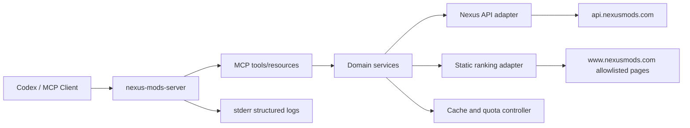

# nexus-mods-server MCP 开发计划

> 状态：MVP 开发与两个硬验收 Case 均已完成
> 编写日期：2026-07-22
> 目标仓库：`GameFinder`
> 目标运行方式：本地 STDIO MCP，后续可扩展为 Streamable HTTP

## 1. 项目目标

开发一个名为 `nexus-mods-server` 的 MCP Server，将 Nexus Mods 的游戏、Mod、文件、依赖、版本、流行度指标和管理操作封装为稳定、结构化、可复用的工具。

它将作为以下工作流的统一数据与操作层：

- `research-nexus-mods`：发现、核验、比较和推荐 Mod。
- 后续安装 Skill：取得文件元数据、依赖和下载信息。
- 后续管理 Skill：检查更新、跟踪、取消跟踪和管理已知 Mod。
- 后续开发 Skill：识别 Loader、依赖、文件结构和作者公开的开发资料。

核心目标不是复制 Nexus 网站，而是提供一组范围明确、证据可追踪、对 Agent 友好的 Nexus 工具。

## 2. 非目标与边界

MVP 不包含：

- 批量镜像或重新托管 Nexus 数据。
- 穷举全部 Mod ID。
- 绕过登录、会员、下载速度或下载授权限制。
- 抓取或执行 Mod 压缩包、DLL、EXE、ASI 等二进制内容。
- 自动安装或执行 Mod。
- 在线游戏作弊部署。
- 逆向依赖于 Nexus 私有前端接口的未文档化协议。

管理与下载能力必须晚于只读研究能力，并采用单独的功能开关和 MCP 工具审批策略。

## 3. 当前凭据验证状态

2026-07-22 的最新本机验证结果：

- 在用户级环境变量中找到 `NEXUS_API_KEY`；没有输出 Key、长度、哈希、账号名、邮箱或用户 ID。
- `GET /v1/users/validate.json` 返回 HTTP `200`，确认当前环境变量中的 Key 有效。
- 账号状态为 `is_premium=false`、`is_supporter=false`。
- 响应头确认每日额度为 `20,000`、每小时额度为 `2,000`。
- `GET /v1/games/eldenring.json` 返回 HTTP `200`，确认游戏元数据读取可用。
- `GET /v1/games/eldenring/mods/trending.json` 返回 HTTP `200` 和 10 条记录，确认基础 Mod discovery 读取可用；测试结束时剩余每日/每小时额度为 `19,999`/`1,999`。
- 这些结果只验证认证和代表性的只读接口，不代表写操作、所有游戏、静态排行榜或实际文件下载均已验证。
- 先前直接发送到对话中的 Key 仍应视为已泄露并保持撤销；本次验证不会比较或记录环境变量中的 Key 是否与其相同。

MCP 运行时必须继续只从本机环境变量读取 Key：

```text
NEXUS_API_KEY
```

Windows 本地开发可以使用安全输入提示写入用户级环境变量，避免 Key 出现在 PowerShell 历史中：

```powershell
$secret = Read-Host "New Nexus API key" -AsSecureString
$pointer = [Runtime.InteropServices.Marshal]::SecureStringToBSTR($secret)
try {
    $plain = [Runtime.InteropServices.Marshal]::PtrToStringBSTR($pointer)
    [Environment]::SetEnvironmentVariable("NEXUS_API_KEY", $plain, "User")
} finally {
    if ($null -ne $pointer) {
        [Runtime.InteropServices.Marshal]::ZeroFreeBSTR($pointer)
    }
    Remove-Variable plain, secret, pointer -ErrorAction SilentlyContinue
}
```

设置后重启 Codex/ChatGPT 桌面端，使 MCP 子进程继承新的用户环境变量。生产或多人使用场景改用专门凭据存储和 Nexus 注册应用/SSO，不依赖用户级环境变量。

Key 不得出现在：

- Git 文件或提交历史；
- `.env` 示例中的真实值；
- MCP 工具参数；
- stdout、stderr、测试快照或错误堆栈；
- Skill 和文档正文。

验证调用：

```http
GET https://api.nexusmods.com/v1/users/validate.json
apikey: <secret>
Application-Name: nexus-mods-server
Application-Version: <semver>
```

验证结果只报告：有效/无效、HTTP 状态、会员能力布尔值和剩余额度；默认不报告账号邮箱、用户 ID 或 Key 回显。

## 4. 关键技术决策

### 4.1 实现语言

采用 TypeScript。

理由：

- Nexus 官方维护 `node-nexus-api`，其类型定义可以作为行为和字段参考。
- MCP 官方 TypeScript SDK 对工具、资源、STDIO 和 Streamable HTTP 支持完整。
- Zod 可以为 MCP 输入、Nexus 响应和内部领域对象提供同一套运行时校验。
- 后续封装为 Codex Plugin 或 npm 包较自然。

### 4.2 MCP SDK 版本

第一版使用并锁定 MCP TypeScript SDK 的最新稳定 `1.x` 版本。

截至 2026-07-22，官方 SDK `main` 分支的 v2 仍标记为 pre-alpha，并说明在 v2 稳定发布前，生产项目继续使用 v1.x。不得直接依赖 v2 pre-alpha。

升级条件：

- v2 发布稳定版本；
- 官方迁移文档完整；
- 工具 schema、transport、annotations 和测试全部通过迁移验证；
- 单独提交迁移，不与业务功能开发混在一起。

### 4.3 Transport

MVP 使用 STDIO：

- 本地 Codex/ChatGPT 桌面端直接启动；
- API Key 仅通过环境变量传入子进程；
- MCP transport 本身不开放固定端口；
- 只有非 Premium 下载授权时，临时绑定 `127.0.0.1` 随机端口并提供一次性本地表单，不监听局域网地址；
- 部署和调试成本最低。

后续按需增加 Streamable HTTP：

- 用于跨设备、远程执行器或公开 Plugin；
- 必须增加 OAuth/受控 Bearer Token、Host 校验、TLS、审计和多用户凭据隔离；
- HTTP transport 不得直接复用本地个人 API Key 模型。

### 4.4 数据获取优先级

固定优先级：

1. Nexus 官方 GraphQL v2：全索引搜索、按 downloads/unique downloads/endorsements 排序、requirements。
2. Nexus 官方 REST v1：认证、游戏、feeds、单个 Mod、文件、changelog 和下载链接。
3. Nexus 服务端渲染的静态排行榜页面，仅作 GraphQL 排名不可用时的降级。
4. Nexus 普通 Mod 页面。
5. 调用方自己的网页搜索能力。

MCP Server 不内置通用搜索引擎。搜索引擎仍由 `research-nexus-mods` Skill 用于语义发现、GitHub、License 和外部文档；MCP 负责 Nexus 结构化数据和受控的站内候选发现。

### 4.5 API 与静态页面的职责

官方 API 用于：

- 游戏身份和 domain 解析；
- GraphQL `mods` 全索引查询、关键词过滤，以及按 downloads、unique downloads、endorsements、createdAt、updatedAt、relevance 排序；
- latest added、latest updated、trending；
- 最近更新 Mod ID；
- 单个 Mod 的描述、版本、状态、作者、下载量、独立下载量、endorsements；
- REST 文件和 Changelog；
- GraphQL `modsByUid.nodes.modRequirements` 下的 DLC requirements、Nexus requirements 和反向依赖；旧 REST `/requirements.json` 实测返回 404，GraphQL 根字段 `modRequirements` 在当前线上 schema 中也不存在，不能使用；
- 后续受控账户操作。

静态排行榜适配器降级用于在 GraphQL `mods` 排名不可用时补足公开候选，例如：

```text
https://www.nexusmods.com/<game-domain>/mods/top
https://www.nexusmods.com/<game-domain>/mods/topalltime?adult=2
```

静态页面只用于取得有界排行榜和候选链接，不进行全站爬取。2026-07-22 实测普通 HTTP 请求该目标 Mod 页面返回 403，因此静态解析器不得作为当前硬验收的唯一通道。

### 4.6 依赖基线

运行时依赖：

```text
@modelcontextprotocol/sdk@1
zod
```

第一版实际锁定 `@modelcontextprotocol/sdk@1.29.0` 和 `zod@4.4.3`。`cheerio`、`lru-cache`、`p-limit` 只在静态降级、缓存或并发模块实际实现时再引入，避免预装未使用依赖。

开发依赖：

```text
typescript
tsx
vitest
eslint
@types/node
```

`package.json` 可以使用兼容范围，但 `pnpm-lock.yaml` 必须提交并锁定实际版本。HTTP 层优先使用当前 Node LTS 的内置 `fetch`；只有出现明确能力缺口时才增加额外 HTTP 库。

## 5. 总体架构



分层要求：

- MCP handler 不直接拼 HTTP 请求。
- Nexus API DTO 不直接作为 MCP 公共 schema 返回。
- 所有外部数据先转换成稳定的领域模型。
- Tool、API adapter、HTML adapter、cache 和认证可单独测试。

## 6. 建议目录结构

```text
nexus-mods-server/
├── package.json
├── pnpm-lock.yaml
├── tsconfig.json
├── vitest.config.ts
├── src/
│   ├── index.ts
│   ├── server.ts
│   ├── config.ts
│   ├── instructions.ts
│   ├── errors.ts
│   ├── logging.ts
│   ├── schemas/
│   │   ├── common.ts
│   │   ├── game.ts
│   │   ├── mod.ts
│   │   ├── file.ts
│   │   └── discovery.ts
│   ├── domain/
│   │   ├── game-service.ts
│   │   ├── mod-service.ts
│   │   ├── discovery-service.ts
│   │   └── management-service.ts
│   ├── nexus/
│   │   ├── api-client.ts
│   │   ├── api-types.ts
│   │   ├── api-mappers.ts
│   │   ├── auth.ts
│   │   ├── quota.ts
│   │   └── urls.ts
│   ├── rankings/
│   │   ├── static-client.ts
│   │   ├── parser.ts
│   │   └── ranking-types.ts
│   ├── cache/
│   │   ├── cache.ts
│   │   └── memory-cache.ts
│   ├── tools/
│   │   ├── system-tools.ts
│   │   ├── game-tools.ts
│   │   ├── discovery-tools.ts
│   │   ├── mod-tools.ts
│   │   └── management-tools.ts
│   └── resources/
│       └── nexus-resources.ts
├── tests/
│   ├── unit/
│   ├── contract/
│   ├── integration/
│   └── fixtures/
└── scripts/
    ├── inspect-server.ts
    └── verify-live-api.ts
```

项目暂不添加 README 之外的重复设计文件；本计划作为实施依据，用户文档在 MCP 可运行后再补充。

## 7. 公共领域模型

### 7.1 所有响应的公共元数据

```ts
type SourceKind = "nexus-rest-v1" | "nexus-graphql-v2" | "nexus-static-page" | "local";

interface ResponseMeta {
  source: SourceKind;
  fetchedAt: string;
  cache: "hit" | "miss" | "bypass";
  coverage?: "complete" | "partial" | "limited";
  warnings: string[];
  quota?: {
    dailyRemaining?: number;
    hourlyRemaining?: number;
  };
}
```

### 7.2 GameRef

```ts
interface GameRef {
  id: number | null;
  name: string;
  domainName: string;
  nexusGameUrl: string;
  modsUrl: string;
}
```

### 7.3 ModSummary

```ts
interface ModSummary {
  gameDomain: string;
  modId: number;
  name: string;
  nexusUrl: string;
  summary: string | null;
  version: string | null;
  author: string | null;
  status: string;
  available: boolean;
  createdAt: string | null;
  updatedAt: string | null;
  metrics: {
    totalDownloads: number | null;
    uniqueDownloads: number | null;
    endorsements: number | null;
    rating: number | null;
  };
}
```

`rating` 在 Nexus 没有提供可核验字段时必须为 `null`，不得从 endorsements 推导。

### 7.4 DiscoveryResult

```ts
interface DiscoveryResult {
  game: GameRef;
  channelsAttempted: string[];
  channelsSucceeded: string[];
  coverage: "complete" | "partial" | "limited";
  candidates: Array<ModSummary & {
    discoveredBy: string[];
    rank?: number;
    rankScope?: string;
  }>;
  meta: ResponseMeta;
}
```

`coverage` 是研究 Skill 判断能否声称“全站最佳”的关键字段。

## 8. MCP Tools 设计

工具名使用稳定的动词加对象形式，不在工具名重复 server namespace；MCP 客户端通常会自动带上 server 前缀。

每个工具同时返回：

- 与公开 schema 一致的 `structuredContent`，供 Agent 稳定消费；
- 简短的 `content` 文本摘要，供不支持 structured content 的客户端和人工调试使用。

两种返回中的事实必须一致。长描述、HTML 和大列表只在明确请求时返回，并受长度与分页限制。

### 8.1 系统与认证工具

#### `health_check`

用途：检查进程、配置、API 连接和静态页面适配器状态。

输入：无。

输出：

- server version；
- transport；
- API Key 是否配置；
- API Key 是否已验证；
- API/静态页面连接状态；
- quota；
- 功能开关。

不得输出 Key、邮箱或完整账户信息。

Annotations：

```text
readOnlyHint: true
destructiveHint: false
idempotentHint: true
openWorldHint: true
```

#### `validate_credentials`

用途：显式调用 Nexus Key 验证端点并刷新认证状态。

输入：无。Key 只能来自环境变量或未来的凭据存储。

输出：有效状态、Premium/Supporter 布尔值和 quota。

### 8.2 游戏工具

#### `resolve_game`

输入：

```json
{
  "gameUrl": "https://www.nexusmods.com/games/eldenring"
}
```

行为：

- 只接受 `https://www.nexusmods.com/games/<slug>`；
- 去除 query、fragment 和结尾 `/`；
- 从官方 API 游戏列表/详情确认 `domainName`；
- 返回 `GameRef`；
- 不接受 Mod 页面作为游戏身份。

#### `list_games`

输入：可选的 `query`、`limit`、`cursor`。

行为：从官方游戏列表中本地过滤和分页；不把完整游戏列表一次性塞入模型上下文。

#### `get_game`

输入：`domainName`。

输出：游戏详情、分类、Mod 数、文件数和下载统计。

### 8.3 候选发现工具

#### `list_latest_added`

输入：`domainName`、可选 `limit`。

来源：官方 API。

#### `list_latest_updated`

输入：`domainName`、可选 `limit`。

来源：官方 API。

#### `list_trending`

输入：`domainName`、可选 `limit`。

来源：官方 API。

#### `list_recently_updated`

输入：

```json
{
  "domainName": "eldenring",
  "period": "1d | 1w | 1m",
  "hydrate": true,
  "limit": 50
}
```

`hydrate=false` 只返回 Mod ID 与活动时间；`hydrate=true` 在并发和额度限制下批量取得详情。

#### `search_mods` / `list_ranked_mods`

输入：

```json
{
  "gameUrl": "https://www.nexusmods.com/games/eldenring",
  "query": "utility trainer menu",
  "sort": "downloads | unique_downloads | endorsements | updated | created | relevance",
  "offset": 0,
  "count": 30
}
```

主来源：Nexus GraphQL v2 `mods` 全索引。省略 `query` 并按 downloads/unique downloads/endorsements 排序时，可得到明确的全游戏排名口径；给出 `query` 时，排名口径必须声明为“匹配查询集合内”。

要求：

- 返回 `rankScope`、`coverage=full-index-query` 和 `totalCount`；
- 不把 endorsement 排名说成下载排名；
- relevance 只用于语义候选，不作为社区采用度；
- GraphQL 失败后才允许进入静态排行榜降级，并将 `coverage` 改为 `partial`；
- 单次最多返回 50 条，不自动遍历整个索引。

#### `discover_mods`

这是面向研究 Skill 的聚合工具。当前线上 GraphQL 已提供 `mods` 全索引搜索，但关键词匹配语义仍由 Nexus schema 决定，不得宣传成无遗漏的自然语言语义搜索。

输入：

```json
{
  "gameUrl": "https://www.nexusmods.com/games/eldenring",
  "channels": ["trending", "latest-updated", "all-time-ranked"],
  "keywords": ["all in one", "utility", "framework"],
  "maxCandidates": 40,
  "includeAdult": false
}
```

行为：

1. 调用 GraphQL 全索引搜索/排名和指定的 REST feeds；只有 GraphQL 不可用时才调用静态排行榜。
2. 按 `(domainName, modId)` 去重。
3. 对已取得的名称和摘要执行本地关键词过滤或加权。
4. 保留每个候选的 `discoveredBy`。
5. 区分 `full-index-query`、`feed-only` 和 `partial-static-fallback`，不把关键词命中集合说成整个游戏的全部相关 Mod。

### 8.4 Mod 核验工具

#### `get_mod`

输入：`domainName`、`modId`。

输出：完整描述、状态、版本、作者、时间、下载量、独立下载量、endorsements、requirements 摘要和 canonical URL。

#### `get_mod_files`

输入：`domainName`、`modId`、可选文件类别过滤。

输出：文件 ID、名称、版本、类别、大小、上传时间、主文件标记和病毒扫描元数据。

不得返回或自动访问实际下载 URL。

#### `get_mod_changelogs`

输入：`domainName`、`modId`。

输出：按版本规范化的 changelog。

#### `get_mod_requirements`

输入：canonical Mod URL。内部先取得 Nexus game ID，计算 UID，再查询 GraphQL `modsByUid.nodes.modRequirements`。

输出：Nexus requirements、DLC requirements 和依赖方向。

### 8.5 管理工具：后续阶段

以下工具不进入只读 MVP：

- `get_download_links`
- `track_mod`
- `untrack_mod`
- `endorse_mod`
- `abstain_mod`

当前实测账号不是 Premium。Nexus 官方客户端说明：非 Premium 用户调用下载链接接口时，还需要 Nexus 网站“Download with Manager”生成的短期 `key` 和 `expires`；Premium 用户可省略这两个参数。因此：

- `validate_credentials` 必须将 Premium 状态转换为明确的下载能力标志，不能只返回“认证成功”；
- 普通账号不得被标记为支持无交互自动下载；
- 普通账号的后续下载流程需要本地 NXM 协议接收器或等价的受控浏览器交接，从网站接收短期授权参数；
- 短期下载授权不得要求用户粘贴到对话，也不得进入模型可见日志；
- 在安全的本地交接机制完成前，`get_download_links` 对普通账号返回结构化的 `interactive_download_authorization_required`，并提供 Nexus 文件页而非伪造下载 URL。

开放前必须：

- 单独的 `NEXUS_ENABLE_ACCOUNT_WRITES=true` 功能开关；
- 正确的 MCP write annotations；
- Codex 默认 approval mode 设置为 `writes` 或更严格；
- 每次 mutation 返回 Nexus 实际确认结果；
- 对网络超时后的“不确定是否成功”进行显式处理；
- 为 endorse/abstain 提供清晰的人类可读确认信息。

MCP 不直接实现“安装到游戏目录”；文件下载、校验、解压和部署应由独立安装层负责。

## 9. MCP Resources

首版可以提供以下只读资源：

```text
nexus://status
nexus://games/{domainName}
nexus://mods/{domainName}/{modId}
nexus://mods/{domainName}/{modId}/files
```

Resources 适合重复读取的稳定快照；需要参数化过滤、分页或账户写入的行为继续使用 Tools。

首版不注册 MCP prompts。研究流程已经由 `research-nexus-mods` Skill 管理，避免在 Skill 与 MCP 两处重复维护同一工作流。

## 10. Server instructions

MCP 初始化时提供精简 `instructions`，前 512 字符必须包含最关键规则：

```text
Use Nexus API tools for authoritative game, mod, file, dependency, version, download, and endorsement metadata. Use discovery results only within their declared coverage and ranking scope. Never treat search order as popularity, infer missing metrics, or expose credentials. Account mutations and download-link tools require explicit user intent and may be disabled. Respect quota warnings and prefer cached read-only calls.
```

Skill 负责高层研究判断，MCP instructions 负责跨工具的不变量、额度和安全约束。

## 11. URL 与输入校验

必须实现：

- 仅允许 HTTPS Nexus 域名。
- 游戏主页只允许 `www.nexusmods.com/games/<slug>`。
- Mod URL 规范化为 `https://www.nexusmods.com/<domainName>/mods/<modId>`。
- `domainName` 只允许 API 已知的 domain，不把任意字符串拼入请求。
- `modId`、`fileId` 必须是安全范围内的正整数。
- `limit` 设置保守上限。
- 不接受调用方传入任意抓取 URL，防止 SSRF。
- HTML adapter 只能访问硬编码 host 和 path 模板。

## 12. Nexus API Client

### 12.1 请求头

所有请求包含：

```text
apikey: <from secret provider>
Application-Name: nexus-mods-server
Application-Version: <package version>
Accept: application/json
User-Agent: nexus-mods-server/<version>
```

### 12.2 Timeout 与 Retry

建议默认：

- 连接/总请求 timeout：15 秒；
- 只对 GET 的瞬时网络错误和 5xx 重试；
- 最多 2 次重试，指数退避并带 jitter；
- 401/403/404/422 不重试；
- 429 读取额度/重置提示并快速失败，不做密集自动重试；
- mutation 不自动重试，防止重复写入。

### 12.3 并发

- 默认 API 并发上限 4；
- hydrate 批量详情采用有界队列；
- quota 较低时自动降低并发或停止扩展候选；
- 每个工具设置最大下游请求预算并在响应中报告。

### 12.4 错误模型

统一错误码：

```text
AUTH_MISSING
AUTH_INVALID
RATE_LIMITED
NOT_FOUND
UNAVAILABLE
VALIDATION_ERROR
UPSTREAM_TIMEOUT
UPSTREAM_PROTOCOL_ERROR
STATIC_PAGE_CHANGED
FEATURE_DISABLED
MUTATION_OUTCOME_UNKNOWN
```

返回对 Agent 有用的恢复建议，但不得附带秘密请求头或完整上游响应。

## 13. Cache 策略

MVP 使用进程内 LRU + TTL：

| 数据 | 建议 TTL |
|---|---:|
| 游戏列表 | 24 小时 |
| 游戏详情/分类 | 1 小时 |
| latest/trending feeds | 5 分钟 |
| 最近更新 ID | 5 分钟 |
| Mod 详情 | 5 分钟 |
| 文件/requirements/changelog | 10 分钟 |
| 静态排行榜第一页 | 10 分钟 |
| 凭据验证 | 15 分钟或遇到 401 前 |

规则：

- 所有结果返回 `fetchedAt` 和 cache 状态。
- 兼容性研究可使用 `fresh=true` 绕过业务缓存，但仍受额度控制。
- 不能把错误响应缓存为正常数据。
- 404 可短暂 negative-cache 1 分钟，防止重复探测。
- 第一版不持久化含用户状态的数据。

## 14. 静态排行榜降级适配器

实现原则：

- 使用普通 HTTP + HTML parser，不引入浏览器内核。
- 仅解析服务器已经返回的标题、排名、摘要、日期、类别、endorsement 和 Mod 链接。
- 保存脱敏 HTML fixture 做回归测试。
- 使用结构与语义双重选择器，避免只依赖 CSS class。
- 检查页面标题、排名标题和链接 domain。
- 页面出现登录墙、空列表或结构变化时立即返回 `STATIC_PAGE_CHANGED`。
- 一个请求失败后不自动启动 headless browser。
- 不读取登录 Cookie，不绕过成人内容或账号偏好。

该适配器是 GraphQL 排名失效后的可选降级，不是当前核心发现或详情来源，也不阻塞两个用户指定硬验收 Case。

## 15. 安全与隐私

### 15.1 Secret 管理

- Key 通过 `NEXUS_API_KEY` 环境变量传给 STDIO 子进程。
- Codex 配置使用 `env_vars = ["NEXUS_API_KEY"]`，不在 TOML 写真实 Key。
- 日志层对 header 名 `apikey`、`authorization`、`cookie` 强制脱敏。
- 测试使用伪造 Key；live test 只在显式环境开关下执行。
- CI 不运行个人 Key 集成测试。

### 15.2 数据与操作边界

- 默认只读。
- 不返回账号邮箱和不必要的用户资料。
- 不接受任意 URL。
- 不下载和执行文件。
- 不自动调用账户 mutation。
- 不帮助在多人/在线环境部署作弊工具。

### 15.3 API 政策

- 不批量抓取并重新托管 Nexus 数据。
- 不用个人 Key 支撑公开服务。
- 公开发行前向 Nexus 注册应用并实现用户授权/SSO。
- 在响应和日志中保留可审计的请求数量与额度状态。

## 16. Codex 集成方案

本地开发期的项目级配置示例：

```toml
[mcp_servers.nexus-mods]
command = "node"
args = ["C:/absolute/path/to/nexus-mods-server/dist/index.js"]
cwd = "C:/absolute/path/to/nexus-mods-server"
env_vars = ["NEXUS_API_KEY"]
startup_timeout_sec = 10
tool_timeout_sec = 60
required = false
default_tools_approval_mode = "writes"
```

在 Windows 上应使用实际 Node 绝对路径，避免 PATH 不一致。

本地验证：

```text
codex mcp list
/mcp
```

配置保存后重启桌面端或 IDE extension。

后续封装为 `game-mod-toolkit` Plugin 时：

- Plugin 提供 MCP Server 的安装/配置元数据；
- 三个 Skill 共享 MCP 工具；
- Skill 不直接接触 API Key；
- MCP 工具名和响应 schema 保持向后兼容。

## 17. 日志与可观测性

STDIO 模式下：

- stdout 只能输出 MCP/JSON-RPC 协议消息；
- 所有日志写 stderr；
- 默认日志级别 `info`，可用 `NEXUS_MCP_LOG_LEVEL` 调整；
- 日志使用结构化 JSON 或一致的 key-value 形式。

记录：

- request/tool correlation ID；
- 工具名；
- Nexus endpoint 模板，不记录 Key；
- HTTP status；
- latency；
- retry count；
- cache hit/miss；
- quota remaining；
- candidate/request 数量。

不记录：

- Key、Authorization、Cookie；
- 完整账号对象；
- 下载签名 URL；
- Mod 长描述全文。

## 18. 测试策略

### 18.1 Unit tests

- URL normalization 和 game URL 拒绝规则。
- Zod 输入限制。
- API DTO 到领域模型映射。
- null/缺失字段处理。
- quota header 解析。
- retry 分类。
- cache TTL 和 key。
- Mod URL 构造。
- Discovery 去重和 `discoveredBy` 合并。
- coverage 计算。
- 日志脱敏。

### 18.2 Contract tests

使用脱敏 fixture 模拟：

- `/users/validate`；
- games list/info；
- latest/trending/recent feeds；
- mod info；
- files、changelogs、requirements；
- 401、403、404、422、429、5xx；
- 缺失 download/endorsement 字段。

确保上游字段变化会产生明确失败，而不是静默生成错误数据。

### 18.3 Static HTML parser tests

- 当前 top page fixture。
- all-time page fixture。
- 空列表、登录墙、成人过滤提示。
- DOM class 改名但语义标题仍存在。
- 完全结构变化触发 `STATIC_PAGE_CHANGED`。

### 18.4 MCP protocol tests

- initialize 和 instructions。
- tools/list。
- resources/list 和 read。
- 每个 tool 的有效与无效输入。
- structured content 与文本摘要一致。
- stdout 无非协议日志。
- SIGINT graceful shutdown。

使用 MCP Inspector 或官方 SDK client 运行端到端测试。

### 18.5 Live integration tests

只在以下条件全部满足时运行：

```text
NEXUS_API_KEY is configured
NEXUS_RUN_LIVE_TESTS=true
```

Live smoke test：

1. `validate_credentials`
2. `resolve_game` for a stable public game URL
3. `list_trending`
4. 对一个返回的 Mod 调用 `get_mod`
5. 检查生成 URL、指标和 quota

测试不得下载文件或执行账户写入。

### 18.6 Skill integration tests

使用新的独立 Session 测试：

```text
Use $research-nexus-mods with an exact Nexus game URL to find a versatile mod.
```

验收：

- 先调用 `resolve_game`；
- 至少使用 API discovery 和 ranked discovery 中可用的通道；
- 报告真实 coverage；
- 用 `get_mod` 核验 finalists；
- 不把搜索摘要当成核心证据；
- API 不可用时明确降级。

### 18.7 用户指定的端到端硬验收 Cases

以下两个 Case 是当前开发 Goal 的硬门槛。只通过单元测试、mock、metadata 请求或 MCP initialize，不算项目完成。

#### Case 1：为 `research-nexus-mods` 提供研究数据

测试必须在一个没有继承本开发 Session 结论的新 Codex Session 中运行。建议使用与 Case 2 相同的游戏，输入：

```text
Use $research-nexus-mods for https://www.nexusmods.com/games/eldenring and find versatile, currently usable, and development-reference mods.
```

验收条件：

1. 新 Session 能发现并启动项目配置中的 `nexus-mods-server`。
2. Skill 先用 MCP 校验游戏身份，再取得候选列表、排行榜口径和代表性 Mod 的权威元数据。
3. Finalists 至少经过 Mod 详情、文件和 requirements 核验；存在 changelog 时一并取得。
4. 输出满足 `research-nexus-mods` 的固定 report contract，包括 canonical Mod URL、功能摘要、实现/框架证据、社区采用度、通用性和开发参考价值。
5. Nexus 候选、下载量、endorsements、版本、文件和 requirements 不以搜索引擎摘要作为主要证据；只有 API/MCP 未覆盖的作者源码、许可证或页面语义才允许使用浏览器补充。
6. 报告明确 observation time、source、coverage、warnings 和证据缺口，不把 trending、搜索顺序或 endorsement 排名误写成下载量排名。
7. MCP 调用失败时 Skill 明确降级；MCP 正常时不得无理由退回“搜索引擎优先”。
8. 独立 Session 产出可由人工复核，且其中至少三个 Nexus canonical links 能正常打开并对应同一游戏。

#### Case 2：完整下载 Elden Ring Mod 9531

固定目标：

```text
https://www.nexusmods.com/eldenring/mods/9531
```

“完整、正常下载”定义为：从 Mod URL 解析身份，选择可下载文件，取得 Nexus 授权下载 URL，将完整 archive 写入用户指定目录，并完成可验证的下载收据。它不包含解压、执行或安装到游戏目录。

文件选择规则：

1. 如果用户给出 `fileId`，严格下载该文件。
2. 未给出 `fileId` 时，选择未归档、未删除、可下载的最新 `MAIN` 文件。
3. 如果不存在唯一合理的 `MAIN` 文件，工具返回候选文件，不擅自选择 optional/old/miscellaneous 文件。

当前账号是非 Premium，因此验收必须覆盖 Nexus 官方要求的交互式 NXM 授权：

1. `prepare_download` 返回目标 Mod、选定文件、预期文件名/大小、账号 capability 和 `interactive_download_authorization_required`。
2. MCP 提供本地、短时、一次性的 NXM 授权接收流程，或安全的等价浏览器交接；用户在 Nexus 页面触发“Download with Manager”。
3. 临时 `key`/`expires` 仅在本地受控内存中使用，不出现在对话、MCP tool 参数、stdout/stderr、普通日志、测试快照或下载收据中。
4. `download_mod_file` 使用临时文件写入，支持超时和有限重试；成功后再原子重命名为最终文件。
5. 不静默覆盖同名文件；默认失败或生成不冲突的安全文件名。
6. 成功条件同时包括：最终文件存在且非空、实际字节数与 Nexus 文件元数据/HTTP 响应一致（若上游提供）、计算 SHA-256、没有残留 `.part` 文件，并返回 canonical Mod URL、`modId`、`fileId`、文件名、字节数、SHA-256、完成时间和目标绝对路径。
7. 对 ZIP 等可安全识别的 archive 进行只读完整性检查；未知或缺少本地解析器的格式只报告 magic/extension，不执行内容。
8. 401/403、授权过期、用户取消、磁盘不足、校验不一致和网络中断都返回结构化错误，不能把部分文件报告为成功。
9. 验收产物写入 `.codex-work/acceptance-downloads/eldenring/mod-9531/`，不加入 Git；测试结束后向用户报告是否保留以及如何删除。

Case 2 的测试可以消耗少量 Nexus API 配额并产生真实下载流量，但不得执行下载内容、改动游戏目录或绕过 Nexus 的会员、授权和速度规则。

### 18.8 2026-07-22 验收执行记录

#### 自动化、协议与 live API

- `pnpm check`：通过。
- `pnpm test`：3 个测试文件通过、1 个 live 文件在普通测试中按设计跳过；10 项通过、3 项跳过。
- `pnpm build`：通过。
- STDIO 官方 SDK client smoke：通过；发现 13 个工具，`validate_credentials` 与目标 Mod 的 `get_mod` live 调用成功。
- 显式 live suite：3/3 通过，覆盖有效凭据、目标 Mod 9531、MAIN 文件 47215、Shadow of the Erdtree DLC requirement、GraphQL 全索引搜索，以及非 Premium 直接下载被分类为 `DOWNLOAD_AUTH_REQUIRED`。
- `pnpm audit --prod`：无已知漏洞；传递依赖 `@hono/node-server` 固定为 2.0.11。

#### Case 1：PASS

使用当前桌面端所配置的 Codex CLI 启动全新的 ephemeral、read-only Session，并从项目根目录冷加载 `.codex/config.toml` 与个人目录中的 `research-nexus-mods`。该 Session 没有继承开发 Session 的候选结论。

实际成功调用：

- `health_check` ×1；
- `resolve_game` ×1；
- `search_mods` ×23；
- `list_feed_mods` ×2；
- 对 5 个入围候选分别调用 `get_mod`、`get_mod_files`、`get_mod_requirements`、`get_mod_changelogs`，各 ×5。

所有强制 MCP 调用均返回 `ok=true`。Session 生成完整中文报告，包含 canonical links、功能、实现框架证据、社区指标、可用性、通用性、开发参考价值、coverage、rank scope、warnings、证据缺口和安全边界；网页只用于补充源码、许可证与官方版本信息。没有调用任何下载工具。

验收报告保存在 `.codex-work/acceptance-research/cold-session-final.md`，该目录不加入 Git。此前通过当前任务子代理进行的测试因工具目录不会重新加载项目 MCP，只得到降级报告，已明确判定为无效尝试，不计入 PASS。

#### Case 2：PASS

已通过真实 metadata 路径确认：

- canonical Mod：`https://www.nexusmods.com/eldenring/mods/9531`；
- Mod：`Elden_Ring_game_tools`，版本 1.3.1；
- 自动选择的最新可用 MAIN：fileId `47215`；
- 文件名：`ErdGameTools 20260607-9531-1-3-1-1780798908.zip`；
- Nexus 元数据大小：1,474,885 bytes。

真实验收记录：

1. 第一次尝试验证了未登录时的安全超时路径：loopback-only、一次性 NXM 接收 Session 以 `authorization_timeout` 结束，没有下载 archive 字节，也没有泄漏临时 `key`/`expires`。
2. 第二次尝试成功取得 NXM 授权并开始真实下载，但暴露出验收客户端仍使用 MCP SDK 默认 60 秒请求超时；普通账号限速下写入 621,772 字节后客户端终止子进程。验收脚本随后把长下载请求超时改为 30 分钟，并在启动和退出时定向清理专用验收目录中的孤立 `.part`。修改后 typecheck、10 项测试和 build 全部通过。
3. 第三次尝试使用新的短期 NXM 授权成功完成真实下载。最终 archive 为 1,474,885 bytes，和 Nexus 元数据完全一致；SHA-256 为 `f3e339ea655b5eba4173f401005baef68506fa125de0b823dd27a733f94e4abd`。
4. 下载器和独立 PowerShell 复核均确认 ZIP 有效；独立读取到 39 个 ZIP entries，且最终目录中 `.part` 数量为 0。
5. 下载收据包含 canonical Mod URL、domain、modId、fileId、文件名、字节数、SHA-256、完成时间、目标绝对路径与 archive check。临时 `key`/`expires` 未进入对话、MCP 参数、状态文件或收据。

验收产物保存在 `.codex-work/acceptance-downloads/eldenring/mod-9531/`，包括真实 ZIP、`.nexus-receipt.json` 和 `acceptance-status.json`；该目录不加入 Git，也未解压、执行或安装文件。

## 19. 开发阶段与验收标准

### Phase 0：项目基线与技术验证

交付：

- TypeScript/pnpm 工程；
- 锁定稳定 MCP SDK 1.x；
- lint、typecheck、test、build；
- API Key 环境变量读取和脱敏测试；
- ADR 或本计划中的决策得到确认。

验收：空 Server 能通过 MCP initialize/list tools，并且 stdout 无日志污染。

预计：0.5-1 人日。

### Phase 1：认证、健康检查与 API Core

交付：

- `health_check`；
- `validate_credentials`；
- HTTP client、timeout、retry、quota、errors；
- Game URL/domain normalization；
- `resolve_game`、`list_games`、`get_game`。

验收：有效/无效/缺失 Key 都产生稳定且不泄密的结果。

预计：1-2 人日。

### Phase 2：只读 Mod 数据

交付：

- latest added/updated/trending/recent；
- `get_mod`；
- `get_mod_files`；
- `get_mod_changelogs`；
- `get_mod_requirements`；
- cache 和领域 schema。

验收：可从一个游戏 URL 得到候选列表并完整核验单个 Mod。

预计：2-3 人日。

### Phase 3：排行榜与聚合发现

交付：

- GraphQL `search_mods` / `list_ranked_mods`；
- `discover_mods`；
- coverage 计算；
- 可选静态排行榜 parser fixtures/circuit breaker。

验收：可在整个游戏索引或关键词匹配集合内按指定指标排序，返回真实 `rankScope` 与 `totalCount`；静态降级若实现，页面变化时必须安全失败。

预计：2-3 人日。

### Phase 4：Codex 与 Skill 集成

交付：

- 项目级 MCP 配置示例；
- `research-nexus-mods` 改为 MCP-first SOP；
- 独立 Session forward tests；
- 报告 contract 与 MCP schema 对齐。

验收：研究 Skill 不再主要依赖搜索引擎取得 Nexus 候选和指标。

预计：1-2 人日。

### Phase 5：管理基础

交付：

- download metadata/link 的受控接口；
- `prepare_download`、本地 NXM 一次性授权接收、`download_mod_file` 和下载收据；
- 临时文件、原子重命名、SHA-256、大小核验和安全 archive 检查；
- tracked mods 读取；
- 可选 track/untrack；
- mutation feature flag、approval annotations 和审计；
- mutation 不确定结果处理。

验收：默认研究工具仍是纯只读；所有账户写操作都需要显式启用和用户意图；用户指定的 Case 2 在非 Premium 账号条件下完整通过。

预计：2-4 人日。

### Phase 6：Plugin 与远程能力

交付候选：

- 打包进 `game-mod-toolkit` Plugin；
- Nexus 注册应用与 SSO；
- 可选 Streamable HTTP；
- 多用户凭据隔离、TLS、OAuth、Host 校验和部署文档。

该阶段只有在本地 STDIO 版本稳定且确有跨设备需求时启动。

## 20. CI 与发布

CI 必须运行：

```text
pnpm install --frozen-lockfile
pnpm lint
pnpm typecheck
pnpm test
pnpm build
```

发布要求：

- npm/package version 使用 SemVer；
- tool schema 的 breaking change 必须升 major；
- 新增只读字段通常为 minor；
- 错误修复为 patch；
- 构建产物可通过绝对 Node 路径启动；
- package 不包含 `.env`、fixtures 中的真实账号信息或 Key。

## 21. 风险与缓解

| 风险 | 影响 | 缓解 |
|---|---|---|
| Nexus API schema 改变 | 数据映射失败 | Runtime validation、contract fixtures、类型化错误 |
| MCP SDK v2 尚未稳定 | API churn | 锁定稳定 1.x，单独安排迁移 |
| GraphQL 搜索 schema 改变 | 全索引 discovery 降级 | 类型化 schema 错误、REST feeds、可选静态排行榜、coverage=partial |
| 静态排行榜被移除或返回 403 | 次级降级不可用 | 不阻塞 GraphQL 主路径，保留 REST feeds 并明确 coverage |
| API Key 泄漏 | 账号与额度风险 | env/secret store、日志脱敏、无 tool 参数、无仓库文件 |
| Rate limit | 工具调用失败 | TTL cache、批量预算、有界并发、返回 quota |
| 搜索结果不完整 | 过强“最佳”结论 | coverage 和 rankScope 强制输出 |
| mutation 超时 | 不确定是否写入 | 不自动重试、返回 `MUTATION_OUTCOME_UNKNOWN` |
| Windows PATH 差异 | MCP 无法启动 | config 使用 Node 与 dist 文件绝对路径 |
| stdout 日志污染 | MCP 协议中断 | 日志只写 stderr，加入自动测试 |

## 22. 完成定义

当前 Goal 被认为完成，必须同时满足：

- API Key 缺失、有效、无效和限流路径均经过测试。
- 研究所需的游戏、列表、Mod、文件、依赖和 changelog 工具可用。
- GraphQL 全索引搜索和 all-game 指标排序经过 live test；静态排行榜仅为可选降级。
- 每个响应包含 source、fetchedAt、cache 和 warnings。
- Discovery 返回 coverage 与发现通道。
- 不泄漏凭据和账号隐私字段。
- MCP Inspector/官方 client 端到端通过。
- Codex 能通过项目配置发现工具。
- `research-nexus-mods` 的独立 Session 测试成功。
- 用户指定的 Case 1 满足第 18.7 节全部研究验收条件。
- 用户指定的 Case 2 对 `https://www.nexusmods.com/eldenring/mods/9531` 完成真实 archive 下载、大小/哈希核验和下载收据；仅取得 metadata 或临时 URL 不算成功。
- 文档、Skill、MCP schema 不互相矛盾。

## 23. 后续增强候选

以下项目不属于本次两个硬验收 Case 的未完成项：

1. 将本地页面命名调整为“NXM 临时凭据接收器”，减少它与 Nexus 登录/OAuth 页面的概念混淆。
2. 在后续 `game-mod-toolkit` Plugin 中提供可选的 NXM bridge 或浏览器 Native Messaging，实现一键交接；当前 loopback 页面继续作为无安装 fallback。
3. 检测并兼容 Vortex 已注册的 `nxm://` 协议处理器，不静默覆盖系统关联。
4. 需要远程或多用户部署时，再增加 Streamable HTTP、OAuth/SSO、凭据隔离、TLS 和审计。
5. 若 GraphQL 主发现路径将来不可用，再实现和维护静态排行榜 parser；当前 REST feeds 与明确 coverage 仍作为有界降级。

## 24. 主要依据

- [Codex MCP 配置与支持能力](https://developers.openai.com/codex/mcp/)
- [MCP 官方 TypeScript SDK](https://github.com/modelcontextprotocol/typescript-sdk)
- [MCP Server Guide](https://github.com/modelcontextprotocol/typescript-sdk/blob/main/docs/server.md)
- [Nexus Mods API 文档](https://api-docs.nexusmods.com/)
- [Nexus Mods 官方 Node API Client](https://github.com/Nexus-Mods/node-nexus-api)
- [Nexus API Client 方法](https://github.com/Nexus-Mods/node-nexus-api/blob/master/src/Nexus.ts)
- [Nexus Mod/API 字段类型](https://github.com/Nexus-Mods/node-nexus-api/blob/master/src/types.ts)
- [Nexus API Acceptable Use Policy](https://help.nexusmods.com/article/114-api-acceptable-use-policy)
- [Nexus API Rate Limits](https://help.nexusmods.com/article/105-i-have-reached-a-daily-or-hourly-limit-api-requests-have-been-consumed-rate-limit-exceeded-what-does-this-mean)
