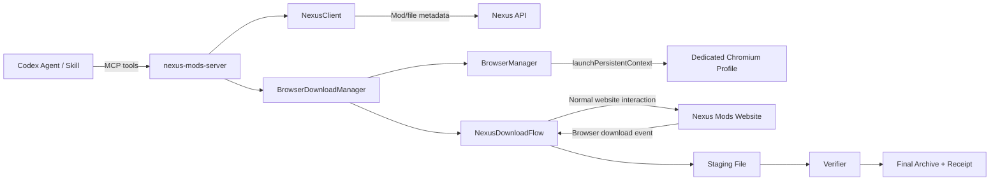
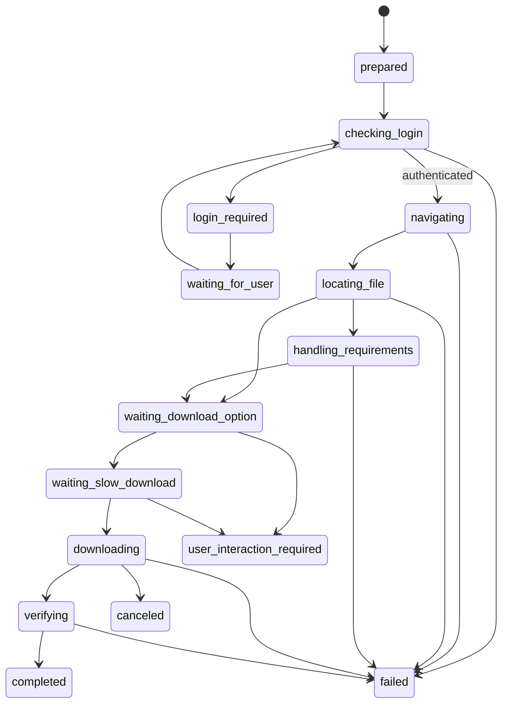

# Nexus Mods 专用持久化 Chromium 下载后端开发计划

> 状态：Phase 0–4 已实现并通过本地验收；Phase 5 真实 Nexus 下载验收尚未开始
> 编写日期：2026-07-24
> 目标项目：`nexus-mods-server`
> 目标运行环境：Windows、本地单用户、STDIO MCP、Node.js 20+
> 首个真实验收目标：Elden Ring Mod 9531 / File 47215

> 跨机器环境与首次登录说明：[`nexus-mods-server/README.md`](../nexus-mods-server/README.md)

## 当前阶段实施与验收记录（2026-07-24）

- Playwright 锁定为 `1.61.1`，当前机器已安装匹配的 headed Chromium `149.0.7827.55` / build `1228`。
- 跨机器安装命令为 `pnpm setup:browser`，内部使用 `playwright install --no-shell chromium`；本阶段固定 `headless: false`，不下载无用的 headless shell。
- 默认专用 Profile 为 `%LOCALAPPDATA%\GameFinder\nexus-browser-profile`，仓库内 Profile 路径会被拒绝；单进程锁、异常关闭处理和 server close 清理已实现。
- 使用全新一次性 Profile 对真实 Nexus 页面完成未登录烟测，正确进入 `waiting_for_user` / `login`，没有读取或输出账号、Cookie、token 或页面正文。
- 当前默认专用 Profile 在 PC-1 命令中已返回 `authenticated`。为避免破坏已有登录状态，没有清空 Profile 重演账号输入。
- PC-2 已通过：新进程重新打开同一个 Profile 后仍返回 `authenticated`。
- headed Chromium Profile 集成测试已通过：测试数据在浏览器关闭、重新启动后仍存在。
- 真实 Chromium 子进程经 STDIO MCP 启动后 framing 完整；Phase 4 后共 17 个工具可正常列出与调用。
- Phase 3 本地 HTML fixture 已覆盖 `Manual → Requirements → Standard → Slow → download event → saveAs()` 全流程。
- Direct Standard Download 在点击前注册 download event，验证不会因事件时序丢失下载。
- 已覆盖重复 `fileId` 容器、仅 Resumable、Cloudflare/CAPTCHA 和最终点击前取消等异常分支。
- 对真实 Mod 9531 页面进行只读探测时，当前页面处于 Cloudflare 验证中；控制器正确映射为 `CAPTCHA_REQUIRED`，没有绕过或点击。
- Phase 4 已把页面控制器接入 prepared session，新增异步 `start_download`、统一 `get_download_status` 与 `cancel_download`。
- `prepare_download` 新增显式 `backend`，默认仍为 `native`，`persistent_chromium` 为 opt-in，原有 native/NXM 调用语义保持兼容。
- browser/native 已共用 `download-verifier.ts`：统一验证预期字节数、SHA-256、ZIP/7z/RAR 基础完整性、文件名、最终路径和 no-overwrite receipt。
- 浏览器长任务在 MCP 进程内后台执行；MCP 协议测试已覆盖 `prepare → start → status → completed`，Manager 测试已覆盖 CAPTCHA 人工接管、取消和单活跃任务约束。
- Phase 4 自动化验收通过：TypeScript 校验、59 项 Vitest（48 通过、11 个显式 opt-in 跳过）以及共享校验器和 MCP 链路测试均通过。
- 本阶段没有执行真实 Mod 下载，也没有实现 Mod 安装。

可复现命令和环境变量见项目 [`README.md`](../nexus-mods-server/README.md)。

## 1. 决策摘要

为 `nexus-mods-server` 增加一个由 MCP 自己管理的专用持久化 Chromium 下载后端。

该后端不复用用户日常 Chrome 的 Profile，也不读取 Vortex 登录信息。MCP 使用 Playwright 启动一个独立的 Chromium Profile；用户首次在可见浏览器中手动登录 Nexus Mods，后续登录 Cookie、Local Storage 和网站设置由该 Profile 持久保存。

下载时，Agent 通过 MCP：

1. 使用 Nexus API 验证 Mod、选择 `fileId` 并取得预期文件元数据；
2. 启动或复用专用 Chromium；
3. 检查 Nexus 网页登录状态；
4. 打开精确文件页面；
5. 按正常网页流程点击 `Manual Download`、处理 Requirements 提示、等待并点击 `Slow Download`；
6. 使用 Playwright 的下载事件接收文件；
7. 把文件保存到指定输出目录的临时位置；
8. 校验字节数、SHA-256 和压缩包完整性；
9. 原子暴露最终文件并生成非敏感下载收据。

首版默认选择网页提供的标准下载，不使用浏览器可恢复下载，不使用 NXM，不依赖 Vortex，也不解析 Nexus Cookie、OAuth token、完整下载 URL 或 CDN 临时参数。

现有本地 NXM 授权页和原生下载后端暂不删除，作为兼容回退路径保留。

## 2. 背景与问题定义

当前 `nexus-mods-server` 已经能够：

- 使用 Nexus API 验证游戏、Mod 和文件；
- 为 Premium 账号直接请求下载链接；
- 为非 Premium 账号创建本地授权页；
- 接收用户粘贴的短期 `nxm://` 授权；
- 下载文件到指定绝对目录；
- 校验字节数、SHA-256 和压缩包结构；
- 生成下载收据；
- 完成 Elden Ring Mod 9531 / File 47215 的真实端到端验收。

当前非 Premium 流程的问题不是下载器本身，而是短期授权的取得方式：

```text
用户打开 Nexus 文件页
→ 找到匹配文件
→ 复制完整 nxm:// 链接
→ 打开本地授权页
→ 粘贴并提交
→ MCP 才能继续下载
```

该流程技术上可用，但用户体验不自然，也把“正常网页上点击几次即可完成的操作”转换成了人工搬运临时凭据。

持久化 Chromium 后端把授权责任交还给正常网页会话：

```text
用户首次登录一次
→ MCP 控制同一个持久化浏览器
→ 网页自己完成账号识别和短期下载授权
→ Playwright 接收浏览器下载
```

## 3. 目标

### 3.1 功能目标

- 提供一个专用于 Nexus Mods 的持久化 Chromium Profile。
- 用户只在首次登录、登录过期、2FA 或 CAPTCHA 时人工介入。
- 登录完成后，Agent 能通过 MCP 控制整个正常下载流程。
- 支持从 canonical Nexus Mod URL 和可选 `fileId` 开始下载。
- 未指定 `fileId` 时沿用现有逻辑选择最新有效 MAIN 文件。
- 支持 Requirements 提示和免费账户 Slow Download 流程。
- 支持把下载保存到调用方指定的绝对目录。
- 支持下载完成后的大小、SHA-256 和压缩包完整性校验。
- 支持结构化状态查询、取消和错误报告。
- MCP、日志和收据不返回 Cookie、会话状态、完整 CDN URL 或其他临时下载凭据。
- 不要求安装或启动 Vortex。

### 3.2 用户体验目标

首次使用：

```text
Agent 调用 open_nexus_login
→ 专用 Chromium 可见地打开
→ 用户手动登录
→ Agent 检测登录完成
```

后续使用：

```text
用户要求下载某个 Mod
→ Agent 选择目标文件
→ 专用 Chromium 自动打开并完成正常网页点击
→ 文件保存和验证
→ Agent 返回本地路径和收据
```

正常情况下，后续下载不再要求用户复制粘贴 NXM，也不要求用户重复登录。

### 3.3 工程目标

- 尽量复用现有 `DownloadManager` 的会话、路径验证、哈希、归档检查和收据逻辑。
- 浏览器自动化与 Nexus API 客户端解耦。
- Nexus 页面选择器集中维护，不散落在 MCP 工具处理函数中。
- 首版采用单浏览器、单下载并发，避免不必要的多实例复杂度。
- 先显式启用，再在真实验收稳定后考虑设为默认后端。

## 4. 非目标

首版不包含：

- 自动输入或保存 Nexus 用户名、密码、2FA 密钥；
- 自动解决 CAPTCHA；
- 绕过免费账户倒计时、广告、限速或正常下载交互；
- 使用 Nexus 未文档化接口直接生成下载 URL；
- 导出、复制或返回浏览器 Cookie；
- 复用日常 Chrome/Edge Profile；
- 使用 Vortex OAuth token；
- Vortex Bridge；
- 自动安装、解压、执行或部署 Mod；
- 浏览器可恢复下载；
- 下载暂停和断点续传；
- 多账号；
- 多个并行 Chromium 实例；
- 多个下载并行执行；
- 对任意网站的通用浏览器自动化；
- 远程 HTTP 暴露浏览器控制能力。

安装与管理属于后续独立工作流。本计划只负责安全地取得原始 Mod 压缩包。

## 5. 验收标准

### 5.1 Case PC-1：首次登录

前置条件：

- 专用 Profile 目录不存在或为空；
- 没有 Nexus 网页登录状态。

步骤：

1. 调用 `open_nexus_login`。
2. MCP 启动可见的专用 Chromium。
3. 浏览器打开 Nexus 登录页。
4. 用户手动完成登录、2FA 或 CAPTCHA。
5. MCP 通过网页状态确认登录成功。

通过标准：

- MCP 返回 `authenticated`；
- Profile 目录已持久化；
- MCP 输出中没有用户名、Cookie、token 或敏感页面内容；
- 关闭 Chromium 后 Profile 仍存在。

### 5.2 Case PC-2：重启后登录保持

前置条件：

- PC-1 已通过。

步骤：

1. 关闭 Chromium。
2. 重启 `nexus-mods-server`。
3. 调用 `browser_status` 并执行一次登录检查。

通过标准：

- Chromium 使用原 Profile 启动；
- Nexus 不要求重新登录；
- 状态为 `authenticated`；
- 不需要导入或恢复单独的 Cookie JSON。

### 5.3 Case PC-3：真实单文件下载

目标：

```text
Mod URL:
https://www.nexusmods.com/eldenring/mods/9531

File ID:
47215
```

已知基准：

```text
文件大小：
1,474,885 bytes

SHA-256：
f3e339ea655b5eba4173f401005baef68506fa125de0b823dd27a733f94e4abd
```

步骤：

1. 使用 browser backend 准备下载。
2. 启动后台下载任务。
3. Chromium 打开精确文件页。
4. 自动完成 Manual Download、Requirements 和 Slow Download 流程。
5. Playwright 捕获下载事件并保存文件。
6. MCP 校验文件并写入收据。

通过标准：

- 用户不复制、不查看、不粘贴 NXM；
- 不启动 Vortex；
- 下载文件存在于请求的绝对输出目录；
- 字节数为 `1,474,885`；
- SHA-256 与基准完全一致；
- 压缩包完整性检查通过；
- 最终文件不是 `.part`、`.crdownload` 或 Playwright 临时文件；
- MCP 返回 canonical Mod URL、fileId、文件名、绝对路径、字节数、SHA-256、完成时间和 backend；
- 未自动解压、执行或安装。

### 5.4 Case PC-4：登录过期

步骤：

1. 使用退出登录后的 Profile，或在测试 Profile 中清除 Nexus 登录状态。
2. 启动浏览器下载。

通过标准：

- MCP 不继续盲目点击；
- 会话进入 `login_required`；
- Chromium 保持可见并停留在可登录页面；
- 用户重新登录后可以恢复同一下载会话，或得到明确的重新开始提示；
- 不误报为下载失败或文件不存在。

### 5.5 Case PC-5：页面阻塞与人工接管

覆盖：

- CAPTCHA；
- 2FA；
- 成人内容确认；
- Cookie consent；
- Nexus 临时维护或限流页面。

通过标准：

- 可以明确区分 `user_interaction_required` 与普通技术错误；
- 浏览器保持可见；
- Agent 不尝试绕过 CAPTCHA；
- 用户处理完阻塞后任务可继续，或安全失败并保留可诊断状态。

### 5.6 Case PC-6：并发与 Profile 占用

步骤：

1. 在一个浏览器任务运行时启动第二个任务。
2. 用另一个进程尝试打开同一个 Profile。

通过标准：

- 首版第二个下载排队或返回稳定的 `DOWNLOAD_BUSY`，不得启动第二个下载流程；
- 同一个 Profile 不被两个 Chromium 实例同时打开；
- Profile 被外部进程占用时返回 `BROWSER_PROFILE_BUSY`；
- 不删除、重建或损坏 Profile。

## 6. 总体架构



职责划分：

- `NexusClient`：验证 canonical URL 对应的 Mod 和文件元数据。
- `BrowserManager`：启动、复用和关闭持久化 Chromium。
- `NexusLoginController`：判断网页登录状态，管理人工登录等待。
- `NexusDownloadFlow`：执行 Nexus 专用页面状态机。
- `BrowserDownloadManager`：管理下载会话、队列、取消和 MCP 状态。
- `Verifier`：完成路径、哈希、大小和归档检查。
- `server.ts`：仅注册工具、校验输入和映射结构化结果。

## 7. 核心技术决策

### 7.1 自动化框架

使用 Playwright Node.js。

首版依赖：

```text
playwright
```

安装并锁定准确版本，同时安装其 Chromium：

```powershell
pnpm add playwright@<pinned-version>
pnpm exec playwright install chromium
```

不用 Selenium、系统级鼠标坐标脚本或浏览器扩展。

理由：

- 原生支持 `launchPersistentContext()`；
- 原生支持下载事件和 `download.saveAs()`；
- 支持语义 locator 和等待条件；
- 可以使用独立 Profile；
- 与当前 TypeScript/Node.js 20 项目直接兼容。

官方参考：

- [Playwright BrowserType.launchPersistentContext](https://playwright.dev/docs/api/class-browsertype#browser-type-launch-persistent-context)
- [Playwright Downloads](https://playwright.dev/docs/downloads)
- [Playwright Authentication](https://playwright.dev/docs/auth)

### 7.2 专用 Profile

默认路径：

```text
%LOCALAPPDATA%\GameFinder\nexus-browser-profile
```

允许通过环境变量覆盖：

```text
NEXUS_BROWSER_PROFILE_DIR
```

要求：

- 必须解析为绝对路径；
- 不得默认为仓库目录、`%USERPROFILE%` 根目录或普通 Chrome User Data；
- 不导出 `storageState.json`；
- 不把 Profile 内容加入 Git、测试快照或日志；
- 清除 Profile 必须是未来单独、明确的用户操作，普通错误恢复不得自动删除。

### 7.3 浏览器类型

首版使用 Playwright 管理的 Chromium：

```ts
chromium.launchPersistentContext(profileDir, {
  headless: false,
  acceptDownloads: true,
  viewport: null
});
```

不连接用户日常 Chrome，不使用其 `Default` Profile。

原因：

- Chrome 官方和 Playwright 对自动化默认用户 Profile 有额外限制；
- 日常浏览器可能已运行，造成 Profile 锁冲突；
- 专用 Profile 的生命周期、登录状态和页面更可预测；
- 不会干扰用户已有标签页、扩展和设置。

### 7.4 有界面运行

MVP 固定 `headless: false`。

有界面浏览器用于：

- 首次登录；
- 2FA；
- CAPTCHA；
- 成人内容确认；
- 页面流程变化时的人工诊断；
- 用户需要临时接管页面时。

稳定后可以研究隐藏或最小化窗口，但不把 headless 作为首版目标。

### 7.5 下载模式

MVP 使用：

```text
Manual Download → Standard/Slow Download → Browser attachment
```

不使用：

```text
Mod Manager Download → nxm:// → Vortex
```

对超过 500MB、网页同时提供 Standard Download 和 Resumable Download 的情况，MVP 固定选择 Standard Download。Resumable Download 使用浏览器 File System Access API，涉及原生文件句柄与恢复状态，不纳入首版。

### 7.6 后台任务

真实 Mod 文件可能很大，不应让一个 MCP 调用阻塞到文件完全下载。

采用：

```text
prepare_download
→ start_download
→ get_download_status
```

`start_download` 快速返回 `sessionId` 和初始状态，浏览器任务在 MCP 进程内后台运行。

### 7.7 并发

首版限制：

- 一个 Chromium persistent context；
- 一个活动 Nexus 下载；
- 最多一个等待人工登录的流程；
- 第二个下载请求返回 `DOWNLOAD_BUSY`，或进入长度有限的单任务队列；
- 不并行点击多个 Nexus 页面。

建议 MVP 先返回 `DOWNLOAD_BUSY`，稳定后再增加队列。

## 8. 建议文件结构

```text
nexus-mods-server/
├── src/
│   ├── browser/
│   │   ├── browser-manager.ts
│   │   ├── browser-profile.ts
│   │   ├── browser-lock.ts
│   │   ├── browser-types.ts
│   │   ├── nexus-login-controller.ts
│   │   ├── nexus-download-flow.ts
│   │   ├── nexus-selectors.ts
│   │   └── page-classifier.ts
│   ├── browser-download-manager.ts
│   ├── download-verifier.ts
│   ├── download-manager.ts
│   ├── nexus-client.ts
│   ├── server.ts
│   ├── types.ts
│   └── index.ts
├── tests/
│   ├── browser-manager.test.ts
│   ├── browser-download-manager.test.ts
│   ├── nexus-download-flow.test.ts
│   ├── nexus-login-controller.test.ts
│   ├── browser-download.integration.test.ts
│   └── browser-download.live.test.ts
├── tests/fixtures/nexus-pages/
│   ├── files-page.html
│   ├── requirements-dialog.html
│   ├── slow-download-page.html
│   ├── login-page.html
│   ├── captcha-page.html
│   └── maintenance-page.html
└── scripts/
    ├── acceptance-browser-login.ts
    └── acceptance-browser-download.ts
```

### 8.1 重构要求

从当前 `download-manager.ts` 提取与 transport 无关的能力：

- 输出路径验证；
- 文件名清理；
- 防覆盖命名；
- staging 路径；
- SHA-256；
- 字节数校验；
- 归档完整性检查；
- 收据写入；
- 原子重命名。

放入：

```text
src/download-verifier.ts
```

原生下载和浏览器下载共同调用，避免复制两套校验逻辑。

## 9. 浏览器生命周期设计

### 9.1 BrowserManager

职责：

- 解析和验证 Profile 路径；
- 获取单实例锁；
- 启动 persistent context；
- 复用已有 context 和 page；
- 检测浏览器意外关闭；
- 提供可见页面；
- 在 MCP 关闭时关闭 context；
- 不删除 Profile。

内部接口草案：

```ts
interface BrowserManager {
  status(): Promise<BrowserRuntimeStatus>;
  ensureStarted(): Promise<BrowserContext>;
  getPage(): Promise<Page>;
  showPage(url?: string): Promise<Page>;
  close(): Promise<void>;
}
```

### 9.2 Profile 锁

同一个 User Data Directory 不允许被两个 Chromium 实例同时使用。

MVP 使用两层保护：

1. MCP 进程内 singleton；
2. Profile 目录旁的独占锁文件。

锁文件示例：

```text
%LOCALAPPDATA%\GameFinder\nexus-browser-profile.lock
```

内容仅包含：

```json
{
  "pid": 12345,
  "startedAt": "2026-07-24T00:00:00.000Z"
}
```

启动时：

- 使用独占创建；
- 已存在时检查 PID 是否仍存活；
- 活跃则返回 `BROWSER_PROFILE_BUSY`；
- 已失效才安全替换；
- 浏览器启动失败时释放锁；
- 正常关闭时释放锁。

不得因为锁冲突删除 Profile。

### 9.3 页面复用

保持一个主工作页面：

- 登录和下载共用该页面；
- 关闭额外广告页或无关 popup；
- Nexus 正常打开的必要 popup 必须先识别再关闭；
- 下载完成后可保留在 Mod 页面；
- 不在每一步重新启动浏览器。

## 10. 登录状态设计

### 10.1 登录原则

- 用户首次在可见 Chromium 中手动登录；
- Agent 不接收账号密码；
- MCP 不读取或返回 Cookie 内容；
- Profile 自然持久化会话；
- 登录过期时再次人工登录。

### 10.2 登录检测

不得只依赖右上角用户名或单个静态文本。

建议组合信号：

1. 打开一个需要账号会话的 Nexus 页面；
2. 检查是否重定向到 `users.nexusmods.com/auth/sign_in`；
3. 检查目标文件区是否仍显示 `You have to be logged in to download files`；
4. 检查 Manual Download 是否在目标文件行可用；
5. 对相互矛盾的 UI 返回 `authentication_unknown`，不要假定已登录。

登录状态：

```ts
type NexusAuthState =
  | "unknown"
  | "checking"
  | "login_required"
  | "waiting_for_user"
  | "authenticated"
  | "authentication_failed";
```

### 10.3 `open_nexus_login`

行为：

1. 启动 Chromium；
2. 打开 Nexus 登录页或目标登录重定向页；
3. 保持浏览器可见；
4. 返回 `waiting_for_user`；
5. 后台以低频率检查是否完成登录；
6. 登录成功后更新全局 auth state。

登录等待应有较长但有限的会话有效期，例如 15 分钟。超时不关闭用户正在操作的浏览器，只把 MCP 登录等待状态标记为 `timed_out`。

## 11. Nexus 网页下载状态机



统一状态：

```ts
type BrowserDownloadState =
  | "prepared"
  | "checking_login"
  | "login_required"
  | "waiting_for_user"
  | "navigating"
  | "locating_file"
  | "handling_requirements"
  | "waiting_download_option"
  | "waiting_slow_download"
  | "downloading"
  | "verifying"
  | "completed"
  | "user_interaction_required"
  | "failed"
  | "canceled";
```

### 11.1 精确导航

目标 URL：

```text
https://www.nexusmods.com/<domain>/mods/<modId>?tab=files&file_id=<fileId>
```

只接受由 canonical Mod URL 解析出的 domain 和 modId；不允许调用方传入任意网页 URL。

### 11.2 文件定位

优先级：

1. 目标文件容器的稳定 `data-fileid="<fileId>"`；
2. 与 `fileId` 对应的 version history URL；
3. API 返回文件名与 MAIN/UPDATE/OPTIONAL 分类组合；
4. 在精确 `file_id` 页面中使用唯一 Manual Download action。

要求：

- 点击前必须确认目标唯一；
- 页面出现多个同名按钮时必须先缩小到目标文件容器；
- 不使用固定 DOM 序号；
- 不使用像素坐标；
- 无法唯一定位时返回 `FILE_ROW_AMBIGUOUS`。

### 11.3 Requirements

可能状态：

- 无 Requirements，直接进入下载选项；
- Requirements 弹窗要求确认；
- 页面跳转到 Requirements 页面；
- 成人内容或内容偏好阻塞。

MVP：

- 正常 Requirements 提示自动选择继续下载；
- 不自动安装依赖；
- 不自动下载依赖；
- 成人内容确认可在用户已设置网站偏好时继续；
- 需要新增账号偏好时进入 `user_interaction_required`。

### 11.4 Slow Download

规则：

- 正常等待按钮出现；
- 正常等待倒计时结束和按钮 enabled；
- 不修改页面计时器；
- 不调用未文档化的生成下载 URL 接口；
- 不从 DOM 中提取临时 CDN URL返回给 MCP；
- 点击前先注册 Playwright `download` event。

伪代码：

```ts
const downloadPromise = page.waitForEvent("download", {
  timeout: downloadStartTimeoutMs
});

await slowDownloadButton.click();

const download = await downloadPromise;
await download.saveAs(stagingPath);
```

### 11.5 大文件选择

如果出现：

```text
Standard Download
Resumable Download
```

MVP 自动选择 Standard Download。

若 Standard Download 不可用：

- 返回 `RESUMABLE_DOWNLOAD_NOT_SUPPORTED`；
- 保持页面可见；
- 不尝试控制原生 File System Access API 保存句柄。

## 12. 下载文件处理

### 12.1 Staging

输出目录必须是调用方提供的绝对路径。

在输出目录下创建：

```text
<outputDirectory>\.nexus-download-staging\
```

Staging 文件名：

```text
<sessionId>-<sanitizedSuggestedFilename>.part
```

规则：

- 不覆盖现有 staging 文件；
- 保存失败时记录非敏感错误；
- 成功验证后才移动到最终路径；
- 普通失败保留或删除 staging 的策略由错误类型决定；
- 默认删除空文件和已确认损坏的 staging；
- 可能可用于诊断或恢复的非空文件保留并明确报告路径。

### 12.2 文件名

来源优先级：

1. Playwright `download.suggestedFilename()`；
2. Nexus API `fileName`；
3. 安全生成的 `<domain>-mod-<modId>-file-<fileId>.archive`。

必须：

- 移除路径分隔符；
- 拒绝 `.` 和 `..`；
- 处理 Windows 保留名；
- 限制长度；
- 防止 Unicode 控制字符；
- 不允许输出目录逃逸。

### 12.3 校验

复用现有能力：

- `stat` 确认普通文件；
- 实际字节数；
- 与 Nexus file metadata 比较；
- SHA-256；
- ZIP/7z/RAR 等已支持格式的安全归档检查；
- 最终路径不覆盖；
- 原子重命名；
- 非敏感 JSON 收据。

如果 Nexus API 文件大小只提供取整值或单位换算值，应允许合理的 metadata 表示差异；真实下载的精确字节数和已知验收哈希优先。

### 12.4 收据

建议结构：

```json
{
  "schemaVersion": 1,
  "backend": "persistent_chromium",
  "canonicalModUrl": "https://www.nexusmods.com/eldenring/mods/9531",
  "domainName": "eldenring",
  "modId": 9531,
  "fileId": 47215,
  "fileName": "example.zip",
  "absolutePath": "C:\\absolute\\path\\example.zip",
  "bytes": 1474885,
  "sha256": "f3e339...",
  "archiveValid": true,
  "browser": {
    "engine": "chromium",
    "backend": "playwright"
  },
  "completedAt": "2026-07-24T00:00:00.000Z"
}
```

收据不得包含：

- Cookie；
- Authorization header；
- 完整下载 URL；
- CDN hostname 查询参数；
- Nexus OAuth token；
- Profile 内容；
- 浏览器历史。

## 13. MCP 工具设计

### 13.1 `browser_status`

用途：

- 检查 Chromium 依赖、Profile、运行状态、锁和最近登录检查。

输入：

```json
{}
```

输出示例：

```json
{
  "ok": true,
  "browser": {
    "engineInstalled": true,
    "profileExists": true,
    "profilePathConfigured": true,
    "profileBusy": false,
    "running": false,
    "authState": "authenticated",
    "authCheckedAt": "2026-07-24T00:00:00.000Z"
  }
}
```

默认不返回真实 Profile 绝对路径；调试模式可返回脱敏或明确配置状态。

### 13.2 `open_nexus_login`

用途：

- 启动可见 Chromium 并进入登录流程。

输入：

```json
{
  "returnToModUrl": "https://www.nexusmods.com/eldenring/mods/9531"
}
```

`returnToModUrl` 可选，必须是 canonical Nexus Mod URL。

输出：

```json
{
  "ok": true,
  "login": {
    "state": "waiting_for_user",
    "expiresAt": "2026-07-24T00:15:00.000Z"
  }
}
```

该工具只打开登录页面，不输入凭据。

### 13.3 扩展 `prepare_download`

新增可选参数：

```json
{
  "modUrl": "https://www.nexusmods.com/eldenring/mods/9531",
  "fileId": 47215,
  "backend": "persistent_chromium"
}
```

`backend`：

```ts
type DownloadBackend =
  | "native"
  | "persistent_chromium";
```

初始默认值：

```text
native
```

PC-1 至 PC-6 全部通过后，再单独决定是否改为：

```text
persistent_chromium
```

browser backend 的 prepare 阶段不启动网页下载，只验证目标并创建 session。

### 13.4 `start_download`

新增工具。

输入：

```json
{
  "sessionId": "uuid",
  "outputDirectory": "C:\\absolute\\download\\directory"
}
```

行为：

- 验证 session；
- 验证绝对输出目录；
- 启动后台任务；
- 快速返回；
- 不等待整个大文件下载完成。

输出：

```json
{
  "ok": true,
  "download": {
    "sessionId": "uuid",
    "backend": "persistent_chromium",
    "state": "checking_login"
  }
}
```

### 13.5 扩展 `get_download_status`

browser backend 返回：

```json
{
  "ok": true,
  "download": {
    "sessionId": "uuid",
    "backend": "persistent_chromium",
    "state": "downloading",
    "requiresUserInteraction": false,
    "file": {
      "fileId": 47215,
      "fileName": "expected.zip"
    },
    "startedAt": "2026-07-24T00:00:00.000Z",
    "updatedAt": "2026-07-24T00:01:00.000Z"
  }
}
```

MVP 不承诺字节级实时进度，因为 Playwright 标准 Download API 没有稳定的进度接口。状态可以可靠区分开始、下载中、校验中和完成。

### 13.6 `cancel_download`

新增工具。

输入：

```json
{
  "sessionId": "uuid"
}
```

行为：

- 下载事件产生后调用 Playwright `download.cancel()`；
- 下载事件产生前设置 session cancel flag，并停止后续页面点击；
- 不关闭整个 Browser Profile，除非浏览器自身失去响应；
- 清理确认无用的 staging 文件；
- 状态变为 `canceled`。

### 13.7 兼容现有 `download_mod_file`

MVP 保留现有工具语义：

- native backend 继续使用原实现；
- browser backend 引导调用 `start_download`；
- 不在同一版本中悄悄把长时间阻塞行为改成后台行为；
- 后续如需统一 API，单独做兼容迁移和 deprecation。

## 14. 内部数据模型

```ts
interface BrowserDownloadSession {
  id: string;
  backend: "persistent_chromium";
  domainName: string;
  modId: number;
  canonicalUrl: string;
  file: NexusModFile;
  outputDirectory?: string;
  state: BrowserDownloadState;
  authState: NexusAuthState;
  createdAt: number;
  updatedAt: number;
  startedAt?: number;
  completedAt?: number;
  expiresAt: number;
  requiresUserInteraction: boolean;
  interactionReason?: BrowserInteractionReason;
  stagingPath?: string;
  finalPath?: string;
  receipt?: DownloadReceipt;
  error?: PublicDownloadError;
}
```

敏感或内部对象不得放入 session 的可序列化公共结构：

- Playwright `Page`；
- `BrowserContext`；
- `Download`；
- Cookie；
- request headers；
- 下载 URL。

这些对象只保存在 Manager 的私有内存映射中。

## 15. 页面分类与错误模型

### 15.1 页面分类

```ts
type NexusPageKind =
  | "login"
  | "mod_files"
  | "requirements"
  | "download_options"
  | "captcha"
  | "adult_content"
  | "rate_limited"
  | "maintenance"
  | "not_found"
  | "access_denied"
  | "unknown";
```

`page-classifier.ts` 只根据：

- 当前 URL；
- 页面标题；
- 少量稳定、非敏感 DOM signal；
- HTTP 导航结果；

进行分类。

不得通过大范围保存完整 HTML 或屏幕截图到普通日志来分类。

### 15.2 公共错误码

```text
BROWSER_NOT_INSTALLED
BROWSER_LAUNCH_FAILED
BROWSER_PROFILE_BUSY
BROWSER_CLOSED
BROWSER_PAGE_UNRESPONSIVE
LOGIN_REQUIRED
LOGIN_TIMEOUT
USER_INTERACTION_REQUIRED
CAPTCHA_REQUIRED
ADULT_CONTENT_CONFIRMATION_REQUIRED
NEXUS_RATE_LIMITED
NEXUS_MAINTENANCE
MOD_PAGE_NOT_FOUND
FILE_ROW_NOT_FOUND
FILE_ROW_AMBIGUOUS
DOWNLOAD_BUTTON_NOT_FOUND
DOWNLOAD_START_TIMEOUT
RESUMABLE_DOWNLOAD_NOT_SUPPORTED
DOWNLOAD_CANCELED
DOWNLOAD_FAILED
DOWNLOAD_SIZE_MISMATCH
ARCHIVE_INVALID
OUTPUT_PATH_INVALID
OUTPUT_FILE_EXISTS
DOWNLOAD_BUSY
```

错误响应包括：

- 稳定错误码；
- 用户可理解的简短消息；
- 当前下载状态；
- 是否需要用户查看浏览器；
- 是否可重试；
- 不含敏感页面数据的诊断摘要。

## 16. 选择器与页面适配策略

所有 Nexus selector 集中在：

```text
src/browser/nexus-selectors.ts
```

优先级：

1. `data-*` 中的 fileId 等稳定业务标识；
2. 精确 `href`；
3. 文件容器内的 semantic role + accessible name；
4. 文件容器内的稳定文本；
5. 最后才使用局部 CSS 结构。

禁止：

- `nth-child` 作为主要定位；
- 全局选择第一个 `Manual Download`；
- 固定坐标；
- 依赖广告 DOM；
- 依赖随机 class 名；
- 修改网页脚本、倒计时或请求参数；
- 直接调用页面未文档化 AJAX 下载接口。

每次交互：

1. 识别当前页面类别；
2. 在正确容器内定位元素；
3. 验证 locator 唯一；
4. 验证可见和 enabled；
5. 执行动作；
6. 等待明确的下一状态，而不是固定长时间 sleep。

## 17. 配置

建议环境变量：

```text
NEXUS_BROWSER_PROFILE_DIR
NEXUS_BROWSER_LAUNCH_TIMEOUT_MS
NEXUS_BROWSER_NAVIGATION_TIMEOUT_MS
NEXUS_BROWSER_DOWNLOAD_START_TIMEOUT_MS
NEXUS_BROWSER_DOWNLOAD_TIMEOUT_MS
NEXUS_BROWSER_LOGIN_WAIT_MS
NEXUS_BROWSER_KEEP_OPEN
```

默认建议：

```text
NEXUS_BROWSER_LAUNCH_TIMEOUT_MS=30000
NEXUS_BROWSER_NAVIGATION_TIMEOUT_MS=45000
NEXUS_BROWSER_DOWNLOAD_START_TIMEOUT_MS=120000
NEXUS_BROWSER_DOWNLOAD_TIMEOUT_MS=0
NEXUS_BROWSER_LOGIN_WAIT_MS=900000
NEXUS_BROWSER_KEEP_OPEN=true
```

`DOWNLOAD_TIMEOUT_MS=0` 表示不对文件传输总时长设置固定上限，但 session 仍可取消，且浏览器关闭或下载失败会结束任务。

配置解析必须：

- 有上限和下限；
- 拒绝负数和无效值；
- 不输出完整 Profile 路径到普通 MCP 响应；
- 不接受 MCP 调用方传入任意 Chromium executable 或启动参数。

## 18. 测试策略

### 18.1 单元测试

不访问 Nexus：

- Profile 路径解析；
- 锁文件创建、活动 PID 和 stale lock；
- 文件名清理；
- 状态机合法迁移；
- 错误映射；
- canonical URL 到精确文件页；
- Requirements 分支；
- Slow Download 分支；
- cancel flag；
- 收据脱敏；
- 输出路径逃逸防护。

### 18.2 本地 HTML 集成测试

使用本地 fixture server 模拟：

- 已登录文件页；
- 未登录文件页；
- 多个文件行；
- Requirements 弹窗；
- Slow Download 倒计时后按钮；
- 标准下载 attachment；
- CAPTCHA 页面；
- 维护页面；
- 404；
- 重复文件名；
- 大文件 Standard/Resumable 选择页。

测试真实 Playwright Chromium：

- persistent context 重启后 Cookie 保留；
- download event；
- `suggestedFilename()`；
- `saveAs()`；
- cancel；
- context 关闭前后临时文件行为；
- staging 到最终文件。

本地 fixture 使用专用临时 Profile，不使用真实用户 Profile。

### 18.3 MCP STDIO 测试

覆盖：

- tools/list 包含新增工具；
- 所有 schema 可序列化；
- `browser_status`；
- `prepare_download(backend=persistent_chromium)`；
- `start_download` 快速返回；
- 状态轮询；
- cancel；
- server close 清理 browser context；
- stdout 不被 Chromium 日志污染，确保 STDIO MCP framing 稳定。

Chromium stdout/stderr 必须重定向或通过内部 logger 处理，不能写入 MCP stdout。

### 18.4 真实 Nexus 测试

仅在明确开启时运行：

```text
NEXUS_LIVE_TEST=1
```

真实测试不进入普通 `pnpm test`。

脚本：

```text
pnpm acceptance:browser-login
pnpm acceptance:browser-download
```

真实测试要求：

- 用户明确同意使用自己的 Nexus 账号；
- 使用专用 Profile；
- 每次只下载一个已知小文件；
- 不安装；
- 不自动清除登录；
- 测试输出不包含 Cookie 或下载 URL；
- 测试结束报告文件路径、大小、SHA-256 和 archive result。

### 18.5 回归测试

现有测试必须继续通过：

```text
pnpm check
pnpm test
pnpm build
pnpm test:stdio
```

原生下载 case 不因浏览器依赖而失效。

## 19. 分阶段开发计划

### Phase 0：基线与依赖

任务：

- 记录当前测试基线；
- 锁定 Playwright 版本；
- 添加 Chromium 安装说明；
- 确认 Chromium 子进程不会污染 STDIO；
- 增加 Profile 和 staging 目录的忽略规则；
- 增加配置解析测试。

退出标准：

- `pnpm install` 后可以安装 Chromium；
- 现有 MCP build/test 全部通过；
- 尚未改变现有默认下载行为。

### Phase 1：BrowserManager

任务：

- 实现 Profile 路径；
- 实现 lock；
- 实现 persistent context singleton；
- 实现启动、复用、关闭；
- 实现 `browser_status`；
- 添加意外关闭处理；
- 添加本地 persistent Cookie 集成测试。

退出标准：

- 浏览器可重复启动；
- MCP 重启后 Profile 数据保留；
- 多实例锁行为确定；
- server close 不遗留孤儿 Chromium。

### Phase 2：登录流程

任务：

- 实现页面分类；
- 实现登录检测；
- 实现 `open_nexus_login`；
- 实现登录等待状态；
- 实现 CAPTCHA/2FA 人工接管；
- 添加 PC-1、PC-2 的验收脚本。

退出标准：

- 用户可首次登录；
- 重启后登录保持；
- 登录过期能稳定返回 `login_required`；
- MCP 不接触账号密码。

### Phase 3：网页下载流程

任务：

- 实现精确文件页导航；
- 实现 fileId 容器定位；
- 实现 Manual Download；
- 实现 Requirements；
- 实现 Slow Download；
- 实现 Standard Download；
- 实现 Playwright download event 和 `saveAs()`；
- 实现取消。

退出标准：

- 本地 HTML fixture 全流程通过；
- 不使用固定坐标或未文档化生成 URL 接口；
- 下载事件不会因注册时序丢失；
- 页面异常映射到稳定错误码。

### Phase 4：文件校验与 Manager 集成

任务：

- 提取 `download-verifier.ts`；
- 添加 browser sessions；
- 扩展 `prepare_download`；
- 新增 `start_download`；
- 扩展 `get_download_status`；
- 新增 `cancel_download`；
- 写入统一 receipt；
- 保持 native backend 兼容。

退出标准：

- 浏览器下载使用与 native 相同的最终校验；
- 大文件任务不阻塞 MCP 调用；
- 可查询、取消；
- 完成后返回绝对路径和收据。

### Phase 5：真实验收

任务：

- 执行 PC-1；
- 执行 PC-2；
- 执行 PC-3；
- 执行 PC-4；
- 执行 PC-5；
- 执行 PC-6；
- 记录页面选择器和版本；
- 检查日志、MCP 输出和收据是否包含临时凭据。

退出标准：

- 六个 acceptance case 全部通过；
- Mod 9531 / File 47215 与基准大小和 SHA-256 一致；
- 不依赖 Vortex；
- 不复制粘贴 NXM；
- 不自动安装。

### Phase 6：Skill 与默认后端决策

任务：

- 更新下载/安装 Skill 的工具 SOP；
- `research-nexus-mods` 继续保持只读，不调用下载工具；
- 文档说明首次登录和人工接管；
- 决定是否把 `persistent_chromium` 设为默认；
- 明确 native NXM fallback 的保留周期。

退出标准：

- Skill 能正确区分研究和下载；
- Agent 遇到 `login_required` 时引导用户使用专用 Chromium；
- 未经明确下载意图不会启动浏览器下载；
- 默认后端变更经过单独提交和测试。

## 20. 迁移与兼容策略

第一阶段：

```text
native                = 当前默认
persistent_chromium   = 显式 opt-in
```

验收稳定后候选策略：

```text
auto:
  如果 browser profile 已登录 → persistent_chromium
  否则 → 返回 login_required，并允许用户选择登录或 native fallback
```

不建议在同一次调用中静默从 browser backend 回退到 native NXM，因为这会突然改变用户交互方式。回退必须在 MCP 响应中明确说明并由 Agent选择。

现有本地 NXM 授权页：

- 暂不删除；
- 保留现有测试；
- 标记为兼容路径；
- 浏览器后端真实运行一段时间后再决定是否弃用。

Vortex Bridge：

- 不进入本计划；
- 已有调研文档继续保留；
- 只有未来需要实时 Vortex 进度、暂停/恢复或自动安装时再重新评估。

## 21. 风险与应对

### 21.1 Nexus 页面改版

风险：

- 按钮文本、DOM 或弹窗发生变化。

应对：

- selector 集中维护；
- 优先 fileId 和语义定位；
- 页面分类与动作分离；
- 本地 fixture 覆盖主要状态；
- 失败时保留可见浏览器，不进行猜测点击。

### 21.2 登录状态不一致

风险：

- 页面头部看似登录，但下载区仍要求登录。

应对：

- 使用多信号 auth check；
- 以实际文件下载区和登录重定向为准；
- 矛盾状态返回 `authentication_unknown`。

### 21.3 CAPTCHA/2FA

风险：

- 无法无人值守完成。

应对：

- 明确进入 `user_interaction_required`；
- 显示并保留浏览器；
- 用户处理后继续；
- 不承诺完全无人值守的首次登录。

### 21.4 Profile 损坏或占用

风险：

- MCP 崩溃留下 lock；
- 用户手动用同一 Profile 启动 Chromium。

应对：

- PID-aware stale lock；
- 不自动删除 Profile；
- 返回明确错误；
- 提供未来显式的 Profile repair/reset 工具，而不是自动修复。

### 21.5 大文件

风险：

- 标准下载中断；
- Playwright 不提供稳定的实时进度；
- Nexus 推荐可恢复下载。

应对：

- MVP 先验证小文件和标准下载；
- 状态只承诺 `downloading`；
- 保留 native/Vortex fallback；
- 后续单独设计 resumable backend。

### 21.6 MCP 进程生命周期

风险：

- Codex Session 结束时 STDIO MCP 被关闭，活动下载随之中止。

应对：

- MVP 文档明确下载期间保持 Session；
- server close 尝试取消并正确关闭；
- 若真实使用经常出现长下载跨 Session，再把 BrowserManager 提取为单实例本地 worker；
- 首版不预先开发 daemon。

### 21.7 网站正常交互要求

风险：

- 免费用户必须看到倒计时、下载选项或账号提示。

应对：

- 走正常网页路径；
- 等待按钮正常启用；
- 不修改计时器；
- 不调用未文档化 URL 生成接口；
- 不试图规避账号或会员限制。

## 22. 日志与诊断

普通日志允许记录：

- sessionId；
- backend；
- domainName、modId、fileId；
- 状态迁移；
- locator 阶段名称；
- 公共错误码；
- 文件名、大小、哈希；
- 非敏感 URL 路径，例如 canonical Mod URL。

普通日志禁止记录：

- Cookie；
- request/response headers；
- 完整下载 URL；
- `nxm://` key/expires；
- CDN query；
- Nexus 登录表单内容；
- Profile 文件内容；
- 页面完整 HTML；
- 未经显式调试许可的完整截图。

失败诊断可以选择性保存：

- 脱敏后的页面分类摘要；
- 当前 URL 去除查询参数后的版本；
- 当前状态机阶段；
- locator 数量；
- 浏览器/Playwright 版本。

截图诊断属于显式调试能力，默认关闭。

## 23. 文档交付

实现完成时需要同步：

- `nexus-mods-server/README.md`：
  - 安装 Playwright Chromium；
  - Profile 位置；
  - 首次登录；
  - 下载工具示例；
  - 登录过期；
  - fallback；
- MCP tool descriptions；
- `.env.example`，只包含变量名和安全默认值；
- acceptance 命令；
- Skill 下载 SOP；
- 本计划状态和最终验收结果。

## 24. Definition of Done

只有满足以下全部条件，持久化 Chromium 后端才视为完成：

- Playwright 和 Chromium 版本锁定；
- 专用 Profile 不位于仓库和日常 Chrome Profile；
- 首次人工登录成功；
- MCP/Chromium 重启后登录保持；
- 登录过期和人工接管状态可识别；
- Mod 9531 / File 47215 完整下载成功；
- 字节数和 SHA-256 与基准一致；
- 压缩包检查通过；
- 下载保存到请求的绝对目录；
- 不启动 Vortex；
- 不使用 NXM；
- 不自动安装；
- 不绕过免费用户正常交互；
- MCP stdout framing 不受 Chromium 输出影响；
- 普通日志、MCP 响应和收据不包含临时凭据；
- Profile 并发占用不会造成损坏；
- 所有单元、集成、STDIO 和现有回归测试通过；
- PC-1 至 PC-6 有记录的验收结果；
- README 和相关 Skill SOP 已更新；
- 变更按阶段提交，未混入 `.codex-work/`、`outputs/` 或用户文件。

## 25. 建议的提交拆分

```text
docs: add persistent Chromium download backend plan
feat: add Playwright persistent browser manager
feat: add Nexus browser login workflow
feat: automate Nexus manual download flow
refactor: share download verification across backends
feat: expose asynchronous browser download MCP tools
test: add persistent Chromium acceptance coverage
docs: document browser download setup and skill workflow
```

每个提交必须保持：

```text
pnpm check
pnpm test
pnpm build
```

可通过。真实 Nexus acceptance 单独执行和记录，不放入普通自动测试。

## 26. 后续但不属于本计划的方向

- 浏览器可恢复下载；
- 通过单实例本地 worker 支持跨 MCP Session 长下载；
- 多下载队列；
- 精确字节进度；
- 下载暂停和恢复；
- 自动导入 Vortex；
- 游戏特定安装器；
- Mod 更新检测和版本替换；
- Collections；
- 多账号 Profile；
- Plugin 中的统一 download/install/manage UX。

这些能力应在当前后端完成真实验收后逐项设计，不提前扩张首版范围。
