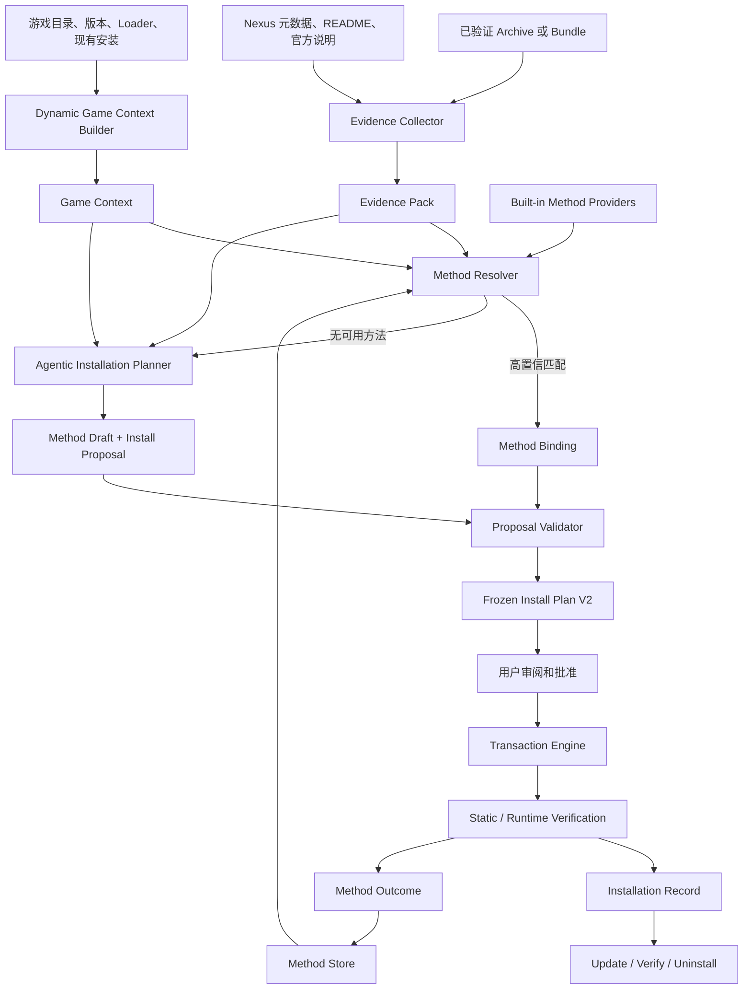

# Phase 6B V2：Agentic Mod 安装与本地经验学习架构

> 状态：架构基线已固定；M1、M2 已实现并通过本地回归，M3–M4 待开发
>
> 固定日期：2026-07-27
>
> 目标仓库：`GameFinder`
>
> 目标组件：`install-game-mods` Skill、`nexus-mods-server` 安装模块
>
> 替代范围：V1 的 Adapter 中心规划层、静态 Game Profile 门槛、未知包阻塞策略
>
> 保留范围：V1 的校验、staging、路径策略、冻结计划、事务、备份、回滚、记录与卸载基础
> 首个真实验收：Stardew Valley Mod 2697 及其必需依赖 SMAPI 2400

## 目录

1. 架构决策
2. 问题与目标
3. 系统边界和总体流程
4. V2 对象模型
5. Method Store
6. Agentic Installation Planner
7. Dynamic Game Context
8. 通用操作中间表示
9. Contract V2
10. MCP 工具边界
11. `install-game-mods` Skill V2 工作流
12. 依赖、验证与卸载
13. V1 迁移方案
14. 测试与验收
15. 实施里程碑

## 1. 架构决策

以下决策在开始 V2 重构前固定：

1. **未知 Mod 不以缺少预编写 Adapter 为默认阻塞理由。**
2. **Agent 负责根据证据推导候选安装方法，MCP 负责验证、冻结和执行受约束操作。**
3. **Adapter 不再是安装规划的必经入口。** 内置 Adapter 可以继续存在，但只作为高置信 Method Provider 或专用验证器。
4. **Game Profile 不再是识别未知游戏实例的硬前提。** 系统可以生成本次会话使用的 Dynamic Game Context。
5. **安装成功后沉淀结构化 Installation Method。** 经验存入 MCP 管理的本地状态库，不自动修改 Skill、仓库代码或内置 Profile。
6. **不恢复旧 Recipe。** Installation Method、Install Plan 和 Installation Record 必须继续保持职责分离。
7. **学习不能扩大执行权限。** Learned Method 只能组合通用引擎已经支持的操作，不能创建任意命令或绕过路径策略。
8. **真正需要开发代码的单位是通用执行能力，而不是某个 Mod。** 只有遇到现有 Operation Catalog 无法表达的新副作用语义时，才扩展引擎。
9. **所有必需依赖使用同一套方法发现和安装流程。** Loader、框架和前置 Mod 不能因为类型不同而被默认交还给用户手动处理。
10. **显式 `$install-game-mods` 调用仍是生产入口。** 自动触发不是硬验收要求。

这里的“自学习”指本机上的结构化经验积累，不指训练或修改语言模型权重。

## 2. 问题与目标

### 2.1 V1 的根本问题

V1 把两类不同问题绑定在一起：

- **理解问题**：这个 Archive 是什么、作者要求如何安装、目标位置在哪里、如何验证。
- **执行问题**：哪些文件可以写入、如何备份、如何回滚、如何留下可卸载记录。

V1 要求理解问题必须由预注册 Adapter 和 Game Profile 解决。结果是：

```text
未知包
  → ADAPTER_NOT_FOUND
  → 等待开发新 Adapter
  → 才能生成 Install Plan
```

该流程适合封闭、预配置的企业部署系统，不适合需要覆盖大量游戏和未知 Mod 的个人 Agent 工具。

### 2.2 V2 目标

- 首次遇到未知 Mod、Loader 或前置组件时，主动收集证据并尝试推导安装方法。
- 把 Agent 的推理转换成结构化、可审阅的候选方案。
- 在不要求编写代码的情况下，用通用操作完成大多数文件型和标准安装器型 Mod。
- 成功后保存可复用经验；后续任务优先检索和验证该经验。
- 继续保证安装计划可冻结、写入可事务化、结果可验证、失败可恢复。
- 保留足以支持更新、修复、卸载和状态协调的 Installation Record。
- 让一个新通用操作解锁一类安装机制，而不是创建一个单 Mod Adapter。

### 2.3 非目标

V2 不承诺无条件静默安装任何程序。以下情况仍可能要求额外批准或人工检查：

- 证据互相冲突，无法确定作者意图。
- 安装器的副作用范围无法描述或观察。
- 需要修改操作系统级驱动、服务、账户权限或安全设置。
- 需要购买 DLC、更新游戏、接受第三方许可或登录外部服务。
- 需要用户选择主观配置、兼容分支或互斥组件。
- 当前 Operation Catalog 完全无法表达所需操作。

这些情况返回的是“需要选择、需要批准或暂不支持的能力”，而不是“请先为这个 Mod 开发 Adapter”。

## 3. 系统边界和总体流程



权限边界：

| 组件 | 可以推理 | 可以生成候选操作 | 可以写游戏目录 |
|---|---:|---:|---:|
| Skill / Agent | 是 | 是 | 否 |
| Evidence Collector | 否 | 否 | 否 |
| Method Store / Resolver | 否 | 是 | 否 |
| Proposal Validator | 否 | 否 | 否 |
| Transaction Engine | 否 | 否 | 是 |

Agent 不能使用 shell、Python、浏览器下载脚本或普通文件工具绕过 MCP 执行安装。Agent 的自由度止于提交结构化 Proposal。

## 4. V2 对象模型

V2 保持“事实、方法、计划、执行、结果”分离。

### 4.1 Evidence Pack

Evidence Pack 是一次候选安装分析的只读事实集合：

- Archive 和 receipt 身份、大小、SHA-256。
- Bundle node、依赖关系、安装顺序和来源身份。
- Archive inventory、目录树、文件类型和安全检查。
- 机器可读 manifest、配置、FOMOD 元数据。
- Archive 内 README 和安装说明。
- Nexus description、Requirements、作者说明和当前文件元数据。
- 官方 Loader 或游戏文档。
- 当前 Game Context。
- 已有 Installation Record、冲突和依赖满足状态。
- 每条结论的来源、抓取时间和内容哈希。

Evidence Pack 是不可变、可寻址的临时对象。它不能包含 Agent 未经来源支持的推断。

### 4.2 Installation Method

Installation Method 是可复用安装知识，不是一次执行记录。

概念字段：

```yaml
schemaVersion: 2
methodId: uuid
revision: 1
state: draft | session_approved | local_verified | promoted | quarantined | deprecated
scope:
  operatingSystems: [win32]
  gameSelectors: []
  loaderSelectors: []
  sourceSelectors: []
  packageSignals: []
  negativeSignals: []
resolution:
  packageRootRules: []
  componentSelectionRules: []
  targetMappings: []
operationsTemplate: []
preconditions: []
verificationTemplate:
  staticChecks: []
  runtimeChecks: []
reversibilityRequirements: []
provenance:
  origin: agent_learned | built_in | imported
  evidenceRefs: []
  derivedFromInstallationIds: []
confidence:
  deterministicSignals: []
  successfulApplications: 0
  failedApplications: 0
  lastVerifiedAt: null
```

Method 不保存：

- 本次绝对游戏路径。
- 本次 staging 路径。
- 本次 `planId` 或 transaction。
- 实际写入结果。
- `installed_at`、备份位置和卸载状态。

这些属于 Install Plan、Transaction Journal 和 Installation Record。

### 4.3 Method Draft

当 Method Store 没有可信匹配时，Agentic Planner 生成 Method Draft。

Draft 必须：

- 引用 Evidence Pack 中的具体证据。
- 区分“观察事实”和“推导结论”。
- 声明适用范围，不能默认泛化到所有游戏或所有版本。
- 只使用 Operation Catalog 中的操作。
- 声明安装前置条件、验证方式和可逆性要求。
- 对所有不确定选择显式建模。

Draft 通过 Proposal Validator 不代表已经学会。只有成功执行并达到规定验证等级后，才能晋升为 `local_verified`。

### 4.4 Install Proposal

Install Proposal 是 Agent 或 Method Resolver 提交给确定性引擎的候选计划。

它包含：

- Evidence Pack 和 Game Context 绑定。
- Method 来源或 Method Draft。
- 选择的 package root、组件和目标映射。
- 具体 Operation Draft。
- 前置条件、冲突策略和验证规则。
- 风险等级、未解决选择和所需批准。

Proposal 可以被拒绝、要求补证或要求用户选择。它不能被执行。

### 4.5 Install Plan V2

Proposal 通过验证后才能冻结成 Install Plan V2。

Install Plan V2 固定：

- Archive、receipt、Evidence Pack 和 Game Context hash。
- Method revision 或 Agent Proposal hash。
- 所有具体源路径、目标路径、参数和预期状态。
- 依赖满足状态。
- 每项操作的可逆性等级。
- 静态和运行时验证要求。
- 风险摘要和批准内容。
- `planId`、`planHash` 和过期时间。

Apply 仍然只接受 `planId`。

### 4.6 Method Outcome

Method Outcome 把一次实际结果反馈给 Method Store：

- Method revision 和匹配证据。
- Installation Record 或失败 transaction。
- 静态、运行时验证等级。
- 实际操作偏差。
- 回滚或恢复结果。
- 失败原因是否由方法本身导致。

失败不能覆盖历史 Method。Store 追加 Outcome，并据此降低置信、隔离 revision 或创建新 revision。

## 5. Method Store

### 5.1 存储位置

默认存储：

```text
%LOCALAPPDATA%\GameModToolkit\
├── methods\
│   ├── drafts\
│   ├── session-approved\
│   ├── local-verified\
│   ├── promoted\
│   ├── quarantined\
│   ├── outcomes\
│   └── index\
├── game-contexts\
├── evidence\
├── plans\
├── transactions\
├── installations\
└── backups\
```

普通安装不能自动修改：

- `skills/install-game-mods/`
- 仓库内 TypeScript Adapter。
- 内置 Profile 或 Method。
- Git 工作树。

### 5.2 方法状态

```text
draft
  → session_approved
  → local_verified
  → promoted

任何状态
  → quarantined
  → deprecated
```

- `draft`：尚未执行，只能用于生成需完整审阅的 Proposal。
- `session_approved`：用户批准用于当前计划，不允许跨任务静默复用。
- `local_verified`：至少一次符合要求的安装验证成功，可在相同证据范围内优先匹配。
- `promoted`：经过跨版本或跨样本回归验证，可作为内置高置信候选。
- `quarantined`：出现方法相关失败、证据漂移或不一致，停止自动匹配。
- `deprecated`：保留历史记录，不再生成新计划。

### 5.3 匹配算法

Method Resolver 按以下顺序匹配：

1. 排除操作系统、游戏、Loader 或明确负面信号不匹配的方法。
2. 优先匹配机器可读 manifest、入口文件和稳定目录结构。
3. 比较来源身份、Archive 布局指纹和版本约束。
4. 比较 Dynamic Game Context 的目标根和 Loader 状态。
5. 检查 Method 所需 Operation 是否仍受当前引擎支持。
6. 检查 Method revision 是否被隔离、弃用或存在失败 Outcome。
7. 返回证据充分度，不只返回一个模型置信分。

匹配结果：

```text
verified_match
candidate_match
ambiguous
evidence_stale
no_match
```

只有 `verified_match` 可以直接实例化为 Proposal；它仍需经过确定性验证和用户批准。其余状态进入 Agentic Planner 或要求具体选择。

### 5.4 晋升和失效

Method 晋升必须绑定实际 Outcome，不接受“Agent 认为正确”作为成功证据。

默认晋升要求：

- 事务成功提交。
- 静态验证通过。
- 所需运行时验证已通过，或 Method 明确声明运行时验证不适用。
- 没有超出声明范围的写入。
- Installation Record 可用于生成合法的 Current-State Inspection。

出现以下情况时重新验证或隔离：

- Archive 布局指纹改变。
- 游戏、Loader 或安装器主版本跨越 Method 约束。
- 目标路径策略改变。
- 运行时验证失败。
- 发现未声明写入。
- 后续卸载或更新暴露所有权错误。

### 5.5 经验泛化

Method 默认从窄作用域开始：

```text
确切 Archive 布局
  → 同一 Mod 的兼容版本
  → 同一 Loader 的同类包
  → 跨游戏通用机制
```

每次扩大作用域都生成新 revision，并要求新的验证 Outcome。系统不得因为一次成功就把单 Mod 规则泛化成通用规则。

## 6. Agentic Installation Planner

### 6.1 职责

当 Method Resolver 没有 `verified_match` 时，Planner：

1. 读取 Evidence Pack 和 Dynamic Game Context。
2. 确定缺失证据。
3. 使用 Nexus MCP、受控浏览器或官方文档补充安装说明。
4. 识别包根、组件、依赖和目标映射。
5. 选择 Operation Catalog 中的最小操作集合。
6. 设计静态和运行时验证。
7. 生成 Method Draft 和 Install Proposal。

Planner 不执行任何写入。

### 6.2 证据优先级

从高到低：

1. 包内机器可读 manifest 和标准安装元数据。
2. 当前文件版本对应的作者安装说明。
3. 官方游戏、Loader 或框架文档。
4. Archive 的明确目录结构与入口文件。
5. 当前游戏实例和已安装 Loader 的可验证结构。
6. 已成功验证、作用域匹配的本地 Method。
7. 社区教程或管理器惯例。
8. 文件名和关键词启发式。

第 7、8 项不能单独支持写入或执行进程。

### 6.3 缺失信息处理

Planner 先尝试补证，不把每个未知点都立即交给用户。

只有当一个选择会改变写入结果且无法从证据确定时，才询问用户，例如：

- 普通版还是兼容版。
- 是否安装可选纹理包。
- 多个游戏实例中选择哪个。
- 是否批准中等风险的受控安装器操作。

### 6.4 失败与重试

如果验证或执行失败：

1. 停止剩余依赖链。
2. 使用 Transaction Journal 回滚或进入 `recovery_required`。
3. 保存失败 Evidence 和 Method Outcome。
4. 判断是环境问题、版本问题、证据不足还是 Method 错误。
5. 允许 Agent 基于新证据生成修订 Draft。
6. 新计划必须重新展示和批准。

失败方法不会自动成为经验。

## 7. Dynamic Game Context

### 7.1 目的

V1 Game Profile 同时承担游戏知识、实例发现和写入权限，导致未知游戏无法进入规划。

V2 拆分为：

- **Game Definition**：可选的内置或已验证游戏知识。
- **Game Instance Facts**：本机只读探测结果。
- **Path Policy**：本次安装允许和禁止的路径。
- **Dynamic Game Context**：以上信息在一次安装中的不可变快照。

### 7.2 Context 来源

Dynamic Game Context 可以由以下证据构建：

- 用户明确提供的游戏根目录。
- Steam、GOG、Epic 等本机 manifest。
- 游戏可执行文件和版本信息。
- 当前目录结构。
- Loader manifest、入口程序和日志位置。
- 内置 Game Definition。
- 本地已验证 Context。
- 作者安装说明中的目标路径约定。

未知游戏不要求先提交仓库 Profile。

### 7.3 Path Policy

Path Policy 必须区分：

- `writableRoots`
- `protectedRoots`
- `liveModRoots`
- `managedStateRoots`
- `observableRoots`
- `processSideEffectRoots`

动态生成的 writable root 必须有证据并在计划审批中展示。游戏根目录不能自动整体视为可写。

### 7.4 Context 状态

```text
observed
  → session_approved
  → local_verified
  → built_in
```

- `observed` 只支持分析。
- `session_approved` 可用于当前计划。
- `local_verified` 可以在相同安装实例上复用，但每次仍重新探测关键路径。
- `built_in` 是仓库内维护的通用定义。

Context 漂移时重新生成，不直接修改旧对象。

## 8. 通用操作中间表示

### 8.1 保留的文件操作

V1 操作继续保留：

- `ensure_directory`
- `install_new_file`
- `replace_file`
- `install_tree`
- `replace_managed_tree`
- `remove_empty_directory`

每项操作继续要求 expected pre-state、expected post-state、路径校验和可逆性声明。

### 8.2 V2 扩展原则

新能力必须先定义为受约束 Operation，并同时实现：

- 输入 schema。
- 路径和参数策略。
- pre-state 捕获。
- 执行器。
- post-state 验证。
- 失败和中断恢复。
- Installation Record 表达。
- 后续卸载或人工恢复语义。
- 单元、沙箱和故障注入测试。

Method 和 Agent 都不能创造 Operation 名称。

### 8.3 受控安装器操作

为覆盖 SMAPI 等框架安装器，V2 需要通用的 `run_bundled_installer` 能力，而不是单 Mod Adapter。

概念字段：

```yaml
kind: run_bundled_installer
entry:
  source: verified_staging
  relativePath: ...
  runtime: native | dotnet | fixed-script-runner
arguments: []
workingDirectory: ...
environmentPolicy: minimal
timeoutMs: ...
allowedExitCodes: [0]
declaredWriteRoots: []
preStateSnapshots: []
postConditions: []
```

约束：

- 入口必须来自已验证 staging 或明确受信任的本机 runtime。
- 禁止自由格式 shell command。
- 参数是结构化数组，并经过逐项验证。
- 不继承无关环境变量。
- 必须设置超时、进程树控制和输出捕获。
- 必须声明预计写入根并在执行前快照。
- 执行后比较副作用范围。
- 无法限制或观察副作用时，计划必须标为高风险并要求额外批准，或进入辅助人工步骤。

该 Operation 一旦实现，应能服务多个官方 Loader 或标准安装器。

### 8.4 能力等级

| 等级 | 类型 | 默认行为 |
|---|---|---|
| A | 可逆文件操作 | 正常生成计划并审批 |
| B | 受控安装器、结构化配置修改 | 显示副作用范围和额外风险后审批 |
| C | 不透明系统级副作用 | 尝试补证；不能证明时进入人工检查点 |
| D | Operation Catalog 无法表达 | 报告缺失的通用能力，不要求开发单 Mod Adapter |

## 9. Contract V2

### 9.1 版本策略

- 新对象使用 `schemaVersion: 2`。
- V1 已提交 Installation Record 保持只读兼容。
- V1 未执行 Install Plan 是短期对象，不迁移；重新规划为 V2。
- V1 Adapter ID 可以保存在 V2 provenance 中，但不再是必填执行身份。

### 9.2 Install Plan V2 概念结构

```yaml
schemaVersion: 2
planId: uuid
planHash: sha256
status: planned
createdAt: ...
expiresAt: ...

source:
  archive: ...
  receipt: ...
  bundleId: ...
  bundleNodeId: ...

evidenceBinding:
  evidencePackId: uuid
  evidencePackHash: sha256

gameBinding:
  gameContextId: uuid
  gameContextHash: sha256
  gameRoot: ...

strategyBinding:
  origin: built_in_method | learned_method | agent_proposal
  methodId: null
  methodRevision: null
  proposalHash: sha256

selection:
  packageUnitId: ...
  packageRoot: ...
  selectedComponents: []

operations: []
conflicts: []
preconditions: []
verificationRequirements: []
reversibility:
  level: full | bounded | manual_recovery
  backupRequirements: []
risk:
  level: low | medium | high
  reasons: []
approval:
  requiresExplicitConfirmation: true
  approvalDigest: sha256
preconditionStateHash: sha256
```

### 9.3 Installation Record V2

Record 除 V1 实际结果外，新增：

- Evidence Pack 和 Game Context 绑定摘要。
- Method/Proposal provenance。
- Method revision。
- 实际执行的受控进程身份、参数摘要、输出回执和副作用观察。
- 计划与实际操作偏差。
- Method Outcome 引用。
- 依赖 Installation ID 和 dependent Installation ID。

卸载仍以实际 operation outcomes、pre-state、post-state、ownership 和 backup 为权威，不以 Method 为权威。

### 9.4 错误分类调整

以下 V1 错误不再直接终止流程：

- `ADAPTER_NOT_FOUND` → `METHOD_RESEARCH_REQUIRED`
- `GAME_PROFILE_NOT_FOUND` → `GAME_CONTEXT_REQUIRED`
- `DEPENDENCY_MISSING` → 继续处理 Bundle 中对应依赖；只有物料或方法缺失时再分类

V2 新增：

- `EVIDENCE_INSUFFICIENT`
- `EVIDENCE_CONFLICT`
- `METHOD_AMBIGUOUS`
- `METHOD_STALE`
- `METHOD_QUARANTINED`
- `PROPOSAL_INVALID`
- `OPERATION_CAPABILITY_MISSING`
- `PROCESS_SIDE_EFFECT_SCOPE_UNPROVEN`
- `VERIFICATION_REQUIREMENT_UNSATISFIED`
- `USER_CHOICE_REQUIRED`

Agent 根据结构化 next action 继续补证、询问选择或重新规划，不能解析自然语言猜测。

## 10. MCP 工具边界

### 10.1 只读证据和上下文

- `prepare_install_evidence(bundlePath?, archivePath?, receiptPath?, bundleNodeId?)`
- `get_install_evidence(evidencePackId)`
- `probe_game_context(gameRoot, gameHint?)`
- `get_game_context(gameContextId)`
- `query_install_methods(evidencePackId, gameContextId)`
- `get_install_method(methodId, revision?)`

### 10.2 Proposal 和计划

- `submit_install_proposal(evidencePackId, gameContextId, proposal)`
- `validate_install_proposal(proposalId)`
- `freeze_install_plan(proposalId)`
- `get_install_plan(planId)`

`submit_install_proposal` 只写 Manager 状态，不写游戏目录。

### 10.3 执行、验证和恢复

- `apply_mod_install(planId)`
- `verify_mod_install(installationId, level?)`
- `get_install_status(kind, id)`
- `rollback_mod_install(transactionId)`

Apply 继续只接受 `planId`。

### 10.4 学习

- `record_method_outcome(installationId | transactionId)`
- `promote_install_method(methodId, revision, targetState)`
- `quarantine_install_method(methodId, revision, reason)`
- `list_install_methods(filters?)`
- `inspect_install_method_history(methodId)`

普通成功安装可以自动生成 `local_verified` 候选，但不能自动晋升为仓库内置方法。

### 10.5 Bundle 编排

Bundle 保持 dependency-first 顺序。对每个尚未满足节点：

1. 准备 Evidence Pack。
2. 查询 Method。
3. 必要时 Agent 推导 Draft。
4. 验证、冻结、审批、执行和验证。
5. 记录依赖 Installation ID。
6. 只有依赖达到要求的验证等级后才处理 dependent。

## 11. `install-game-mods` Skill V2 工作流

Skill 保持精简，详细 schema 和 MCP SOP 放入 references，避免把每个游戏或 Mod 的经验写进 SKILL.md。

生产流程：

1. 显式接收一个 Bundle，或一个 Archive/receipt。
2. 验证输入和 dependency order。
3. 构建 Dynamic Game Context。
4. 对每个未满足节点准备 Evidence Pack。
5. 查询 Method Store 和 built-in providers。
6. 有 verified match 时实例化 Proposal。
7. 没有 verified match 时主动研究并生成 Method Draft。
8. 把 Proposal 交给 MCP 验证；按结构化错误补证或询问必要选择。
9. 展示证据、来源、具体写入、受控进程、风险、回滚和验证方式。
10. 等待用户批准冻结 Plan。
11. 只通过 `planId` 执行。
12. 完成静态和所需运行时验证。
13. 写 Installation Record 和 Method Outcome。
14. 成功后沉淀本地 Method；继续处理依赖链。

Skill 不应回复：

> 当前没有这个 Mod 的 Adapter，请先开发 Adapter。

应回复为以下一种：

- 已找到并验证可复用安装方法。
- 已根据证据推导候选方法，请审阅计划。
- 仍缺少某条具体证据或用户选择。
- 当前缺少某项通用 Operation 能力。
- 安装器副作用范围无法证明，需要高风险批准或人工检查点。

## 12. 依赖、验证与卸载

### 12.1 依赖闭包

Download Bundle 是安装输入物料的权威集合。Install 阶段：

- 重新验证每个 Archive 和 receipt。
- 探测已经满足的依赖。
- 对未满足依赖使用同一 Method 流程。
- 保存依赖 Installation ID。
- 禁止在前置依赖失败后继续安装 dependent。

Loader 不再因为缺少预写 Adapter 而默认阻塞。

### 12.2 验证等级

```text
material_verified
  → plan_validated
  → transaction_committed
  → static_verified
  → runtime_verified
```

每个 Method 声明 dependent 所需的最低验证等级。例如普通 SMAPI Mod 在安装前要求 SMAPI 至少达到 `static_verified`；最终验收要求 Mod 达到 `runtime_verified`。

### 12.3 卸载

Method 只帮助解释安装机制，不能作为卸载事实。

Uninstall Planner 继续读取：

- Installation Record。
- 实际 operation outcomes。
- pre-state、post-state 和 backup。
- 当前磁盘状态。
- ownership 和 dependent 关系。

受控安装器如果无法产生可证明的反操作，Record 必须声明 `manual_recovery` 或受限卸载能力，不能虚构完整回滚。

## 13. V1 迁移方案

### 13.1 原样保留

- Download Plan、Archive receipt 和 Bundle Manifest。
- Input Verifier。
- Archive Inspector。
- Staging Manager。
- Path Policy 的路径穿越、保护根和规范化逻辑。
- 文件哈希、树哈希和 Conflict Detector。
- Plan Store 的不可变发布、TTL 和 stale 检查。
- Transaction Engine、Instance Lock 和 Process Guard。
- Backup Store、Transaction Journal 和 Recovery Manager。
- Installation Record、State Inspector、Uninstall Planner 和 Uninstall Engine。

### 13.2 重构

| V1 | V2 |
|---|---|
| Package Analysis | Evidence Pack 的 Archive 分析部分 |
| Adapter Registry | Method Resolver + Built-in Method Providers |
| Adapter Planner | Agentic Planner 或 Method Instantiator |
| 必填 `adapterId` | `strategyBinding` |
| 注册 Game Profile | Dynamic Game Context + 可选 Game Definition |
| Adapter static/runtime verifier | Method Verification Template + 通用 Verifier |
| `ADAPTER_NOT_FOUND` 阻塞 | `METHOD_RESEARCH_REQUIRED` |

### 13.3 退役

- “未知安装机制必须先开发 Adapter”的规则。
- “普通安装不能学习可复用方法”的非目标。
- “缺少注册 Profile 就不能分析”的门槛。
- Skill 中遇到 Loader Runtime 且无 Adapter 就立即结束的 SOP。
- 把 `adapterId` 作为 Transaction Engine 执行所必需的代码身份。

### 13.4 兼容策略

- V1 已提交 Record 保持可验证和可卸载。
- V1 Adapter 可以包装为只读 Built-in Method Provider。
- `smapi-folder-mod` 的已有逻辑可以首先转成内置 Method，不再作为唯一入口。
- V1 临时 Plan 不迁移；重新生成 V2 Plan。
- Contract V2 重构期间保留 V1 测试作为事务底层回归集。

## 14. 测试与验收

### 14.1 Contract 和 Store

- Method revision 不可变。
- 状态晋升和隔离符合状态机。
- Outcome 只能追加，不能覆盖历史。
- Evidence、Context、Proposal 和 Plan hash 绑定正确。
- Method 作用域漂移会降级或阻止匹配。

### 14.2 Agentic Planner

- 未知标准文件包能在没有 Adapter 时生成合法 Proposal。
- Proposal 中每个关键判断都能追溯到 Evidence。
- 不支持的 Operation 被 Validator 拒绝。
- 歧义只询问真正影响安装结果的选择。
- 失败 Outcome 不会被晋升为已验证 Method。

### 14.3 Dynamic Game Context

- 未注册游戏可以从明确 game root 构建 observed Context。
- 动态 writable root 必须有证据并经过批准。
- protected root 永远不能被 Method 或 Agent 覆盖。
- Context 漂移导致计划 stale。

### 14.4 事务回归

- V1 文件操作、冲突、备份、回滚和恢复测试全部保持通过。
- V2 strategyBinding 不削弱 plan hash 和 apply-by-ID。
- 受控进程异常、超时和未声明副作用有故障注入测试。

### 14.5 Stardew Valley 冷启动验收

初始条件：

- Method Store 中没有 SMAPI 2400 或 Mod 2697 的方法。
- 不注册 SMAPI 专用安装 Adapter。
- 使用已经通过 Download Skill 生成的完整 Bundle。
- 用户提供或确认 Stardew Valley game root。

要求：

1. 系统自行识别 SMAPI 是必需 Loader Runtime。
2. Agent 根据 Archive、Nexus 和官方证据推导 SMAPI 候选安装方法。
3. MCP 验证并冻结 SMAPI Install Plan。
4. 用户批准后，系统安装并静态验证 SMAPI。
5. 系统继续推导或识别 Mod 2697 的 SMAPI 文件夹安装方法。
6. 用户批准后安装 Mod 2697。
7. 两个节点分别生成 Installation Record，并记录 dependency relationship。
8. SMAPI 日志确认 Mod 被识别和加载。
9. 两个成功方法进入 `local_verified`。
10. 失败路径可以回滚或明确进入 `recovery_required`。
11. Record 足以派生安全 Uninstall Plan。

### 14.6 暖启动学习验收

在新的独立任务中，用相同或兼容证据再次处理：

- Method Resolver 能找到本地已验证方法。
- 不重复完整的开放式安装研究。
- 重新验证 Archive、Context、版本范围和磁盘 pre-state。
- 仍展示并批准具体 Install Plan。
- 经验复用不绕过确定性校验。

### 14.7 泛化验收

选择第二个未预编写 Adapter 的标准 SMAPI Mod：

- 系统应复用已验证的 SMAPI 文件夹机制。
- 不应创建单 Mod Method，除非其布局确实是已知例外。
- Archive 布局或说明不一致时应退回 Agentic Planner。

满足冷启动、暖启动和泛化验收后，才认为 V2 的“自学习安装”目标成立。

## 15. 实施里程碑

不继续沿用不断增长的 6B-x 子阶段。V2 使用四个里程碑：

### M1：Contract V2 与只读学习基础

- 定义 Evidence Pack、Dynamic Game Context、Installation Method、Proposal 和 Plan V2。
- 实现 Method Store、状态机、索引和 Outcome。
- 将 V1 Adapter/Profile 映射为兼容 Provider。
- 不执行真实游戏写入。

实施结果（2026-07-27）：

- 新增独立 `src/install/v2` 命名空间，未切换 V1 apply 路径。
- Contract V2 已覆盖 Evidence Pack、Dynamic Game Context、Game Definition、Installation Method、Install Proposal、Install Plan V2、受控安装器 Operation、Method Outcome 和 Provider Candidate。
- Method Store 已实现不可变 revision、受约束状态转换、原子索引、启动重建、Outcome 追加、哈希校验和查询过滤。
- `LegacyV1CompatibilityProvider` 已把 V1 Adapter 匹配结果映射为只读候选，并把 V1 Game Profile 映射为 V2 Game Definition；兼容候选不具有独占规划权。
- 定向 M1 测试与全量测试通过；M1 没有新增 MCP 写工具，也没有触碰真实游戏目录。

### M2：Agentic 文件型安装闭环

- 实现 Evidence 和 Context MCP 工具。
- 实现 Method 查询、Proposal 验证和冻结。
- 用现有文件 Operation 完成“无预编写 Adapter”的沙箱安装。
- 更新 `install-game-mods` Skill V2。

实施结果（2026-07-27）：

- 新增不可变 `Evidence Pack`、`Dynamic Game Context`、`Install Proposal`、`Install Plan V2` 与 V2→V1 执行桥的持久化 Store，并在每次读取时校验内容哈希。
- 新增 `probe_game_context`、`prepare_install_evidence`、`query_install_methods`、`submit_install_proposal`、`freeze_install_plan`、`apply_agentic_install_plan` 等 Contract V2 MCP 工具。
- `Method Resolver` 可同时查询 Method Store 与只读 V1 Compatibility Provider；没有候选 Method 时明确进入 `agent_proposal`，不再返回“必须开发 Adapter”。
- 新增通用 `agentic-v2-file-method` 兼容执行器。它不参加 V1 匹配，只负责把已通过 V2 Validator 的文件 Operation 交给既有锁、备份、Journal、验证和回滚引擎。
- M2 Validator 只接受被选 Package Root 到声明 writable root 内的 `install_tree`，拒绝 protected root、`layered_path` 所有权和未实现的 Operation。
- `install-game-mods` 已切换到 Evidence → Context → Method/Agent Proposal → Plan → 明确审批 → apply-by-ID 的 V2 SOP。
- 新增端到端测试证明：未注册游戏、无候选 Method、无预编写 Game/Mod Adapter 时，Agent Proposal 可以冻结计划；冻结前不修改游戏；批准后通过事务引擎完成文件型安装和静态验证。
- `run_bundled_installer` 仍按设计返回 `OPERATION_CAPABILITY_MISSING`，留给 M3 的受控进程执行能力；这不等价于要求开发 Mod 专用 Adapter。

### M3：受控安装器与依赖闭环

- 实现 `run_bundled_installer` 通用能力。
- 增加进程约束、副作用观察、快照和恢复测试。
- 让 Bundle 中 Loader Runtime 与普通 Mod 使用同一编排流程。

### M4：真实学习验收

- 完成 Stardew Valley 冷启动验收。
- 完成新任务中的暖启动复用。
- 完成第二个 SMAPI Mod 的泛化验收。
- 验证 Installation Record 到 Uninstall Plan 的完整交接。

每个里程碑完成后单独提交和验收。M4 通过后，V1 规划层代码才能正式标记为退役。
