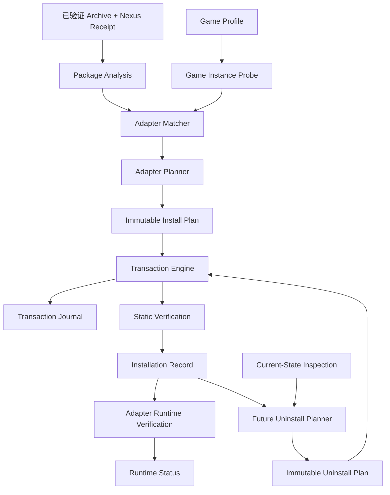

# Phase 6B：Mod 安装基础架构设计（V1）

> **替代状态（2026-07-27）：底层保留，规划层已被 V2 替代。**
>
> 当前架构基线为 [`phase6b-agentic-installation-architecture-v2.md`](phase6b-agentic-installation-architecture-v2.md)。
>
> 本文的 Archive 校验、staging、路径策略、冻结计划、事务、备份、回滚、Installation Record 与卸载状态模型继续作为 V2 基础；Adapter 中心规划、注册 Game Profile 硬门槛、未知包直接阻塞、禁止本地经验学习，以及原 Phase 6B-5 验收路径不再作为后续实现目标。
> 本文保留用于解释现有 V1 代码和迁移来源，不应继续据此增加单 Mod、单 Loader Adapter。
>
> 历史实现状态：Phase 6B-0～6B-4.1 已实现并通过本地自动化、Dependency Resolver 真实 API 测试及依赖感知下载/Bundle 黑盒测试；安装代码将按 V2 迁移。
> 编写日期：2026-07-25  
> 目标仓库：`GameFinder`  
> 目标组件：`install-game-mods` Skill 与 `nexus-mods-server` 本地安装模块  
> 本文范围：通用安装引擎、安装类型 Adapter、游戏 Profile，以及面向后续卸载的状态模型  
> 架构决策：第一版不引入每 Mod 持久化安装规则或 Adapter Override 系统

## 目录

1. 执行摘要
2. 目标与非目标
3. 系统边界与数据流
4. 第一层：通用安装引擎
5. 第二层：安装类型 Adapter
6. 第三层：游戏 Profile
7. 三层协作流程
8. MCP 工具边界
9. `install-game-mods` Skill 的职责
10. 运行时对象与生命周期
11. 面向后续卸载的可逆性设计
12. 测试策略
13. Phase 6B 实施顺序
14. 首版真实验收标准
15. 评审时需要确认的决策

## 1. 执行摘要

Phase 6B 不直接开发一个“能猜测任意 Mod 应该复制到哪里”的 Agent，而是先建立三层稳定基础：

1. **通用安装引擎**：安全检查、计划固化、事务执行、备份、回滚、验证和状态记录。
2. **安装类型 Adapter**：识别一种安装机制，并把包结构解释成受约束的安装计划。
3. **游戏 Profile**：描述某款游戏及其本机实例的可识别事实、允许路径、Loader、版本和验证位置。

三层之间的核心权限边界如下：

- 通用引擎是唯一有权修改游戏目录的组件。
- Adapter 不直接写盘，只能产生计划和执行验证。
- Game Profile 是声明式数据，不能包含任意命令或脚本。
- Agent/Skill 只能选择流程、展示计划和调用 MCP 工具，不能自行拼接复制命令绕过引擎。
- Package Analysis 负责识别，Install Plan 负责本次意图，Transaction Journal 负责中断恢复，Installation Record 负责长期事实。
- 后续卸载根据 Installation Record、备份和当前磁盘状态生成新的 Uninstall Plan，不直接倒序重放原 Install Plan。

第一版以 Stardew Valley 的 SMAPI 文件夹型 Mod 为纵向验收路径，目标 Mod 为：

- [Skip Fishing Minigame](https://www.nexusmods.com/stardewvalley/mods/2697)
- 当前 MAIN：v0.7.4
- Nexus file ID：`115145`
- 必需框架：SMAPI

该案例用于验证基础架构，不代表第一版已经支持全部游戏和全部 Mod 类型。

## 2. 目标与非目标

### 2.1 目标

- 让安装操作可规划、可审阅、可验证、可回滚。
- 将跨游戏共性固定在通用引擎中。
- 按安装机制复用 Adapter，减少“一款游戏开发一套安装器”的重复工作。
- 用声明式 Game Profile 支持多商店、多安装实例和本机自动发现。
- 从第一次安装开始记录足以支持更新、修复和未来卸载的事实。
- 确保每一种可执行安装操作都具有明确的可逆性要求。
- 所有高风险判断失败时停止，而不是猜测路径后继续。

### 2.2 非目标

Phase 6B 第一版不承诺：

- 自动安装任意游戏和任意 Mod。
- 自动运行未知 EXE、BAT、PowerShell、DLL 注册器或二进制 patcher。
- 自动完成 FOMOD 交互选项。
- 自动导入 Vortex、MO2 或其他 Mod 管理器。
- 自动安装 SMAPI 等外部框架。
- 自动递归下载所有依赖。
- 修改存档、注册表、启动参数或系统级配置。
- 实现完整卸载功能。
- 自动学习或持久化每个 Mod 的特殊安装规则。

### 2.3 不可破坏的系统不变量

1. 没有已固化的安装计划，不得写入游戏目录。
2. 应用计划时只能传入 `planId`，不能重新传入任意源路径和目标路径。
3. 计划中的所有目标路径必须位于 Game Profile 明确允许的根目录内。
4. 每一次文件变更必须属于一个 transaction。
5. 覆盖现有文件前必须记录原状态，并在需要时生成可验证备份。
6. 事务失败后必须进入回滚或明确的 `recovery_required` 状态。
7. 不得从 Mod 压缩包或 README 中执行任意命令。
8. Adapter 和 Game Profile 都不能直接绕过通用引擎写盘。
9. 安装成功与 Mod 成功加载是两个不同状态，不能混为一谈。
10. 无法证明路径、依赖、版本或冲突状态时，返回阻塞结果。
11. 每个已提交写操作必须在 Installation Record 中保存其实际结果、post-state 和需要的 pre-state/backup 引用。
12. 卸载前必须核验当前磁盘状态；发现外部修改时不能机械删除或覆盖。

## 3. 系统边界与数据流



数据职责：

| 数据 | 生产者 | 使用者 | 是否可写游戏目录 |
|---|---|---|---:|
| 下载回执 | Download backend | Archive Inspector | 否 |
| Package Analysis | Archive Inspector + Adapter probe | Adapter Planner | 否 |
| Game Profile | Profile Registry | Instance Probe / Adapter | 否 |
| Game Instance | Instance Probe | Adapter / Engine | 否 |
| Install Plan | Adapter + Engine planner | Transaction Engine | 否 |
| Transaction Journal | Transaction Engine | Recovery / Record compaction | 是，记录实际执行 |
| Installation Record | Transaction Engine | Verify / Update / Uninstall | 否 |
| Current-State Inspection | Reconcile / Adapter verifier | Uninstall Planner | 否 |
| Uninstall Plan | Uninstall Planner | Transaction Engine | 否 |

系统不设置一个同时承担安装方法、单次计划和长期记录的持久对象。正常包由 Package Analysis、Adapter 和 Game Profile 直接生成 Install Plan。

## 4. 第一层：通用安装引擎

### 4.1 职责

通用安装引擎负责所有确定性、与游戏无关的能力：

- 验证 Archive 与下载回执。
- 安全枚举和解压支持的压缩包。
- 规范化和校验路径。
- 建立 staging 区。
- 计算文件 hash 和目录清单。
- 固化不可变安装计划。
- 检测计划生成后发生的环境漂移。
- 获取每个游戏实例的互斥锁。
- 预估磁盘空间。
- 创建备份。
- 执行文件操作。
- 记录 write-ahead transaction journal。
- 静态验证目标文件。
- 提交或回滚事务。
- 生成 Installation Record 和用户可读安装回执。
- 检查已安装状态是否变为 `dirty`。
- 根据已提交 Installation Record 和当前磁盘状态，为后续卸载提供可逆性输入。

### 4.2 不负责的事情

通用引擎不负责：

- 猜测某个 DLL 属于哪个 Loader。
- 判断某款游戏的 `Mods` 目录在哪里。
- 从作者描述中推断安装方式。
- 选择某个 Mod 的可选组件。
- 判断游戏运行日志中什么文本表示加载成功。
- 执行任意安装器。

这些知识由 Adapter 和 Game Profile 提供。无法由二者确定的非标准包在第一版中返回 `ADAPTER_NOT_FOUND`、`ADAPTER_AMBIGUOUS` 或其他阻塞状态，不建立特殊规则系统。

### 4.3 内部组件

```text
Install Core
├── Input Verifier
├── Archive Inspector
├── Package Analyzer
├── Staging Manager
├── Path Policy
├── Plan Store
├── Conflict Detector
├── Instance Lock Manager
├── Backup Store
├── Transaction Engine
├── Static Verifier
├── State Inspector
├── Uninstall Planner（后续公开）
├── Recovery Manager
└── State / Record Store
```

#### Input Verifier

- 校验 Archive 绝对路径。
- 校验 receipt 与 Archive 的文件名、字节数、SHA-256。
- 校验 Nexus `domainName`、`modId` 和 `fileId`。
- 拒绝 `.part`、`.crdownload` 或下载未完成状态。
- 不信任仅由用户输入的 hash；以实际重新计算结果为准。

#### Archive Inspector

- 以流式方式枚举条目，避免先全量解压再检查。
- 第一版只支持 ZIP。
- 记录每个条目的原始路径、规范化路径、大小、CRC、类型和压缩率。
- 识别共同顶层目录，但不自动剥离。
- 生成只读 archive inventory，供 Package Analyzer 使用。

#### Package Analyzer

- 把 archive inventory、包内机器可读 manifest 和 Adapter probe 汇总成 Package Analysis。
- 识别 package type、候选 package root、包身份、版本、入口文件和依赖信号。
- 一个 Archive 可以包含零个、一个或多个 package unit。
- 多个有效根、多个变体或证据冲突时明确返回 ambiguity，不自行选择。
- 完整 Analysis 默认只在本次安装期间存在；Installation Record 仅保存必要摘要、Analysis hash 和最终选择。

#### Staging Manager

- 每次安装使用独立 staging 目录。
- staging 不位于游戏 Loader 的扫描目录中。
- 只解压计划需要的条目。
- 解压后重新计算文件 hash。
- 事务完成后按保留策略清理。

#### Path Policy

- 把所有目标转换为 Game Instance 下的规范化绝对路径。
- 在规范化、解析 `..`、检查 reparse point 后再次验证允许根。
- 在 Windows 上检查：
  - 盘符和 UNC 路径变化；
  - 保留设备名；
  - 结尾空格和句点；
  - 大小写碰撞；
  - ADS 路径；
  - junction、symlink 和其他 reparse point。
- 拒绝目标路径逃逸。

#### Plan Store

- 为计划生成 `planId`。
- 对计划内容、Archive hash、Game Instance 和磁盘前置状态计算 plan hash。
- 固化后不可编辑。
- 计划具有创建时间、过期时间和状态。
- `apply` 前重新检查前置条件；环境变化时使计划失效。

#### Conflict Detector

区分：

- `new_path`：目标不存在。
- `same_content`：目标存在且 hash 相同。
- `managed_same_mod`：由同一 Mod 的旧安装拥有。
- `managed_other_mod`：由另一受管 Mod 拥有。
- `unmanaged_existing`：存在但不属于状态库。
- `protected_path`：Game Profile 禁止修改。
- `case_collision`：路径仅大小写不同。
- `dirty_managed_path`：受管文件已被外部修改。

冲突结果必须进入计划，不能在 apply 阶段静默决定。

#### Backup Store

- 覆盖或删除前保存 preimage。
- 备份以内容 hash 寻址，允许相同内容去重。
- transaction journal 保存逻辑路径与备份对象映射。
- 备份写入后再次校验 hash。
- 第一版不自动删除仍被已提交事务引用的备份。

#### Transaction Engine

- 只执行标准操作中间表示。
- 每一步执行前写 journal，执行后记录结果。
- 尽可能采用“临时路径写入 + 同卷 rename”。
- 跨卷复制必须显式记录为非原子步骤。
- 失败时停止后续操作并开始逆序回滚。

#### Static Verifier

- 验证目标路径存在性。
- 验证最终字节数和 SHA-256。
- 验证 Adapter 指定的必要文件。
- 检查临时文件和 staging 泄漏。
- 验证 transaction journal 与磁盘状态一致。

#### Recovery Manager

- MCP Server 重启后扫描未结束 transaction。
- 根据 journal 判断可继续回滚、可完成提交或需要人工恢复。
- 不把“进程退出”自动视为安装失败或成功。

#### State Inspector

- 根据 Installation Record 重新读取当前目标路径。
- 比较当前 hash、安装后 post-state、已知备份和 ownership。
- 区分 unchanged、missing、modified、replaced_by_managed_layer、unmanaged_extra 和 protected。
- 为 verify、update 和后续 uninstall 生成 Current-State Inspection。
- 只读检查，不直接修复或删除文件。

### 4.4 标准操作中间表示

这是通用引擎唯一可以执行的底层操作集合。每种操作在加入引擎时必须同时定义：

- apply 前需要记录的 pre-state；
- apply 后必须验证的 post-state；
- 事务内失败时的 rollback 语义；
- 后续卸载时可生成的 inverse operation；
- 无法安全逆转时的阻塞条件。

第一版支持：

- `ensure_directory`
- `install_new_file`
- `replace_file`
- `install_tree`
- `replace_managed_tree`
- `remove_empty_directory`

第二阶段可考虑：

- `merge_json`
- `merge_ini`
- `set_launch_argument`
- `create_link`

默认禁止：

- `run_executable`
- `run_shell`
- `patch_binary`
- `write_registry`
- `modify_save`
- `download_remote_file`

Adapter 不能创造新的操作名称。需要新的写入语义时，必须先扩展并测试通用引擎。

可逆性示例：

| 安装操作 | 必需 pre-state | post-state | 后续卸载候选操作 |
|---|---|---|---|
| `install_new_file` | 目标不存在 | 安装后 hash | 当前 hash 未变时删除 |
| `replace_file` | 原文件 hash + backup ref | 新文件 hash | 当前 hash 未变时恢复备份 |
| `ensure_directory` | 目录是否存在 | 目录存在 | 仅删除由本次创建且最终为空的目录 |
| `install_tree` | 目标树不存在或冲突结果 | 实际安装文件集合 | 按已安装文件集合逐项核验和删除 |
| `replace_managed_tree` | 旧受管树快照 + backup ref | 新受管树快照 | 恢复上一受管版本并保留未知文件 |

`skipped_same_content` 不产生卸载操作，因为本次安装没有取得该路径的所有权。

### 4.5 事务状态机

```text
planned
→ preflight
→ locked
→ staging
→ backing_up
→ applying
→ static_verifying
→ committed
```

失败分支：

```text
preflight_failed
apply_failed
verification_failed
→ rolling_back
→ rolled_back
```

无法自动恢复时：

```text
recovery_required
```

`committed` 只表示磁盘安装成功。运行时状态单独记录：

```text
runtime_unverified
runtime_verified
runtime_failed
```

### 4.6 幂等性

- 同一个 `planId` 不得提交两次。
- 相同 Archive hash、Game Instance、Adapter 版本和目标状态可以生成等价计划。
- 目标内容已经完全相同时，应返回 `already_installed` 或无操作计划。
- 已有同一 Mod 的旧版本时，必须明确生成更新计划，不能创建重复目录。
- apply 发现前置 hash 变化时返回 `plan_stale`，要求重新规划。

### 4.7 并发控制

- 每个 Game Instance 同一时间只允许一个写事务。
- 只读 inspect 和 profile probe 可以并发。
- 锁记录进程 ID、启动时间、transaction ID 和心跳。
- 判断陈旧锁时还要检查 transaction journal，不得仅按时间删除。
- 不允许两个 Agent 同时修改同一游戏实例。

### 4.8 磁盘与进程前检

执行前检查：

- staging、备份和目标卷剩余空间。
- 游戏进程、Loader、Mod 管理器是否正在占用目标文件。
- 目标文件是否只读或被锁定。
- Game Instance 是否仍然存在。
- Archive 和 receipt 自计划生成后是否变化。

Game Profile 提供相关进程名和识别规则；引擎负责执行检查。

### 4.9 状态存储

默认使用：

```text
%LOCALAPPDATA%\GameModToolkit\
├── game-instances\
├── plans\
├── transactions\
├── installations\
├── backups\
├── staging\
├── locks\
└── logs\
```

不把 Manager 状态默认放入游戏的实时 Mod 扫描目录。

第一版可使用原子写入的 JSON 文件，但应遵守：

- 临时文件写完、flush、校验后 rename。
- 每个对象独立文件，避免一个巨大 Manifest 成为单点损坏源。
- schema 带版本号。
- 后续可迁移 SQLite，但路径、transaction ID 和 installation ID 保持稳定。

### 4.10 Installation Record

Installation Record 是安装完成后的长期权威数据。它记录实际发生的事实，而不是复制原 Install Plan：

- installation ID
- transaction ID
- source plan ID 与 plan hash
- game profile ID 与版本
- game instance ID
- adapter ID 与版本
- Archive 路径、大小和 SHA-256
- Nexus receipt 关联信息
- Package Analysis 摘要、Analysis hash 和最终选择的 package root
- 每个 operation 的 planned kind 与实际 outcome
- 实际创建、替换、跳过和未执行的路径
- 每个受管路径的 pre-state、post-state 和 ownership mode
- 安装后 hash 或 tree manifest
- preimage backup 引用、backup hash 和 previous owner
- static verification 结果
- runtime verification 状态
- dirty / missing / externally_modified 状态
- 时间戳

同一个计划可能因为 `same_content`、条件分支或中途失败而产生不同实际结果，因此后续卸载不得只读取原 Plan。

MCP 返回给 Agent 的“安装回执”只是 Installation Record 的用户可读摘要和定位链接；Installation Record 本身是未来 verify、update、uninstall 和 reconcile 的权威输入。

长期卸载不应依赖完整原始 Package Analysis。Record 只保留必要摘要，足以解释当时选择了哪个 package root、Adapter 和身份。

### 4.11 错误分类

建议使用稳定错误码：

- `INPUT_RECEIPT_MISMATCH`
- `ARCHIVE_UNSUPPORTED`
- `ARCHIVE_UNSAFE`
- `ARCHIVE_LIMIT_EXCEEDED`
- `GAME_PROFILE_NOT_FOUND`
- `GAME_INSTANCE_NOT_FOUND`
- `GAME_INSTANCE_AMBIGUOUS`
- `ADAPTER_NOT_FOUND`
- `ADAPTER_AMBIGUOUS`
- `DEPENDENCY_MISSING`
- `INSTALL_CONFLICT`
- `PROTECTED_PATH`
- `GAME_PROCESS_RUNNING`
- `PLAN_STALE`
- `LOCK_BUSY`
- `INSUFFICIENT_SPACE`
- `APPLY_FAILED`
- `VERIFY_FAILED`
- `ROLLBACK_FAILED`
- `RECOVERY_REQUIRED`
- `INSTALLATION_DIRTY`
- `DEPENDENTS_EXIST`
- `OWNERSHIP_CONFLICT`
- `BACKUP_MISSING`
- `UNINSTALL_BLOCKED`

Agent 不应通过解析自然语言错误来决定下一步。

## 5. 第二层：安装类型 Adapter

### 5.1 设计目标

Adapter 表达一种可复用的安装机制，而不是某个具体 Mod 的安装说明。

一个 Adapter 可以适用于：

- 一个 Loader 下的大量 Mod；
- 多款采用相同目录约定的游戏；
- 同一游戏中的某一类包；
- 一种需要专门验证逻辑的安装类型。

Adapter 应尽量按机制命名，例如：

- `self-contained-folder`
- `root-overlay`
- `smapi-folder-mod`
- `bepinex-plugin`
- `lua-script-package`
- `content-pack`

避免直接创建 `mod-2697-installer` 这类单 Mod Adapter。

### 5.2 Adapter 的权限模型

Adapter 是受信任、版本化的代码模块，但仍然没有直接写盘权限。

Adapter 可以：

- 读取 Package Analysis、archive inventory 和 staging 中允许的文本元数据。
- 读取 Game Profile 和已探测的 Game Instance。
- 声明依赖、冲突和必要条件。
- 产生标准操作计划。
- 声明静态和运行时验证规则。
- 根据 Installation Record 与 Current-State Inspection 补充 Loader 特有的卸载验证规则。

Adapter 不可以：

- 直接复制或删除文件。
- 执行压缩包内程序。
- 执行 README 中的命令。
- 写入 Game Profile 未授权目录。
- 产生通用引擎不认识的操作。
- 在 apply 时临时改变已经固化的计划。

### 5.3 Adapter 合约

每个 Adapter 至少声明：

```text
identity
├── adapterId
├── adapterVersion
├── supportedOperatingSystems
└── capabilityFlags

matching
├── supportedGameProfiles
├── supportedLoaders
├── archiveSignals
└── negativeSignals

planning
├── preflight
├── buildPlan
└── explainPlan

verification
├── staticChecks
└── runtimeChecks
```

推荐生命周期接口：

```text
probePackage(context) -> MatchResult
probeInstance(context) -> InstanceCompatibility
preflight(context) -> Preconditions
buildPlan(context) -> OperationPlan
verifyStatic(context) -> VerificationResult
verifyRuntime(context) -> VerificationResult
```

所有返回值必须结构化。

### 5.4 匹配结果

Adapter 匹配不能只返回布尔值。建议返回：

- `adapterId`
- `confidence`
- `positiveSignals`
- `negativeSignals`
- `missingEvidence`
- `requiresUserChoice`
- `supportedCapabilities`

状态：

```text
matched
possible
ambiguous
unsupported
blocked
```

只有唯一的 `matched` Adapter 才能直接进入规划。

### 5.5 证据优先级

Adapter 识别优先使用：

1. 包内机器可读 manifest。
2. Loader 定义的标准目录和文件。
3. 当前 Archive 的明确结构。
4. 当前文件版本对应的 Nexus metadata。
5. 作者 README 和描述。
6. Game Profile 的已知模式。
7. 名称和关键词启发式。

最后两项不能单独支撑高置信度自动写入。

### 5.6 安装类型目录

初始类型目录如下：

| 类型 | 示例 | 第一版策略 |
|---|---|---|
| 自包含目录 | 一个 Mod 一个文件夹 | 支持 |
| Loader 插件 | SMAPI、BepInEx 插件 | 先支持 SMAPI |
| Content Pack | 由框架读取的资源目录 | 可复用目录引擎，后续 Adapter |
| Root Overlay | 压缩包目录映射游戏根目录 | 只规划，默认高冲突 |
| Script Package | Lua、REDscript 等 | 需要 Loader Adapter |
| Mod Manager Package | Vortex/MO2 专用元数据 | 后续支持 |
| FOMOD | 带条件与选项 | 第一版不支持执行 |
| Binary Patcher | 修改现有资源 | 阻塞 |
| Executable Installer | EXE/MSI/BAT | 阻塞或人工流程 |

### 5.7 Adapter 选择算法

1. 根据 Game Profile 排除不适用 Adapter。
2. 根据已检测 Loader 缩小候选。
3. 使用 archive manifest 和目录信号评分。
4. 执行 negative signal 检查。
5. 比较候选置信度。
6. 唯一高置信候选进入 preflight。
7. 多个候选接近时返回 `ADAPTER_AMBIGUOUS`。
8. 没有候选时返回 `ADAPTER_NOT_FOUND`。

Agent 可以向用户展示候选，但不能自己选择一个低置信 Adapter 后继续写入。

### 5.8 Adapter 版本与兼容性

- Adapter 使用语义化版本。
- Installation Record 固定记录执行时的 Adapter 版本。
- Adapter 更新后不能假设旧 Installation Record 可直接按新逻辑卸载。
- 破坏 plan 或 verification 语义时提升主版本。
- Registry 保留仍被安装记录引用的旧 Adapter 元数据。
- Adapter 被发现有缺陷时可以标记 `disabled` 或 `deprecated`。

### 5.9 Adapter 的可信来源

正式 Adapter 只能来自：

- 仓库内经过测试的内置模块；
- 用户显式安装并批准的 Plugin 更新；
- 经过晋升和回归测试的本地 Adapter。

普通 Mod 安装过程不能自动生成可执行 Adapter 代码并立刻使用。

未知游戏可以形成 Profile 草案；未知安装机制则保持阻塞。只有当现有操作语义无法表达新机制时，才进入 Adapter 开发流程。

### 5.10 第一版 SMAPI Adapter

第一版 Adapter：`smapi-folder-mod`。

识别信号：

- Archive 内存在 SMAPI `manifest.json`。
- manifest 包含合法 `UniqueID`。
- DLL Mod 包含并能解析 `EntryDll`。
- Content Pack 包含 `ContentPackFor`。
- Game Profile 声明支持 SMAPI。

本机前检：

- 游戏根目录有效。
- `Mods` 目录处于允许写入根。
- SMAPI 安装存在且版本满足要求。
- 没有同一 `UniqueID` 的未管理重复目录。

规划策略：

- 每个 SMAPI package 作为独立目录安装。
- 使用 manifest 身份，不使用 ZIP 文件名作为唯一身份。
- 更新时备份旧 package 目录。
- 保留合理的用户配置需单独形成明确计划；第一版可选择完整目录替换并提前报告。

静态验证：

- `manifest.json` 可读。
- `UniqueID` 与计划一致。
- `EntryDll` 或 Content Pack 入口存在。
- 安装后文件 hash 匹配。

运行时验证：

- 读取 Game Profile 声明的 SMAPI 日志位置。
- 确认目标 `UniqueID` 或名称被 Loader 识别。
- 区分“已加载”“跳过”“版本不兼容”和“运行错误”。

面向卸载：

- 默认记录 Archive 实际带来的文件集合，不假设运行后整个 Mod 目录仍完全归安装器所有。
- 对 SMAPI 运行后生成的 `config.json`、缓存或其他未知文件，第一版在卸载时保留并报告。
- 只有经过 Adapter 明确声明和验证的包才能使用 `exclusive_tree` 整目录所有权。

## 6. 第三层：游戏 Profile

### 6.1 Profile 与 Instance 的区别

**Game Profile** 是可复用的游戏定义：

- 如何识别游戏；
- 可能从哪些商店安装；
- 哪些路径可写；
- 支持哪些 Loader；
- 如何检测版本和运行状态；
- 如何验证 Mod 加载。

**Game Instance** 是本机上的一个具体安装：

- 规范化游戏根目录；
- 商店和 library；
- 实际游戏版本；
- 已检测 Loader；
- 可用 Mod 目录；
- 当前进程和日志路径；
- 本地状态目录关联。

一份 Profile 可以产生多个 Instance。

### 6.2 Game Profile 设计原则

- 使用结构化、版本化数据，不把每款游戏写成 Skill Markdown。
- Profile 是声明式的，不能携带 shell 命令。
- 路径模板必须受字段和变量白名单限制。
- Profile 只声明事实和探测规则，不声明具体 Mod 的文件映射。
- 本机发现结果单独存储，不回写内置 Profile。
- 用户覆盖项与内置 Profile 分层保存。

### 6.3 Profile 概念字段

本文只确定 Profile 所需信息类别，不锁定最终 JSON schema。

```text
identity
├── profileId
├── schemaVersion
├── gameName
├── nexusDomainName
└── platformGameIds

discovery
├── supportedOperatingSystems
├── storefronts
├── registryHints
├── libraryManifestHints
└── executableAnchors

filesystem
├── rootAnchors
├── writableRoots
├── protectedRoots
├── liveModRoots
└── stateLocationPolicy

version
├── executableVersionSources
├── metadataFiles
└── loaderVersionSources

loaders
├── loaderIds
├── detectionSignals
├── modRoots
└── logLocations

runtime
├── processNames
├── lockSensitiveProcesses
└── runtimeVerificationSources
```

### 6.4 路径权限

Profile 必须把路径分成：

- `writableRoots`：Adapter 可以规划写入。
- `protectedRoots`：任何 Adapter 都不能写入。
- `liveModRoots`：会被 Loader 扫描的目录。
- `managerStateAllowed`：允许保存本地 Manager 数据的位置。
- `externalRoots`：日志、配置等只读位置。

如果路径同时匹配允许和禁止规则，以禁止规则优先。

游戏根目录本身不应自动等于全部可写。Root Overlay Adapter 需要 Profile 显式声明允许的子目录。

### 6.5 自动发现

Windows 第一版发现顺序：

1. 用户显式提供的游戏根目录。
2. 已保存并仍然有效的 Game Instance。
3. Steam library manifests。
4. 已知商店的受支持 manifest 或注册信息。
5. 受限范围内的锚点搜索。

禁止：

- 无边界扫描整个系统盘。
- 只因目录名相似就认定为游戏实例。
- 根据桌面快捷方式的显示名称直接写入目标。

发现结果必须由至少两个证据支持，或由用户显式确认：

- 预期 executable；
- 商店 app ID；
- Profile 指定的元数据文件；
- 可解析的版本信息；
- 已知目录结构。

### 6.6 Instance 身份

Game Instance 需要稳定 ID，不能只使用可变化的路径字符串。

建议由首次确认时生成 UUID，并记录：

- Profile ID；
- 规范化根目录；
- 卷标识与文件系统标识；
- 商店和 app ID；
- 锚点文件 fingerprint；
- 首次发现与最近验证时间。

路径变化后通过证据重新关联，不能默认为一个全新实例或静默沿用旧路径。

### 6.7 Loader 探测

Profile 声明 Loader 探测规则，Instance Probe 返回：

- loader ID；
- detected / not_detected / ambiguous；
- 版本；
- 安装路径；
- Mod 根目录；
- 证据；
- compatibility warnings。

Loader 缺失时，Adapter 可以返回 `DEPENDENCY_MISSING`，但不能在第一版自动安装外部 Loader。

### 6.8 Profile 来源与优先级

来源分为：

1. `built_in`：仓库内测试过的 Profile。
2. `local_verified`：本机成功探测并验证过的 Profile。
3. `local_draft`：自动生成或用户提供但尚未验证。
4. `session_override`：当前操作的临时路径或选择。

优先级不是简单覆盖：

- built-in 提供约束和默认规则；
- local verified 记录本机差异；
- session override 只能选择实例或补充路径；
- local draft 不得授权写入，直到完成验证。

### 6.9 Profile 的自动生成与晋升

未知游戏可以生成 Profile 草案，但草案只用于探测：

```text
unknown
→ draft
→ instance_probed
→ locally_verified
→ built_in_candidate
```

晋升要求：

- 游戏身份明确；
- executable 和根目录证据充分；
- writable/protected 路径经过验证；
- 至少一个 Adapter 的 sandbox 测试通过；
- 没有依赖任意命令探测；
- 回归测试通过。

普通安装不得自动修改仓库内的内置 Profile。

### 6.10 Stardew Valley Profile

第一版内置 Profile 需要描述：

- Nexus domain：`stardewvalley`
- Windows executable 锚点；
- Steam app ID；
- 游戏根目录识别；
- `Mods` 为 SMAPI live Mod root；
- SMAPI executable/文件和版本探测；
- 游戏与 SMAPI 进程名；
- SMAPI 日志位置；
- 游戏原始文件保护策略；
- Manager 状态不得存入 `Mods` 扫描目录。

它不包含 Skip Fishing Minigame 的安装步骤。

## 7. 三层协作流程

### 7.1 只读分析

1. Input Verifier 核验 Archive 与下载回执。
2. Archive Inspector 生成 inventory，Package Analyzer 生成 Package Analysis。
3. Profile Registry 解析目标游戏。
4. Instance Probe 定位并验证本机游戏实例。
5. Adapter Registry 对 Package Analysis + instance 进行匹配。
6. 返回候选 Adapter、依赖、冲突和缺失证据。

该阶段不写入游戏目录。

### 7.2 安装规划

1. 用户或 Skill 选择唯一游戏实例。
2. 唯一高置信 Adapter 完成 preflight。
3. Adapter 产生标准操作。
4. 通用引擎重新验证所有目标路径。
5. Conflict Detector 记录冲突。
6. Plan Store 固化计划并返回 `planId`。

### 7.3 执行

1. `apply_mod_install(planId)` 重新验证 plan hash 和前置状态。
2. 获取 Game Instance 锁。
3. staging 和备份。
4. 按 journal 执行操作。
5. 静态验证。
6. 将实际 operation outcomes、pre-state、post-state 和 backup refs 压实为 Installation Record。
7. 释放锁。

### 7.4 运行时验证

1. 用户显式启动游戏/Loader，或批准由专用工具启动。
2. Adapter 根据 Profile 提供的日志源验证加载结果。
3. 更新 installation runtime 状态。
4. 运行时失败不自动删除安装；返回诊断或单独回滚建议。

### 7.5 后续卸载

1. 根据 installation ID 读取 Installation Record。
2. 检查是否有其他受管 Mod 或 dependency edge 阻止卸载。
3. State Inspector 生成 Current-State Inspection。
4. 对照 post-state 区分 unchanged、dirty、missing、被其他受管层覆盖和未知新增文件。
5. Uninstall Planner 根据“实际已提交操作”生成新的不可变 Uninstall Plan。
6. 用户确认阻塞项和保留项后，以新的 transaction 执行。
7. 验证目标 Mod 的受管文件已删除或上一层已恢复。
8. 将原 Installation Record 标记为 `uninstalled`，并关联 uninstall transaction；不删除历史记录。

Uninstall Plan 是一次新的计划，不是原 Install Plan 的简单倒序副本。

## 8. MCP 工具边界

### 8.1 第一版建议工具

只读：

- `inspect_mod_archive`
- `list_game_profiles`
- `detect_game_installs`
- `probe_game_install`
- `match_install_adapters`
- `plan_mod_install`
- `get_install_status`
- `verify_mod_install`

写操作：

- `apply_mod_install`
- `rollback_mod_install`
- `cancel_mod_install`

Profile 管理后续工具：

- `propose_game_profile`
- `save_local_game_profile`
- `validate_game_profile`

后续卸载工具：

- `inspect_mod_installation`
- `plan_mod_uninstall`
- `apply_mod_uninstall`
- `verify_mod_uninstall`

### 8.2 工具调用规则

- `inspect_mod_archive` 不解压到游戏目录。
- `plan_mod_install` 可以写 Manager 自身的 plan store，但不修改游戏目录。
- `apply_mod_install` 只接受 `planId`。
- `rollback_mod_install` 只接受 transaction ID。
- `verify_mod_install` 只读游戏文件和日志。
- `plan_mod_uninstall` 只接受 installation ID，不接受 Agent 临时拼接的删除路径。
- `apply_mod_uninstall` 只接受不可变 uninstall plan ID。
- 所有工具返回稳定状态码和结构化警告。
- MCP 输出不得包含 Nexus 临时授权、浏览器 cookie 或凭据。

### 8.3 与现有服务器的集成

建议 Phase 6B 第一版继续使用当前 `nexus-mods-server` 进程，减少第二套本地 MCP 配置；是否采用该建议仍作为评审决策保留。

代码必须逻辑隔离：

```text
nexus-mods-server/src/
├── nexus/
├── download/
├── install/
│   ├── core/
│   ├── adapters/
│   ├── profiles/
│   ├── storage/
│   └── tools/
└── server.ts
```

现有 Nexus API 与 Persistent Chromium 下载模块不依赖 install 模块。未来如果本地管理能力扩大，可以把 `install/` 拆成独立 MCP，而不改变 Skill 和核心数据契约。

## 9. `install-game-mods` Skill 的职责

Skill 应保持轻量，负责：

- 识别安装意图。
- 要求或发现 Archive、下载回执和目标游戏实例。
- 选择正确的 MCP 分析、规划、执行和验证顺序。
- 在冲突、缺少依赖、Adapter 模糊时停止并解释。
- 向用户展示计划摘要和结果。
- 不自行执行 PowerShell 复制、解压或删除命令。

建议静态结构：

```text
skills/install-game-mods/
├── SKILL.md
├── agents/
│   └── openai.yaml
└── references/
    ├── engine-contract.md
    ├── adapter-contract.md
    ├── profile-contract.md
    └── result-contract.md
```

这些 reference 描述稳定协议，不按每款游戏无限增加 Markdown。

Game Profile、Adapter registry 和运行时安装状态属于 MCP 后端，不放在 Skill references 中。

## 10. 运行时对象与生命周期

三层架构描述“谁负责什么”，运行时对象描述“一次安装产生什么数据”。两者不应混为一个层级树。

安装与后续卸载使用六类运行时对象：

| 对象 | 生命周期 | 权威用途 | 是否直接用于卸载 |
|---|---|---|---:|
| Package Analysis | 本次分析期间 | 识别包类型、package unit、根目录和入口 | 否，仅保留摘要 |
| Install Plan | apply 前及审计期 | 固化本次准备执行的操作 | 否，仅作来源和审计 |
| Transaction Journal | 执行期到归档 | 记录每一步实际执行和中断点 | 仅用于未完成事务恢复 |
| Installation Record | 长期 | 记录已提交安装的实际结果和所有权 | 是，核心权威输入 |
| Backup Object | 被 Record/Journal 引用期间 | 保存被覆盖内容的 preimage | 是，用于恢复 |
| Current-State Inspection | verify/update/uninstall 期间 | 描述当前磁盘与 Record 的差异 | 是，决定能否安全逆转 |

### 10.1 Package Analysis

负责回答：

- Archive 中有几个 package unit；
- 每个 package unit 属于什么类型；
- 有效 package root 在哪一层；
- 包身份、版本、入口和依赖信号是什么；
- 应由哪个 Adapter 继续规划；
- 是否存在多个版本、多个组件或无法自动解决的歧义。

完整 Analysis 默认不永久保存。Installation Record 保留：

- Analysis schema/version；
- analyzer 与 Adapter probe 版本；
- Analysis hash；
- 最终 package identity；
- 最终选择的 package root；
- 对后续解释必要的 ambiguity resolution 摘要。

### 10.2 Install Plan

Install Plan 表示“这一次准备怎么安装”：

- 绑定 Archive hash、Game Instance、Adapter 版本和前置状态；
- 包含标准操作、冲突和验证要求；
- 固化后不可编辑；
- apply 只通过 `planId` 引用；
- 环境漂移后失效。

Plan 不是长期卸载依据。事务提交后可以归档或压缩，只需长期保留 plan ID/hash 和审计摘要。

### 10.3 Transaction Journal

Journal 是 append-only 的执行日志：

- 操作开始前记录 intent 和 pre-state；
- 操作完成后记录 outcome 和 post-state；
- 保存 backup ref；
- 标记 skipped、failed 和 rolled_back；
- 支持进程崩溃后的恢复。

未完成事务的回滚以 Journal 为权威。事务成功提交后，Journal 中的长期事实压实到 Installation Record；后续卸载不应依赖解析一份可能很长的原始 Journal。

### 10.4 Installation Record

Installation Record 表示“实际上安装了什么”，必须覆盖：

- 安装身份与来源；
- 实际执行的 operation outcomes；
- 每个受管路径的 pre-state/post-state；
- ownership mode；
- backup refs 和 previous owner；
- static/runtime verification；
- dirty 状态；
- update/uninstall transaction 关联。

Plan 中存在但未执行或被 `same_content` 跳过的操作不能被记为本次安装所有权。

### 10.5 Backup Object

Backup Object 是内容寻址的 preimage：

- 记录原文件或原目录树的 hash；
- 独立于可变化的原路径；
- 由 Record 和 Journal 通过稳定 ID 引用；
- 在所有引用它的安装层被移除前不得清理；
- 使用前重新验证内容 hash。

没有可验证 Backup Object 时，`replace_file` 等操作不能承诺可恢复卸载。

### 10.6 Current-State Inspection

卸载前不能假设磁盘仍然等于安装完成时。Current-State Inspection 比较：

- Record 中的 post-state；
- 当前目标路径；
- 当前受管所有权层；
- 已知 Backup Objects；
- 当前 Game Profile 约束。

结果至少区分：

```text
unchanged
missing
modified
replaced_by_managed_layer
unmanaged_extra
protected
```

Inspection 是一次只读快照，具有生成时间和 state hash。生成 Uninstall Plan 后如果磁盘再次变化，该 Plan 必须失效。

## 11. 面向后续卸载的可逆性设计

### 11.1 核心结论

卸载在概念上确实是安装的反操作，但不能简单倒序执行原 Install Plan。

原因：

- Plan 记录意图，不一定等于实际执行结果；
- `same_content` 操作可能被跳过；
- 安装后 Loader 可能生成配置或缓存；
- 用户可能修改已安装文件；
- 另一个 Mod 可能覆盖同一路径；
- update 可能形成多个所有权层；
- 原备份可能缺失或损坏。

正确模型是：

```text
Installation Record
+ Backup Objects
+ Current-State Inspection
+ Adapter / Game Profile constraints
→ Uninstall Plan
→ 新的 Uninstall Transaction
```

### 11.2 对象在卸载中的作用

| 对象 | 卸载用途 |
|---|---|
| Package Analysis | 通常不需要；Record 中摘要可帮助解释包身份 |
| Install Plan | 审计当初意图，不能作为删除清单 |
| Transaction Journal | 恢复未完成的 install/uninstall transaction |
| Installation Record | 确定本次安装实际拥有和替换了哪些内容 |
| Backup Object | 恢复被本次安装覆盖的上一状态 |
| Current-State Inspection | 判断路径是否仍可安全删除或恢复 |
| Adapter | 提供 Loader 特有的校验和运行时产物策略 |
| Game Profile | 限制卸载允许触碰的路径并检查游戏进程 |

### 11.3 反操作规则

| 已提交安装结果 | 卸载动作 | 阻塞条件 |
|---|---|---|
| 创建新文件 | 当前 hash 等于 post-state 时删除 | 文件已修改 |
| 替换既有文件 | 当前 hash 未变且 backup 有效时恢复 preimage | 当前文件 dirty 或 backup 缺失 |
| 创建目录 | 删除受管文件后仅在目录为空时删除 | 包含未知文件 |
| 安装自包含目录 | 按实际已安装文件集合逐项删除 | 目录内有修改或未知新增文件 |
| 更新旧受管目录 | 恢复 previous owner 对应的快照/文件 | 上一层记录或备份不完整 |
| `same_content` 跳过 | 不执行任何动作 | 不适用；本次没有所有权 |
| 操作未执行或已回滚 | 不执行任何动作 | 不适用 |

任何反操作在 apply 前都要再次验证 Current-State Inspection 的 state hash。

### 11.4 所有权模式

第一版至少区分：

#### `installed_file_set`

- 默认模式。
- Record 保存 Archive 实际带来的文件集合及安装后 hash。
- 卸载只删除 hash 未变化的受管文件。
- 运行后生成的未知文件默认保留并报告。

该模式适合 SMAPI Mod，因为 Mod 可能在首次运行后生成 `config.json`。

#### `exclusive_tree`

- 整个目录树由一个安装拥有。
- 仅当 Adapter 明确证明该目录不会包含需要保留的运行时或用户数据时使用。
- 卸载前仍要检查外部修改。

#### `layered_path`

- 同一路径可能由 base game、Mod A、Mod B 依次覆盖。
- Record 保存 previous owner 与 preimage。
- 卸载顶层时恢复上一层。
- 第一版不完整实现任意层移除；存在更高层 owner 时阻止卸载下层。

### 11.5 Dirty 状态

出现以下情况时标记 `dirty`：

- 当前文件 hash 与 Record post-state 不同；
- 受管文件缺失；
- 目标被未知程序替换；
- 目录出现未分类内容；
- previous owner 或 backup 无法验证。

默认策略：

- 不静默删除 dirty 文件；
- 不用旧 backup 覆盖用户修改；
- 展示差异并允许后续提供保留、强制清理或人工处理流程；
- 第一版安装 Skill 只报告，不实现强制卸载。

### 11.6 运行时生成文件

安装包未包含但运行后产生的文件不自动归安装器所有。

Adapter 可以把常见文件分类为：

- `generated_config`
- `generated_cache`
- `generated_log`
- `unknown_extra`

默认卸载策略：

- 配置和未知文件保留；
- 缓存和日志只有在 Adapter 明确声明且用户选择时清理；
- 保留后将 Installation Record 标记为 `uninstalled_with_retained_data`。

### 11.7 依赖与共享组件

卸载前检查：

- 是否有其他已安装 Mod 依赖目标；
- 目标是否是共享 Loader 或框架；
- 是否存在更高 ownership layer；
- 是否属于由其他管理器部署的内容。

有依赖时返回 `DEPENDENTS_EXIST`。第一版不自动级联卸载，也不因卸载目标 Mod 而自动删除可能仍被使用的依赖。

### 11.8 Uninstall Transaction

卸载本身使用与安装相同的事务引擎：

```text
uninstall_planned
→ preflight
→ locked
→ backing_up_current_dirty_state（如适用）
→ applying_inverse
→ verifying_absence_or_restore
→ uninstalled
```

失败时：

```text
uninstall_failed
→ rolling_back_uninstall
→ installed_restored
```

原 Installation Record 不被删除，而是追加：

- uninstall plan ID；
- uninstall transaction ID；
- 实际删除、恢复、跳过和保留内容；
- 最终状态；
- 时间戳。

### 11.9 更新与卸载的关系

Mod 更新是一个特殊的替换 transaction，不应建模成“先无记录地卸载，再全新安装”。

更新时：

1. 读取旧 Installation Record。
2. 检查旧安装是否 dirty。
3. 分析新 Archive 并生成新 Install Plan。
4. 在同一 transaction 中保存旧 pre-state、应用新版本并提交新 Record revision。
5. 保留足以恢复上一版本的 ownership 和 backup 引用。

这样后续卸载可以恢复到正确上一层，而不是错误恢复到最初 base game。

## 12. 测试策略

### 12.1 通用引擎单元测试

- ZIP 路径穿越。
- 绝对路径与 UNC 路径。
- Windows 保留设备名。
- 大小写碰撞。
- reparse point 逃逸。
- 压缩炸弹阈值。
- receipt hash 不匹配。
- plan 过期和环境漂移。
- 锁竞争与陈旧锁恢复。
- 磁盘空间不足。
- 文件被占用。
- 每个 mutation 步骤的故障注入。
- 回滚后磁盘恢复。
- journal 中断恢复。
- 同一 plan 重放。

### 12.2 Adapter 合约测试

所有 Adapter 使用统一测试套件：

- 不直接写盘。
- 不产生未知操作。
- 不产生允许根以外路径。
- 对正样本高置信匹配。
- 对负样本拒绝。
- 对包装层目录和混合包不做激进推断。
- 缺依赖时返回稳定错误。
- 静态验证能发现缺少入口文件。
- 每个产生的操作都满足引擎可逆性合约。

### 12.3 Profile 合约测试

- 每个 executable anchor 有正负样本。
- 多 Steam library 发现。
- 无效或移动后的安装目录。
- 多实例歧义。
- writable/protected 路径不冲突。
- Loader 版本探测。
- 日志路径不授予写权限。
- draft Profile 不能授权 apply。

### 12.4 沙箱集成测试

使用临时目录模拟游戏：

- clean install
- already installed
- same-content reinstall
- update existing managed Mod
- unmanaged conflict
- dirty managed file
- apply 中断
- verify 失败
- rollback 失败后 recovery
- install → derive uninstall plan → uninstall 后恢复原状态
- 安装后文件被修改，卸载进入 dirty 阻塞
- 安装后新增配置，卸载保留未知文件
- Mod B 覆盖 Mod A，卸载 B 后恢复 A
- 存在更高 ownership layer 时阻止卸载下层

测试不得依赖真实游戏目录。

### 12.5 真实验收

真实游戏验收必须在独立步骤进行，且用户明确提供或确认游戏实例。

测试结束后保留：

- Archive 和下载回执；
- plan 摘要；
- transaction journal；
- Installation Record 与用户可读安装回执；
- verification 结果。

## 13. Phase 6B 实施顺序

### Phase 6B-0：合约与夹具

- 固定 engine、adapter、profile 的 TypeScript 接口。
- 固定 Package Analysis、Plan、Journal、Installation Record、Backup Object 和 Current-State Inspection 的内部版本号。
- 为每种引擎操作定义 pre-state、post-state、rollback 和 uninstall inverse 合约。
- 准备安全与恶意 ZIP 夹具。
- 建立临时游戏目录测试 harness。

通过标准：合约测试和路径安全测试通过。

### Phase 6B-1：只读分析与 Game Profile

- 实现 Archive Inspector。
- 实现 Package Analyzer。
- 实现 Game Profile registry。
- 实现 Game Instance discovery/probe。
- 加入 Stardew Valley built-in Profile。

通过标准：能从已验证 ZIP 和本机路径生成 Package Analysis 与已验证 Game Instance，不写游戏目录。

### Phase 6B-2：Adapter 与安装计划

- 实现 Adapter registry。
- 实现 `smapi-folder-mod`。
- 实现冲突检测。
- 实现不可变 Plan Store。

通过标准：能为目标 Mod 生成准确 dry-run 计划，缺少 SMAPI 时阻塞。

### Phase 6B-3：事务、备份与回滚

- 实现 per-instance lock。
- 实现 Backup Store、Transaction Journal 和 Installation Record。
- 实现 apply、static verify、commit、rollback。
- 实现 State Inspector 和内部 Uninstall Plan 派生。
- 实现中断恢复。

通过标准：沙箱故障注入覆盖所有写入阶段；事务回滚和 install→uninstall round-trip 均能恢复预期状态，dirty 文件不会被静默删除。

### Phase 6B-4：MCP 与 Skill

- 注册安装 MCP 工具。
- 编写 `install-game-mods` Skill。
- 固定结果输出和错误解释。
- 确认 Research、Download、Install 路由互不越界。

通过标准：全新 Codex 任务正确触发安装 Skill，只使用 planId 执行。

实施记录（2026-07-27）：

- 已在现有 `nexus-mods-server` 中注册 Profile、Instance probe、Archive inspection、Adapter matching、plan、apply、status、verify 和 transaction recovery 工具。
- `plan_mod_install` 将 Archive、receipt、Package Analysis、Game Profile、Game Instance、Adapter、staging 和 target pre-state 固化到不可变 Plan 与服务器内部 Plan Execution Context。
- `apply_mod_install` 的 MCP input schema 只有 `planId`；执行前重新验证 Plan hash、Context hash、receipt、Archive SHA-256、staging tree、进程锁和目标前置状态。
- 已创建 `install-game-mods` Skill，并将 `research-nexus-mods`、`download-nexus-mods`、`install-game-mods` 的触发边界固定为“选择 / 下载 / 安装”。
- 自动化 MCP 测试已证明 planning 不修改游戏目录、apply 只通过 `planId`、静态验证成功，以及缺少 SMAPI 时安全阻塞。
- `rollback_mod_install` 第一版只恢复未完成安装事务，不卸载已提交 Mod；公开 Uninstall MCP/Skill 仍属于后续阶段。
- `cancel_mod_install` 暂不公开：当前不可变计划不修改游戏目录，过期计划会自然失效；若后续需要主动释放 staging，再引入带审计状态的取消操作。

### Phase 6B-4.1：依赖感知下载与 Bundle 交接

职责修订：

- 生产工作流使用显式 `$download-nexus-mods` 与 `$install-game-mods` 调用；隐式自动触发仅作为描述质量覆盖，不再作为硬验收条件。
- Download 阶段负责解析硬依赖图、标准化 Nexus 身份、冻结每个具体文件、逐个下载并生成 Bundle Manifest。
- Install 阶段负责检测依赖满足状态、按 Bundle 的 dependency-first 顺序逐项规划和安装；下载完成不表示依赖已安装。
- Loader/runtime 不交给普通 Mod-folder Adapter。SMAPI 使用独立 `smapi-loader-installer` Adapter 设计；该 Adapter 完成前只能下载并报告阻塞，不能声称自动安装。

新增 MCP 对象与工具：

- `resolve_mod_dependencies`：把 Nexus `gameId + modId`、DLC 与外部 requirement 标准化为有界 DAG。
- `plan_mod_download`：冻结 root 和所有可下载硬依赖的 file ID；保留版本 notes、manual requirements、blockers、Plan hash 与 expiry。
- `create_mod_bundle`：只接受已审查 Download Plan 和完整 receipt 集，重新验证每个 Archive/receipt 后写出不可变 Bundle Manifest。
- `inspect_mod_bundle`：验证 Bundle hash、Archive hash、receipt 和 dependency-first install order。

Bundle Manifest 不替代 Installation Record：

- Bundle 证明“下载物料完整且未变化”。
- Game Profile 与 Installation Record 证明“本机依赖已经满足”。
- Install Plan 控制“一次具体安装写入”。
- Bundle 内每个尚未满足的条目仍需要独立 Install Plan、审批、事务和验证。

第一版 SMAPI Loader Adapter 只固定安全设计，不执行安装器。未来实现必须使用受约束的 Adapter operation、冻结的官方 Archive、固定参数、进程锁、超时、journal、post-state 验证和可证明恢复；禁止 Agent 提供任意命令。

### Phase 6B-5：Stardew Valley 真实验收

- 使用 Download Skill 获取 Mod 2697 / file 115145。
- 验证 Stardew Valley 与 SMAPI 环境。
- 生成并审查安装计划。
- 执行安装和静态验证。
- 通过 SMAPI 启动日志完成运行时验证。

通过标准见下一节。

## 14. 首版真实验收标准

环境前提：

- Stardew Valley 已安装。
- 用户提供或确认正确游戏根目录。
- 兼容版本 SMAPI 已安装。
- 游戏与 SMAPI 未运行。
- 使用 `download-nexus-mods` 产生的精确 Archive 和 receipt。

目标：

- Nexus Mod：`stardewvalley/mods/2697`
- File：`115145`
- Version：`0.7.4`

验收要求：

1. receipt 的 Mod ID、file ID、大小和 SHA-256 与 Archive 一致。
2. Stardew Profile 正确识别 Game Instance。
3. SMAPI Adapter 正确识别包内 manifest 和入口文件。
4. 计划只写入目标 SMAPI package 目录和 Manager 状态目录。
5. 不修改 Stardew 原始文件、存档、注册表和启动参数。
6. apply 完成后所有目标 hash 与 staging 一致。
7. 生成有效 Installation Record 和用户可读安装回执。
8. 重复执行不会创建第二份重复 Mod。
9. SMAPI 日志确认 Mod 被成功识别和加载。
10. 安装失败时能恢复安装前状态。
11. Record 足以在沙箱中派生安全 Uninstall Plan，且 SMAPI 运行后生成的未知配置不会被默认删除。

第一版可以在满足以上条件时判定 Phase 6B 安装链路通过。

## 15. 评审时需要确认的决策

在开始编码前三层之前，需要确认：

1. Phase 6B 是否继续扩展现有 `nexus-mods-server`，还是立即拆出独立本地安装 MCP。
2. Manager 状态根是否采用 `%LOCALAPPDATA%\GameModToolkit`。
3. 第一版是否只支持 ZIP。
4. 第一版是否把“SMAPI 已安装”设为硬前提。
5. 首次安装计划是否必须显式展示后再 apply。
6. 运行时验收是否必须检查 SMAPI 日志。
7. 对现有同名/同 `UniqueID` Mod，第一版采用阻塞还是支持事务化更新。
8. 第一版是否只实现 uninstall-ready Record 和内部 round-trip 测试，暂不公开 Uninstall Skill/MCP 工具。
9. `installed_file_set` 是否作为 SMAPI Adapter 默认 ownership mode。
10. 卸载后保留运行时生成配置时，状态是否使用 `uninstalled_with_retained_data`。

这些决策都可以在不引入特殊安装规则系统的情况下确定并实现。
